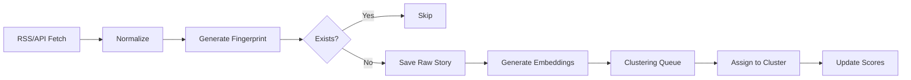

# SOURCE-NEWS: OPTIMIZED PRODUCTION BLUEPRINT

## EXECUTIVE SUMMARY

Source-News is a Nigerian-focused news intelligence platform that aggregates, clusters, and analyzes news from multiple sources using AI-powered bias detection, sentiment analysis, and viewpoint comparison. Built on Next.js 15, Supabase, and multi-AI orchestration.

---

## 1. CORE ARCHITECTURE

### 1.1 Technology Stack

**Frontend Layer**
- Next.js 15+ (App Router, RSC)
- TypeScript (strict mode)
- TailwindCSS + shadcn/ui
- SWR for data fetching
- Vercel deployment

**Backend Layer**
- Supabase (Postgres + pgvector + Auth + Storage)
- Vercel Redis (caching, rate-limiting)
- Next.js API Routes (serverless)
- n8n (workflow automation)

**AI Layer** (Priority fallback chain)
1. Google Gemini 2.0 Flash
2. OpenAI GPT-4.2
3. Groq Llama 3.1 70B
4. xAI Grok 2

**Infrastructure**
- Vercel (hosting + cron)
- GitHub (version control)
- Vercel Analytics (monitoring)

---

## 2. DATA ARCHITECTURE

### 2.1 Database Schema (Supabase)

```sql
-- Core Tables
CREATE TABLE sources (
  id UUID PRIMARY KEY DEFAULT gen_random_uuid(),
  name TEXT NOT NULL,
  type TEXT, -- 'rss', 'api', 'twitter', 'government'
  url TEXT,
  credibility_score INTEGER DEFAULT 50,
  bias_lean TEXT, -- 'left', 'centre', 'right', 'government'
  is_active BOOLEAN DEFAULT true,
  license_status TEXT DEFAULT 'pending',
  created_at TIMESTAMPTZ DEFAULT NOW()
);

CREATE TABLE stories_raw (
  id UUID PRIMARY KEY DEFAULT gen_random_uuid(),
  source_id UUID REFERENCES sources(id),
  title TEXT NOT NULL,
  content TEXT,
  url TEXT UNIQUE NOT NULL,
  canonical_url TEXT,
  fingerprint TEXT UNIQUE,
  published_at TIMESTAMPTZ,
  metadata JSONB,
  ingested_at TIMESTAMPTZ DEFAULT NOW()
);

CREATE TABLE story_clusters (
  id UUID PRIMARY KEY DEFAULT gen_random_uuid(),
  primary_title TEXT NOT NULL,
  summary TEXT,
  news_score INTEGER DEFAULT 0,
  engagement_score INTEGER DEFAULT 0,
  sentiment_score FLOAT,
  bias_distribution JSONB, -- {left: 2, centre: 3, right: 1}
  category TEXT,
  is_trending BOOLEAN DEFAULT false,
  created_at TIMESTAMPTZ DEFAULT NOW(),
  updated_at TIMESTAMPTZ DEFAULT NOW()
);

CREATE TABLE cluster_items (
  cluster_id UUID REFERENCES story_clusters(id) ON DELETE CASCADE,
  story_id UUID REFERENCES stories_raw(id) ON DELETE CASCADE,
  relevance_score FLOAT DEFAULT 0.8,
  PRIMARY KEY (cluster_id, story_id)
);

CREATE TABLE embeddings (
  id UUID PRIMARY KEY DEFAULT gen_random_uuid(),
  story_id UUID REFERENCES stories_raw(id) ON DELETE CASCADE,
  title_vector VECTOR(1536),
  content_vector VECTOR(1536),
  created_at TIMESTAMPTZ DEFAULT NOW()
);

CREATE INDEX ON embeddings USING ivfflat (title_vector vector_cosine_ops);
CREATE INDEX ON embeddings USING ivfflat (content_vector vector_cosine_ops);

-- User Tables
CREATE TABLE users (
  id UUID PRIMARY KEY REFERENCES auth.users(id),
  email TEXT UNIQUE,
  full_name TEXT,
  plan_tier TEXT DEFAULT 'free', -- 'free', 'premium', 'gold'
  preferences JSONB DEFAULT '{}',
  created_at TIMESTAMPTZ DEFAULT NOW()
);

CREATE TABLE user_usage (
  id UUID PRIMARY KEY DEFAULT gen_random_uuid(),
  user_id UUID REFERENCES users(id) ON DELETE CASCADE,
  date DATE DEFAULT CURRENT_DATE,
  ai_explanations_used INTEGER DEFAULT 0,
  bias_checks_used INTEGER DEFAULT 0,
  UNIQUE(user_id, date)
);

CREATE TABLE bookmarks (
  id UUID PRIMARY KEY DEFAULT gen_random_uuid(),
  user_id UUID REFERENCES users(id) ON DELETE CASCADE,
  cluster_id UUID REFERENCES story_clusters(id) ON DELETE CASCADE,
  created_at TIMESTAMPTZ DEFAULT NOW(),
  UNIQUE(user_id, cluster_id)
);

CREATE TABLE reports (
  id UUID PRIMARY KEY DEFAULT gen_random_uuid(),
  user_id UUID REFERENCES users(id),
  story_id UUID REFERENCES stories_raw(id),
  reason TEXT,
  status TEXT DEFAULT 'pending',
  created_at TIMESTAMPTZ DEFAULT NOW()
);
```

### 2.2 Redis Cache Structure

```
Keys:
- story:summary:{story_id} → JSON (TTL: 24h)
- story:explanation:{story_id} → JSON (TTL: 12h)
- user:limits:{user_id}:{date} → JSON (TTL: 24h)
- feed:latest → JSON array (TTL: 5min)
- feed:trending → JSON array (TTL: 10min)
- fingerprint:{hash} → "1" (TTL: 7d)
- ai:health:{provider} → status (TTL: 5min)
```

---

## 3. DATA INGESTION PIPELINE

### 3.1 RSS Sources (Approved Nigerian Outlets)

```typescript
const RSS_SOURCES = [
  { name: 'Premium Times', url: 'https://premiumtimesng.com/feed', bias: 'centre' },
  { name: 'Punch', url: 'https://punchng.com/feed/', bias: 'centre' },
  { name: 'Vanguard', url: 'https://www.vanguardngr.com/feed/', bias: 'centre' },
  { name: 'The Cable', url: 'https://www.thecable.ng/feed', bias: 'centre' },
  { name: 'Channels TV', url: 'https://www.channelstv.com/feed/', bias: 'centre' },
  { name: 'Techpoint Africa', url: 'https://techpoint.africa/feed/', bias: 'centre' },
  { name: 'Nairametrics', url: 'https://nairametrics.com/feed/', bias: 'centre' }
];
```

### 3.2 Ingestion Worker Flow



### 3.3 Worker Configuration (n8n)

**Workflow 1: RSS Ingestion** (Every 5 minutes)
1. HTTP Request to RSS feeds
2. Parse XML
3. Transform to standard format
4. Call `/api/worker/ingest`

**Workflow 2: Clustering** (Every 10 minutes)
1. Fetch unclustered stories
2. Generate embeddings
3. Run similarity search
4. Update clusters

**Workflow 3: Scoring** (Every 30 minutes)
1. Calculate NewsScore
2. Update trending flags
3. Refresh cache

---

## 4. API SPECIFICATIONS

### 4.1 Public Endpoints

**GET /api/feed/latest**
```typescript
Response: {
  clusters: Array<{
    id: string;
    title: string;
    summary: string;
    newsScore: number;
    sourceCount: number;
    biasDistribution: { left: number; centre: number; right: number };
    category: string;
    publishedAt: string;
  }>;
  pagination: { page: number; total: number };
}
```

**GET /api/story/:id**
```typescript
Response: {
  cluster: {
    id: string;
    title: string;
    summary: string;
    stories: Array<{
      id: string;
      title: string;
      url: string;
      source: string;
      bias: string;
      publishedAt: string;
    }>;
  };
}
```

**POST /api/story/:id/explain** (Auth required)
```typescript
Request: { userId: string }
Response: {
  explanation: string;
  sentiment: { polarity: number; emotion: string };
  keyFacts: string[];
  viewpoints: { left: string; centre: string; right: string };
  creditsUsed: number;
}
```

### 4.2 AI Service Integration

```typescript
// lib/ai/orchestrator.ts
async function getAICompletion(prompt: string, type: 'explanation' | 'summary') {
  const providers = ['gemini', 'openai', 'groq', 'grok'];
  
  for (const provider of providers) {
    try {
      const health = await redis.get(`ai:health:${provider}`);
      if (health === 'down') continue;
      
      const result = await callProvider(provider, prompt);
      return result;
    } catch (error) {
      await redis.set(`ai:health:${provider}`, 'down', 'EX', 300);
      continue;
    }
  }
  
  throw new Error('All AI providers unavailable');
}
```

---

## 5. FEATURE TIERS

| Feature | Free | Premium | Gold |
|---------|------|---------|------|
| Daily stories | 50 | Unlimited | Unlimited |
| AI explanations/day | 2 | 60 | Unlimited |
| Bias comparisons | 3/day | Unlimited | Unlimited |
| Search depth | Titles only | Full content | Full + semantic |
| Bookmarks | 20 max | Unlimited | Unlimited |
| Twitter signals | ❌ | ✅ | ✅ |
| Custom alerts | ❌ | ✅ | ✅ |
| Real-time updates | ❌ | ❌ | ✅ |
| Source dashboard | ❌ | ❌ | ✅ |

---

## 6. UI/UX STRUCTURE

### 6.1 Design System

**Colors**
- Background: `#FFFFFF` (light) / `#000000` (dark)
- Text: `#000000` (light) / `#FFFFFF` (dark)
- Accent: `#333333` / `#CCCCCC` (grayscale only)
- Borders: `#E5E5E5` / `#1A1A1A`

**Typography**
- Headings: Inter, 600-700 weight
- Body: Inter, 400 weight
- Monospace: JetBrains Mono

**Components**
- Story cards: Minimal shadow, clean lines
- Bias indicators: Color-coded dots (subtle)
- Floating AI button: Fixed bottom-right, 60px diameter

### 6.2 Page Structure

**Home Page** (`/`)
- Hero with tagline
- Trending clusters (top 5)
- Latest feed (infinite scroll)
- Filter sidebar (category, bias, date)

**Story Cluster Page** (`/story/[id]`)
- Primary headline
- Summary block
- Viewpoint columns (3-4 columns)
- Source list with bias indicators
- Floating AI explanation button

**Dashboard** (`/dashboard`)
- Usage stats
- Bookmarks
- Preferences
- Plan management

---

## 7. DEPLOYMENT CHECKLIST

### Phase 1: Foundation (Week 1-2)
- [ ] Initialize Next.js project
- [ ] Set up Supabase project
- [ ] Configure Vercel Redis
- [ ] Create database schema
- [ ] Set up authentication

### Phase 2: Ingestion (Week 3-4)
- [ ] Build RSS worker
- [ ] Implement fingerprinting
- [ ] Create embedding pipeline
- [ ] Set up n8n workflows

### Phase 3: Core Features (Week 5-6)
- [ ] Clustering algorithm
- [ ] AI orchestration layer
- [ ] Feed API endpoints
- [ ] Story detail pages

### Phase 4: User Features (Week 7-8)
- [ ] User dashboard
- [ ] Bookmarking system
- [ ] Usage tracking
- [ ] Tier enforcement

### Phase 5: Polish (Week 9-10)
- [ ] Admin panel
- [ ] Monitoring & logging
- [ ] Performance optimization
- [ ] Security audit

---

## 8. ENVIRONMENT VARIABLES

```env
# Supabase
NEXT_PUBLIC_SUPABASE_URL=
NEXT_PUBLIC_SUPABASE_ANON_KEY=
SUPABASE_SERVICE_ROLE_KEY=

# Redis
KV_REST_API_URL=
KV_REST_API_TOKEN=

# AI Providers
GOOGLE_GEMINI_API_KEY=
OPENAI_API_KEY=
GROQ_API_KEY=
XAI_GROK_API_KEY=

# n8n
N8N_WEBHOOK_URL=
N8N_API_KEY=

# Twitter (Optional)
TWITTER_BEARER_TOKEN=

# App
NEXT_PUBLIC_APP_URL=
NEXTAUTH_SECRET=
```

---

## 9. CRITICAL IMPLEMENTATION NOTES

1. **Always use pgvector for similarity search** - Don't reinvent clustering
2. **Cache aggressively** - AI calls are expensive
3. **Rate limit per-user, not global** - Track in Redis
4. **Fingerprint before inserting** - Avoid duplicate stories
5. **Use Server Actions for mutations** - Keep API routes minimal
6. **Implement RLS policies** - Secure at database level
7. **Log all AI provider failures** - Switch providers automatically
8. **Use Next.js Image for all images** - Performance critical
9. **Implement proper error boundaries** - Graceful degradation
10. **Test clustering with real Nigerian news** - Tune similarity thresholds

---

## 10. SUCCESS METRICS

- Story ingestion rate: >100/hour
- Clustering accuracy: >85% same-story grouping
- AI response time: <3 seconds
- Cache hit rate: >60%
- User engagement: >3 min avg session
- Mobile performance: Lighthouse >90

---

**This blueprint is optimized for sequential implementation by coding agents and development teams.**