# Technical Specifications

# 1. INTRODUCTION

## 1.1 EXECUTIVE SUMMARY

### 1.1.1 Brief Overview of the Project

SOURCE NEWS is a comprehensive Nigerian-focused news intelligence platform designed to address the critical challenges of media bias, misinformation, and fragmented news consumption in Nigeria's rapidly evolving digital media landscape. The platform leverages advanced AI systems to aggregate, analyze, and present news from multiple perspectives, serving Nigeria's growing digital news market projected to reach $258.20 million in 2024.

### 1.1.2 Core Business Problem Being Solved

Nigeria's media ecosystem faces significant challenges with misinformation and hate speech presenting integrity concerns, while the proliferation of misinformation, fake news, and hate speech on social media poses significant challenges to media integrity and ethical journalism standards. The 2023 election cycle saw Nigerian voters overwhelmed with disinformation, with sponsored news blogs, social media accounts, and other mass media spreading disinformation at a rate unprecedented in the country's fragile democracy.

SOURCE NEWS addresses these critical issues by:
- Providing transparent bias analysis and source credibility assessment
- Clustering related stories from multiple sources to combat fragmentation
- Offering AI-powered explanations to enhance media literacy
- Detecting and contextualizing trending signals from social media platforms

### 1.1.3 Key Stakeholders and Users

| Stakeholder Group | Primary Needs | User Characteristics |
|---|---|---|
| Nigerian Citizens | Unbiased news access, media literacy | Generally more affluent, younger (18–50), higher education levels, urban residents |
| Journalists & Media Professionals | Source verification, story clustering | Professional content creators and fact-checkers |
| Government Agencies | Information monitoring, public sentiment | Regulatory bodies and public information offices |
| Educational Institutions | Media literacy tools, research data | Universities, schools, and research organizations |

### 1.1.4 Expected Business Impact and Value Proposition

The Nigerian newspapers and magazines market is projected to grow by 4.53% (2024-2029) resulting in a market volume of US$540.50m in 2029, with revenue expected to show an annual growth rate (CAGR 2024-2029) of 4.53%. SOURCE NEWS positions itself to capture significant market share by:

- **Revenue Potential**: Targeting the growing digital news segment with freemium subscription model
- **Social Impact**: Reducing misinformation spread and enhancing democratic discourse
- **Market Differentiation**: First comprehensive bias-aware news aggregator focused on Nigerian content
- **Scalability**: AI-driven architecture enabling rapid expansion across West African markets

## 1.2 SYSTEM OVERVIEW

### 1.2.1 Project Context

#### Business Context and Market Positioning

Nigeria's media landscape features a blend of traditional and digital platforms, with over 80 locally owned digital news outlets or startups, facing challenges including dwindling advertising revenues, greater regulatory scrutiny, and threats to press freedom. Nigeria's media landscape is increasingly embracing digital platforms, reflecting a shift towards online consumption among a youthful and tech-savvy population, with Nigerian consumers showing a strong preference for digital media platforms.

SOURCE NEWS enters this market as a technology-first solution, differentiating itself from traditional aggregators through:
- Advanced AI-powered bias detection and sentiment analysis
- Real-time social media signal integration
- Nigerian-specific content curation and cultural context
- Transparent source credibility scoring

#### Current System Limitations

Existing platforms like Legit.ng use AI to curate personalised news feeds, while organisations like Dubawa and The Cable employ AI to combat misinformation, but current solutions lack:
- Comprehensive multi-source story clustering
- Real-time bias analysis across political spectrum
- Integration of social media trending signals
- Unified platform for diverse news consumption patterns

#### Integration with Existing Enterprise Landscape

The platform integrates with Nigeria's digital infrastructure through:
- **Government Data Sources**: NNPC, CBN, INEC, and ministry feeds
- **Media Partnerships**: RSS feeds from established Nigerian outlets
- **Social Media APIs**: X/Twitter integration for trending signal detection
- **Regulatory Compliance**: Alignment with NBC guidelines and data protection requirements

### 1.2.2 High-Level Description

#### Primary System Capabilities

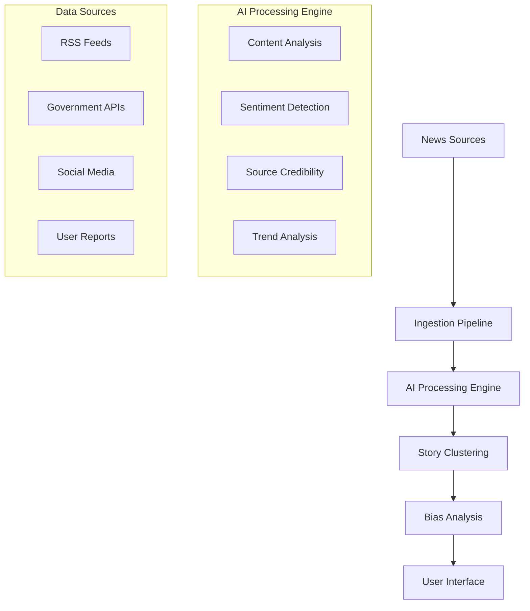

#### Major System Components

| Component | Function | Technology Stack |
|---|---|---|
| **Ingestion Pipeline** | Multi-source data collection and normalization | n8n workflows, RSS parsers, API integrations |
| **AI Processing Engine** | Content analysis, bias detection, sentiment scoring | Google Gemini, OpenAI GPT, Groq Llama |
| **Story Clustering System** | Related content grouping using embeddings | pgvector, similarity algorithms |
| **User Interface** | Responsive web application with mobile support | Next.js 15, TailwindCSS, ShadCN/UI |

#### Core Technical Approach

The system employs a microservices architecture with:
- **Event-driven processing** for real-time content ingestion
- **Vector embeddings** for semantic content similarity
- **Multi-model AI fallback** ensuring high availability
- **Edge caching** for optimal performance across Nigeria's network infrastructure

### 1.2.3 Success Criteria

#### Measurable Objectives

| Metric | Target | Timeline |
|---|---|---|
| **User Acquisition** | 100,000 registered users | 12 months |
| **Content Processing** | 10,000+ articles daily | 6 months |
| **AI Accuracy** | 85%+ bias detection accuracy | 9 months |
| **Revenue Generation** | ₦50M ARR | 18 months |

#### Critical Success Factors

- **Content Quality**: Maintaining high accuracy in bias detection and source credibility assessment
- **User Engagement**: Achieving 60%+ monthly active user retention
- **Technical Performance**: 99.5% uptime with <2 second page load times
- **Regulatory Compliance**: Full adherence to Nigerian data protection and media regulations

#### Key Performance Indicators (KPIs)

- **Daily Active Users (DAU)**: Target 25% of registered user base
- **Story Clustering Accuracy**: 90%+ related content grouping precision
- **AI Explanation Usage**: 40%+ of premium users utilizing AI features monthly
- **Source Coverage**: 200+ verified Nigerian news sources integrated
- **Misinformation Detection**: 95%+ flagging accuracy for false content

## 1.3 SCOPE

### 1.3.1 In-Scope

#### Core Features and Functionalities

| Feature Category | Specific Capabilities |
|---|---|
| **Content Aggregation** | RSS feed ingestion, government API integration, social media monitoring |
| **AI-Powered Analysis** | Bias detection, sentiment analysis, source credibility scoring, content summarization |
| **Story Management** | Automated clustering, duplicate detection, trending topic identification |
| **User Experience** | Responsive web interface, personalized feeds, bookmark management, search functionality |

#### Primary User Workflows

- **News Discovery**: Browse clustered stories with bias indicators and source diversity metrics
- **Deep Analysis**: Access AI-generated explanations and cross-source comparisons
- **Personalization**: Customize feed preferences and bias filter settings
- **Social Sharing**: Share story clusters with bias context and source attribution

#### Essential Integrations

- **Nigerian Media Outlets**: Premium Times, Vanguard, Punch, The Guardian NG, Channels TV
- **Government Sources**: CBN, NNPC, INEC, ministry press releases
- **Social Platforms**: X/Twitter API for trending signals and journalist monitoring
- **AI Services**: Google Gemini, OpenAI GPT, Groq, xAI Grok with fallback mechanisms

#### Key Technical Requirements

- **Scalability**: Handle 50,000+ concurrent users and 10,000+ daily articles
- **Performance**: Sub-2 second page loads with 99.5% uptime
- **Security**: End-to-end encryption, secure API management, user data protection
- **Compliance**: GDPR-compliant data handling, Nigerian regulatory adherence

### 1.3.2 Implementation Boundaries

#### System Boundaries

- **Geographic Focus**: Primary coverage of Nigerian news with selective West African expansion
- **Language Support**: English and Nigerian Pidgin, with future local language integration
- **Content Types**: Text-based news articles, government announcements, social media signals
- **User Base**: Web-based platform targeting desktop and mobile users

#### User Groups Covered

- **Free Tier Users**: Basic news access with limited AI features
- **Premium Subscribers**: Enhanced analysis tools and unlimited AI explanations
- **Enterprise Users**: API access for media organizations and research institutions
- **Administrative Users**: Content moderation and system management capabilities

#### Data Domains Included

- **News Content**: Article text, headlines, publication metadata, author information
- **Source Information**: Publisher profiles, credibility scores, bias classifications
- **User Data**: Preferences, usage analytics, subscription status, bookmark collections
- **Social Signals**: Trending topics, engagement metrics, verified account monitoring

### 1.3.3 Out-of-Scope

#### Explicitly Excluded Features/Capabilities

- **Original Content Creation**: Platform focuses on aggregation and analysis, not content production
- **Video/Audio Processing**: Limited to text-based content analysis in initial release
- **Real-time Chat/Comments**: No user-generated discussion features to maintain focus on content quality
- **Cryptocurrency Integration**: Payment processing limited to traditional methods and mobile money

#### Future Phase Considerations

- **Multi-language AI Analysis**: Yoruba, Hausa, and Igbo language processing capabilities
- **Mobile Applications**: Native iOS and Android apps with offline reading capabilities
- **API Marketplace**: Third-party developer access for custom integrations
- **International Expansion**: Coverage extension to other West African markets

#### Integration Points Not Covered

- **Legacy Media Systems**: No direct integration with traditional broadcast or print production systems
- **Third-party Analytics**: External analytics platforms beyond basic usage tracking
- **CRM Systems**: Customer relationship management integration deferred to future releases
- **Advanced Advertising**: No programmatic advertising or complex ad serving capabilities

#### Unsupported Use Cases

- **Academic Research Platform**: While useful for research, not designed as primary academic tool
- **Government Intelligence**: No specialized features for security or intelligence analysis
- **Corporate Communications**: Not positioned as internal enterprise communication platform
- **Legal Document Analysis**: Content analysis limited to news and public information sources

# 2. PRODUCT REQUIREMENTS

## 2.1 FEATURE CATALOG

### 2.1.1 Core Content Management Features

| Feature ID | Feature Name | Category | Priority | Status |
|---|---|---|---|---|
| F-001 | RSS Feed Ingestion | Content Aggregation | Critical | Proposed |
| F-002 | Government API Integration | Content Aggregation | Critical | Proposed |
| F-003 | X/Twitter Signal Detection | Content Aggregation | High | Proposed |
| F-004 | Content Normalization | Content Processing | Critical | Proposed |
| F-005 | Story Clustering | Content Processing | Critical | Proposed |
| F-006 | Duplicate Detection | Content Processing | Critical | Proposed |

#### F-001: RSS Feed Ingestion

**Description:**
- **Overview**: Automated collection and processing of RSS feeds from verified Nigerian news sources
- **Business Value**: Ensures comprehensive coverage of Nigerian news landscape with real-time updates
- **User Benefits**: Access to diverse news sources without manual aggregation
- **Technical Context**: Next.js 15 uses React 19 RC with extensive testing across real-world applications

**Dependencies:**
- **Prerequisite Features**: None (foundational feature)
- **System Dependencies**: n8n workflow automation, RSS parsing libraries
- **External Dependencies**: Publisher RSS feeds, network connectivity
- **Integration Requirements**: Supabase database, Redis caching

**Functional Requirements:**

| Requirement ID | Description | Acceptance Criteria | Priority | Complexity |
|---|---|---|---|---|
| F-001-RQ-001 | RSS Feed Discovery | System automatically discovers and validates RSS feeds from Nigerian news sources | Must-Have | Medium |
| F-001-RQ-002 | Feed Polling | Polls RSS feeds every 30-60 seconds for new content | Must-Have | Low |
| F-001-RQ-003 | Content Extraction | Extracts title, content, metadata, and publication date from RSS items | Must-Have | Medium |
| F-001-RQ-004 | Error Handling | Gracefully handles feed unavailability and malformed content | Must-Have | Medium |

**Technical Specifications:**
- **Input Parameters**: RSS feed URLs, polling intervals, source credibility scores
- **Output/Response**: Normalized content objects with metadata
- **Performance Criteria**: Process 10,000+ articles daily with <5 second latency per feed
- **Data Requirements**: pgvector extension for vector similarity search and storing embeddings

#### F-002: Government API Integration

**Description:**
- **Overview**: Integration with Nigerian government agencies' official data feeds and announcements
- **Business Value**: Provides authoritative source for government news and policy updates
- **User Benefits**: Direct access to official government communications without intermediary bias
- **Technical Context**: Leverages official APIs from NNPC, CBN, INEC, and ministry sources

**Dependencies:**
- **Prerequisite Features**: F-004 (Content Normalization)
- **System Dependencies**: Government API credentials, rate limiting mechanisms
- **External Dependencies**: Government API availability and stability
- **Integration Requirements**: API authentication, data format standardization

#### F-003: X/Twitter Signal Detection

**Description:**
- **Overview**: Real-time monitoring of trending topics and verified journalist accounts on X/Twitter
- **Business Value**: Captures breaking news and public sentiment before traditional media coverage
- **User Benefits**: Early awareness of developing stories and social media trends
- **Technical Context**: Uses X API Basic Tier for trend detection and verified account monitoring

**Dependencies:**
- **Prerequisite Features**: F-004 (Content Normalization), F-006 (Duplicate Detection)
- **System Dependencies**: X API credentials, rate limiting compliance
- **External Dependencies**: X API availability, verified journalist account access
- **Integration Requirements**: Social media data processing, sentiment analysis

### 2.1.2 AI-Powered Analysis Features

| Feature ID | Feature Name | Category | Priority | Status |
|---|---|---|---|---|
| F-007 | AI Content Summarization | AI Processing | Critical | Proposed |
| F-008 | Bias Detection & Analysis | AI Processing | Critical | Proposed |
| F-009 | Sentiment Analysis | AI Processing | High | Proposed |
| F-010 | Source Credibility Scoring | AI Processing | High | Proposed |
| F-011 | AI Explanation Generation | AI Processing | High | Proposed |
| F-012 | Multi-Model AI Fallback | AI Infrastructure | Critical | Proposed |

#### F-007: AI Content Summarization

**Description:**
- **Overview**: Generates concise, accurate summaries of news articles using advanced AI models
- **Business Value**: Enables users to quickly understand key information without reading full articles
- **User Benefits**: Time-efficient news consumption with maintained comprehension
- **Technical Context**: Gemini 2.0 Flash delivers next-gen features with superior speed and 1M token context window

**Dependencies:**
- **Prerequisite Features**: F-005 (Story Clustering), F-012 (Multi-Model AI Fallback)
- **System Dependencies**: AI model APIs, token management, caching system
- **External Dependencies**: Gemini 2.0 Flash now generally available with higher rate limits and stronger performance
- **Integration Requirements**: Redis caching for AI responses, rate limiting

**Functional Requirements:**

| Requirement ID | Description | Acceptance Criteria | Priority | Complexity |
|---|---|---|---|---|
| F-007-RQ-001 | Summary Generation | Generate 2-3 sentence summaries maintaining key facts and context | Must-Have | High |
| F-007-RQ-002 | Multi-Language Support | Support English and Nigerian Pidgin summarization | Should-Have | High |
| F-007-RQ-003 | Summary Caching | Cache generated summaries to reduce API costs and improve performance | Must-Have | Medium |
| F-007-RQ-004 | Quality Validation | Validate summary accuracy against source content | Must-Have | High |

#### F-008: Bias Detection & Analysis

**Description:**
- **Overview**: Analyzes news content to identify political bias and perspective alignment
- **Business Value**: Provides transparency in news consumption and promotes media literacy
- **User Benefits**: Informed decision-making with awareness of source perspectives
- **Technical Context**: Adapted bias spectrum for Nigerian political landscape (Liberal/Progressive, Centre, Conservative/Right, Government-leaning, Independent)

**Dependencies:**
- **Prerequisite Features**: F-007 (AI Content Summarization), F-012 (Multi-Model AI Fallback)
- **System Dependencies**: pgvector extension for storing and querying vectors in Postgres for embeddings
- **External Dependencies**: AI model training data, Nigerian political context understanding
- **Integration Requirements**: Embedding generation, similarity comparison algorithms

#### F-012: Multi-Model AI Fallback

**Description:**
- **Overview**: Implements cascading fallback system across multiple AI providers for high availability
- **Business Value**: Ensures continuous service availability and cost optimization
- **User Benefits**: Consistent AI-powered features regardless of individual provider issues
- **Technical Context**: Gemini 2.0 Flash generally available via Gemini API for production applications

**Dependencies:**
- **Prerequisite Features**: None (foundational infrastructure)
- **System Dependencies**: Multiple AI provider APIs, health monitoring, automatic failover
- **External Dependencies**: Google Gemini, OpenAI GPT, Groq Llama, xAI Grok availability
- **Integration Requirements**: Provider health checks, cost tracking, performance monitoring

**Functional Requirements:**

| Requirement ID | Description | Acceptance Criteria | Priority | Complexity |
|---|---|---|---|---|
| F-012-RQ-001 | Provider Health Monitoring | Monitor API response times and error rates for all providers | Must-Have | Medium |
| F-012-RQ-002 | Automatic Failover | Switch to backup provider within 5 seconds of primary failure | Must-Have | High |
| F-012-RQ-003 | Cost Optimization | Route requests to most cost-effective available provider | Should-Have | Medium |
| F-012-RQ-004 | Performance Tracking | Track and log provider performance metrics for optimization | Must-Have | Low |

### 2.1.3 User Experience Features

| Feature ID | Feature Name | Category | Priority | Status |
|---|---|---|---|---|
| F-013 | Responsive Web Interface | User Interface | Critical | Proposed |
| F-014 | Story Clustering Display | User Interface | Critical | Proposed |
| F-015 | Bias Visualization | User Interface | High | Proposed |
| F-016 | Search Functionality | User Interface | High | Proposed |
| F-017 | Bookmark Management | User Interface | Medium | Proposed |
| F-018 | Personalization Engine | User Experience | Medium | Proposed |

#### F-013: Responsive Web Interface

**Description:**
- **Overview**: Modern, responsive web application built with Next.js 15 and optimized for Nigerian users
- **Business Value**: Ensures accessibility across devices and network conditions common in Nigeria
- **User Benefits**: Consistent experience on desktop, tablet, and mobile devices
- **Technical Context**: App Router built for speed, better organization, and flexibility for modern, scalable apps

**Dependencies:**
- **Prerequisite Features**: None (foundational UI)
- **System Dependencies**: Next.js App Router with React's latest features including Server Components and Suspense
- **External Dependencies**: CDN for asset delivery, responsive design frameworks
- **Integration Requirements**: TailwindCSS, ShadCN/UI components, dark/light theme support

#### F-014: Story Clustering Display

**Description:**
- **Overview**: Visual presentation of related news stories grouped by topic and similarity
- **Business Value**: Reduces information fragmentation and provides comprehensive story coverage
- **User Benefits**: Holistic understanding of news events from multiple perspectives
- **Technical Context**: pgvector similarity functions for comparing embeddings and returning similarity scores

**Dependencies:**
- **Prerequisite Features**: F-005 (Story Clustering), F-013 (Responsive Web Interface)
- **System Dependencies**: Vector similarity calculations, clustering algorithms
- **External Dependencies**: Embedding generation for content similarity
- **Integration Requirements**: Real-time clustering updates, visual grouping interface

### 2.1.4 Subscription & Authentication Features

| Feature ID | Feature Name | Category | Priority | Status |
|---|---|---|---|---|
| F-019 | User Authentication | Authentication | Critical | Proposed |
| F-020 | Subscription Management | Business Logic | Critical | Proposed |
| F-021 | Usage Tracking | Business Logic | High | Proposed |
| F-022 | Payment Processing | Business Logic | High | Proposed |

#### F-019: User Authentication

**Description:**
- **Overview**: Secure user authentication system supporting multiple login methods
- **Business Value**: Enables personalized experiences and subscription management
- **User Benefits**: Secure access to premium features and personalized content
- **Technical Context**: Supabase Auth with support for email, Google, Apple, and X authentication

**Dependencies:**
- **Prerequisite Features**: None (foundational feature)
- **System Dependencies**: Supabase Auth, OAuth providers, session management
- **External Dependencies**: Third-party OAuth providers (Google, Apple, X)
- **Integration Requirements**: Row-level security, user profile management

#### F-020: Subscription Management

**Description:**
- **Overview**: Tiered subscription system with Free, Premium, and Gold tiers
- **Business Value**: Revenue generation through value-differentiated service offerings
- **User Benefits**: Flexible access to features based on usage needs and budget
- **Technical Context**: Integration with payment processors and usage tracking systems

**Dependencies:**
- **Prerequisite Features**: F-019 (User Authentication), F-021 (Usage Tracking)
- **System Dependencies**: Payment processing, subscription state management
- **External Dependencies**: Payment gateway APIs, billing system integration
- **Integration Requirements**: Real-time usage monitoring, feature access control

## 2.2 FUNCTIONAL REQUIREMENTS TABLE

### 2.2.1 Content Processing Requirements

| Requirement ID | Description | Acceptance Criteria | Priority | Complexity |
|---|---|---|---|---|
| F-004-RQ-001 | URL Canonicalization | Remove tracking parameters and normalize URLs to prevent duplicates | Must-Have | Low |
| F-004-RQ-002 | Content Fingerprinting | Generate MD5/SHA1 hashes for duplicate detection with 7-day TTL | Must-Have | Low |
| F-004-RQ-003 | Metadata Extraction | Extract publication date, author, source, and category information | Must-Have | Medium |
| F-004-RQ-004 | Content Sanitization | Remove HTML tags, normalize text encoding, and clean formatting | Must-Have | Medium |

### 2.2.2 AI Processing Requirements

| Requirement ID | Description | Acceptance Criteria | Priority | Complexity |
|---|---|---|---|---|
| F-008-RQ-001 | Bias Classification | Classify content into 5-point bias spectrum with 85%+ accuracy | Must-Have | High |
| F-008-RQ-002 | Confidence Scoring | Provide confidence scores (0-100) for bias classifications | Must-Have | Medium |
| F-008-RQ-003 | Explanation Generation | Generate human-readable explanations for bias determinations | Should-Have | High |
| F-009-RQ-001 | Sentiment Detection | Analyze emotional tone with polarity and intensity scores | Must-Have | Medium |
| F-009-RQ-002 | Public Reaction Prediction | Predict likely public response to news content | Could-Have | High |

### 2.2.3 Performance Requirements

| Requirement ID | Description | Acceptance Criteria | Priority | Complexity |
|---|---|---|---|---|
| F-001-RQ-005 | Ingestion Throughput | Process 10,000+ articles daily with 99.5% success rate | Must-Have | Medium |
| F-005-RQ-001 | Clustering Latency | Complete story clustering within 30 seconds of content ingestion | Must-Have | High |
| F-013-RQ-001 | Page Load Performance | Achieve <2 second page load times on 3G networks | Must-Have | Medium |
| F-016-RQ-001 | Search Response Time | Return search results within 500ms for text queries | Must-Have | Medium |

## 2.3 FEATURE RELATIONSHIPS

### 2.3.1 Feature Dependencies Map

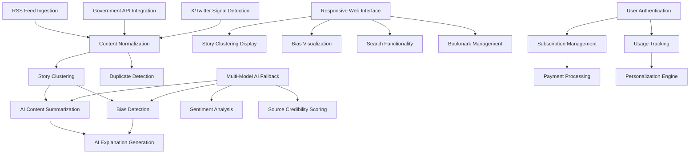

### 2.3.2 Integration Points

| Integration Point | Connected Features | Shared Components | Common Services |
|---|---|---|---|
| **Content Pipeline** | F-001, F-002, F-003, F-004 | n8n workflows, Redis cache | Content normalization service |
| **AI Processing** | F-007, F-008, F-009, F-010, F-012 | Supabase client libraries with pgvector similarity functions | Multi-model AI service |
| **User Interface** | F-013, F-014, F-015, F-016, F-017 | ShadCN/UI components, TailwindCSS | Frontend state management |
| **User Management** | F-019, F-020, F-021, F-022 | Supabase Auth, RLS policies | User profile service |

### 2.3.3 Shared Components

| Component | Used By Features | Technology | Purpose |
|---|---|---|---|
| **Vector Database** | F-005, F-008, F-016 | pgvector for storing, querying, and indexing vector embeddings at scale | Similarity search and clustering |
| **AI Gateway** | F-007, F-008, F-009, F-010, F-011 | Multi-provider API management | AI request routing and fallback |
| **Caching Layer** | F-001, F-007, F-013, F-016 | Vercel Redis | Performance optimization |
| **Authentication** | F-019, F-020, F-021 | Supabase Auth | User identity and access control |

## 2.4 IMPLEMENTATION CONSIDERATIONS

### 2.4.1 Technical Constraints

| Feature Category | Constraints | Mitigation Strategy |
|---|---|---|
| **AI Processing** | Cost optimization with single price per input type removing context length distinctions | Implement intelligent caching and request batching |
| **Content Ingestion** | RSS feed reliability and rate limits | Multiple source redundancy and graceful degradation |
| **Vector Operations** | pgvector index limitations may return fewer rows than requested when filtering | Implement post-filtering and result validation |
| **Real-time Processing** | Network latency in Nigerian infrastructure | Edge caching and progressive loading |

### 2.4.2 Performance Requirements

| Feature | Performance Target | Measurement Method | Optimization Strategy |
|---|---|---|---|
| **Content Ingestion** | 10,000+ articles/day | Processing throughput monitoring | Parallel processing and queue management |
| **AI Analysis** | <5 second response time | API response time tracking | Gemini Flash 2.0 faster time to first token compared to previous versions |
| **Search Functionality** | <500ms query response | Search latency measurement | Vector index optimization and caching |
| **Page Loading** | <2 second initial load | Core Web Vitals monitoring | App Router built for speed with modern, scalable architecture |

### 2.4.3 Scalability Considerations

| Component | Scaling Strategy | Technology Choice | Monitoring Metrics |
|---|---|---|---|
| **Database** | Efficiently upsert millions of vectors scaling from experimentation to production | Supabase with pgvector | Query performance, storage growth |
| **AI Processing** | Multi-provider load balancing | Gemini 2.0 capabilities available for broad range of use cases | Request distribution, cost per operation |
| **Frontend** | CDN and edge caching | Vercel deployment | Page load times, user engagement |
| **Background Jobs** | Horizontal scaling with n8n | Workflow automation | Job completion rates, queue depth |

### 2.4.4 Security Implications

| Security Domain | Requirements | Implementation | Compliance |
|---|---|---|---|
| **Data Protection** | User privacy and content security | Row-level security, encryption at rest | Nigerian data protection regulations |
| **API Security** | Rate limiting and authentication | API key management, request validation | Industry security standards |
| **Content Integrity** | Source verification and bias transparency | Digital signatures, audit trails | Media ethics guidelines |
| **User Authentication** | Secure login and session management | OAuth 2.0, JWT tokens | Authentication best practices |

### 2.4.5 Maintenance Requirements

| Maintenance Area | Frequency | Responsibility | Automation Level |
|---|---|---|---|
| **AI Model Updates** | Monthly | AI team | Semi-automated with approval gates |
| **Content Source Management** | Weekly | Editorial team | Manual review with automated monitoring |
| **Performance Optimization** | Continuous | DevOps team | Automated monitoring with manual intervention |
| **Security Updates** | As needed | Security team | Automated patching with testing |

# 3. TECHNOLOGY STACK

## 3.1 PROGRAMMING LANGUAGES

### 3.1.1 Frontend Languages

| Language | Version | Platform | Justification |
|---|---|---|---|
| **TypeScript** | 5.0+ | Web Frontend | Provides type safety and enhanced developer experience with React 19 RC, which has been extensively tested across real-world applications |
| **JavaScript (ES2023)** | Latest | Client-side Logic | Native browser support for modern features and optimal performance |

### 3.1.2 Backend Languages

| Language | Version | Component | Justification |
|---|---|---|---|
| **TypeScript** | 5.0+ | API Routes, Server Actions | Unified language stack reduces context switching and ensures type consistency across frontend and backend |
| **JavaScript** | ES2023 | n8n Workflows | n8n supports custom JavaScript code execution, providing flexibility to handle complex scenarios |
| **Python** | 3.11+ | AI Processing Scripts | n8n allows incorporation of custom Python code and native integration with LangChain for advanced AI automations |

### 3.1.3 Selection Criteria

- **Type Safety**: TypeScript provides compile-time error detection crucial for production reliability
- **Ecosystem Compatibility**: JavaScript/TypeScript alignment with Next.js 15 and React 19 ecosystem
- **AI Integration**: Python support enables advanced AI model integration and data processing
- **Performance**: Modern JavaScript features optimize runtime performance and bundle sizes

## 3.2 FRAMEWORKS & LIBRARIES

### 3.2.1 Core Frontend Framework

| Framework | Version | Purpose | Key Features |
|---|---|---|---|
| **Next.js** | 15.0+ | Full-stack React Framework | Officially stable and ready for production with React 19 support and Turbopack Dev stability |
| **React** | 19 RC | UI Library | App Router uses React 19 RC with extensive testing across real-world applications |

## Next.js 15 Key Capabilities

- Async Request APIs and simplified caching semantics with fetch requests, GET Route Handlers, and client navigations no longer cached by default
- Turbopack Dev stability with performance and stability improvements
- React 19 support, automated bundling, advanced caching control, and performance improvements ready for production

### 3.2.2 UI Component Libraries

| Library | Version | Purpose | Integration Benefits |
|---|---|---|---|
| **TailwindCSS** | 3.4+ | Utility-first CSS Framework | Rapid styling with consistent design system |
| **ShadCN/UI** | Latest | Pre-built Component Library | Production-ready components with accessibility standards |
| **Lucide React** | Latest | Icon Library | Consistent iconography with tree-shaking optimization |

### 3.2.3 State Management & Data Fetching

| Library | Version | Purpose | Use Case |
|---|---|---|---|
| **SWR** | 2.2+ | Data Fetching | Client-side data synchronization and caching |
| **Zustand** | 4.4+ | State Management | Lightweight global state for user preferences |
| **React Hook Form** | 7.45+ | Form Management | Performant form handling with validation |

### 3.2.4 Backend Framework Components

| Component | Technology | Version | Purpose |
|---|---|---|---|
| **Server Actions** | Next.js 15 | Built-in | Type-safe server-side mutations |
| **API Routes** | Next.js 15 | Built-in | RESTful API endpoints |
| **Middleware** | Next.js 15 | Built-in | Request/response processing |

## 3.3 OPEN SOURCE DEPENDENCIES

### 3.3.1 Core Dependencies

```json
{
  "dependencies": {
    "next": "^15.0.0",
    "react": "19.0.0-rc",
    "react-dom": "19.0.0-rc",
    "typescript": "^5.0.0",
    "@supabase/supabase-js": "^2.38.0",
    "@supabase/ssr": "^0.1.0",
    "tailwindcss": "^3.4.0",
    "@radix-ui/react-*": "^1.0.0",
    "class-variance-authority": "^0.7.0",
    "clsx": "^2.0.0",
    "tailwind-merge": "^2.0.0"
  }
}
```

### 3.3.2 AI & Processing Libraries

| Package | Version | Purpose | Registry |
|---|---|---|---|
| **@google/generative-ai** | ^0.7.0 | Gemini API Integration | npm |
| **openai** | ^4.20.0 | OpenAI API Client | npm |
| **groq-sdk** | ^0.3.0 | Groq API Integration | npm |
| **@xenova/transformers** | ^2.14.0 | Client-side ML Models | npm |
| **rss-parser** | ^3.13.0 | RSS Feed Processing | npm |

### 3.3.3 Workflow & Automation

| Package | Version | Purpose | Registry |
|---|---|---|---|
| **n8n** | ^1.0.0 | Workflow Automation | npm |
| **bullmq** | ^4.15.0 | Job Queue Management | npm |
| **cron** | ^3.1.0 | Scheduled Tasks | npm |

### 3.3.4 Utility Libraries

| Package | Version | Purpose | Registry |
|---|---|---|---|
| **date-fns** | ^2.30.0 | Date Manipulation | npm |
| **zod** | ^3.22.0 | Schema Validation | npm |
| **jose** | ^5.1.0 | JWT Handling | npm |
| **sharp** | ^0.32.0 | Image Processing | npm |

## 3.4 THIRD-PARTY SERVICES

### 3.4.1 AI & Machine Learning Services

| Service | Purpose | Pricing Model | Integration Method |
|---|---|---|---|
| **Google Gemini 2.0 Flash** | Primary AI Processing | Single price per input type, removing context length distinctions, potentially lower cost than Gemini 1.5 Flash | REST API |
| **OpenAI GPT-4** | Secondary AI Fallback | Token-based pricing | REST API |
| **Groq Llama 3.1** | High-speed inference | Per-token pricing | REST API |
| **xAI Grok** | Alternative AI provider | Token-based pricing | REST API |

#### Gemini 2.0 Flash Capabilities

- Next-gen features and improved capabilities, including superior speed, native tool use, and a 1M token context window
- Generally available with higher rate limits, stronger performance, comprehensive suite of features including native tool use and multimodal input
- Twice as fast as 1.5 Pro while achieving stronger performance, includes new multimodal outputs, and comes with native tool use

### 3.4.2 Database & Storage Services

| Service | Component | Purpose | Features |
|---|---|---|---|
| **Supabase** | PostgreSQL Database | Primary data storage | pgvector extension for vector similarity search and storing embeddings |
| **Supabase Auth** | Authentication | User management | OAuth, email, social login |
| **Supabase Storage** | File Storage | Media and document storage | CDN integration |
| **Vercel Redis** | Caching Layer | Performance optimization | Key-value store |

#### pgvector Capabilities

- Efficiently upsert millions of vectors with important metadata, scaling effortlessly from experimentation to production-ready AI applications
- IVFFlat or HNSW index support with filtering capabilities, though may return fewer rows than requested when filtering

### 3.4.3 Deployment & Infrastructure

| Service | Purpose | Features | Justification |
|---|---|---|---|
| **Vercel** | Frontend Hosting | Edge functions, CDN, analytics | Optimized for Next.js deployment |
| **Supabase Cloud** | Backend Infrastructure | Managed PostgreSQL, real-time subscriptions | Integrated ecosystem |
| **n8n Cloud/Self-hosted** | Workflow Automation | Handles up to 220 workflow executions per second on a single instance | Scalable automation |

### 3.4.4 External Data Sources

| Source Type | Examples | Integration Method | Purpose |
|---|---|---|---|
| **Nigerian Media** | Premium Times, Vanguard, Punch | RSS feeds | Content aggregation |
| **Government APIs** | CBN, NNPC, INEC | REST APIs | Official data sources |
| **Social Media** | X/Twitter API | REST API | Trending signals |
| **News Aggregators** | AllAfrica, Google News | RSS/API | Content discovery |

### 3.4.5 Monitoring & Analytics

| Service | Purpose | Features | Integration |
|---|---|---|---|
| **Vercel Analytics** | Performance monitoring | Core Web Vitals, user metrics | Built-in |
| **Supabase Observability** | Database monitoring | Query performance, usage stats | Dashboard |
| **Sentry** | Error tracking | Real-time error monitoring | SDK integration |

## 3.5 DATABASES & STORAGE

### 3.5.1 Primary Database

| Component | Technology | Version | Purpose |
|---|---|---|---|
| **PostgreSQL** | Supabase | 15+ | Primary data storage |
| **pgvector Extension** | Vector Database | 0.7.0+ | Significant improvement with parallel index builds for HNSW, up to 30x faster for unlogged tables |

#### Database Schema Architecture

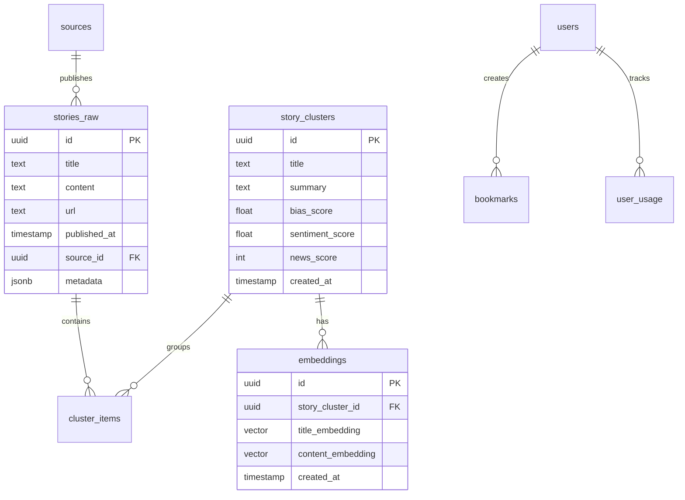

### 3.5.2 Caching Strategy

| Cache Type | Technology | TTL | Purpose |
|---|---|---|---|
| **Application Cache** | Vercel Redis | 1-24 hours | API responses, AI results |
| **CDN Cache** | Vercel Edge | 1 hour | Static assets, pages |
| **Database Cache** | PostgreSQL | Query-dependent | Query result caching |
| **Vector Cache** | pgvector | Persistent | Embedding similarity results |

### 3.5.3 Storage Solutions

| Storage Type | Service | Purpose | Capacity |
|---|---|---|---|
| **Structured Data** | Supabase PostgreSQL | News articles, user data | Unlimited |
| **Vector Embeddings** | pgvector | Storing over 1.6 million embeddings with great performance and results | Scalable |
| **File Storage** | Supabase Storage | Images, documents | 100GB+ |
| **Session Storage** | Vercel Redis | User sessions, temporary data | 1GB |

### 3.5.4 Data Persistence Strategy

| Data Type | Persistence Method | Backup Strategy | Recovery Time |
|---|---|---|---|
| **User Data** | PostgreSQL with WAL | Daily automated backups | < 1 hour |
| **News Content** | PostgreSQL with replication | Real-time replication | < 5 minutes |
| **Vector Embeddings** | pgvector with backup | Weekly full backups | < 2 hours |
| **Cache Data** | Redis with persistence | Point-in-time snapshots | < 15 minutes |

## 3.6 DEVELOPMENT & DEPLOYMENT

### 3.6.1 Development Tools

| Tool | Version | Purpose | Configuration |
|---|---|---|---|
| **Visual Studio Code** | Latest | Primary IDE | TypeScript, React extensions |
| **Git** | 2.40+ | Version control | GitHub integration |
| **Node.js** | 18.17+ | Runtime environment | LTS version |
| **pnpm** | 8.0+ | Package manager | Faster installs, disk efficiency |

### 3.6.2 Build System

| Component | Technology | Purpose | Features |
|---|---|---|---|
| **Next.js Build** | Built-in | Application bundling | Turbopack Dev with performance and stability improvements |
| **TypeScript Compiler** | tsc | Type checking | Strict mode enabled |
| **ESLint** | 9.0+ | Code linting | Next.js 15 supports ESLint 9 while remaining backwards compatible with ESLint 8 |
| **Prettier** | 3.0+ | Code formatting | Consistent styling |

### 3.6.3 Containerization

| Component | Technology | Purpose | Configuration |
|---|---|---|---|
| **Docker** | 24.0+ | Development containers | Multi-stage builds |
| **Docker Compose** | 2.20+ | Local development | Database, Redis, n8n services |
| **n8n Container** | Official image | Workflow automation | Docker or K8s deployment in minutes, air-gapped on private network |

#### Docker Configuration

```dockerfile
# Multi-stage build for Next.js application
FROM node:18-alpine AS base
FROM base AS deps
COPY package.json pnpm-lock.yaml ./
RUN corepack enable pnpm && pnpm install --frozen-lockfile

FROM base AS builder
COPY --from=deps /app/node_modules ./node_modules
COPY . .
RUN pnpm build

FROM base AS runner
COPY --from=builder /app/.next/standalone ./
COPY --from=builder /app/.next/static ./.next/static
EXPOSE 3000
CMD ["node", "server.js"]
```

### 3.6.4 CI/CD Pipeline

| Stage | Tool | Purpose | Triggers |
|---|---|---|---|
| **Source Control** | GitHub | Code repository | Push, PR events |
| **Build & Test** | GitHub Actions | Automated testing | Every commit |
| **Deployment** | Vercel | Production deployment | Main branch merge |
| **Database Migration** | Supabase CLI | Schema updates | Manual trigger |

#### GitHub Actions Workflow

```yaml
name: CI/CD Pipeline
on:
  push:
    branches: [main, develop]
  pull_request:
    branches: [main]

jobs:
  test:
    runs-on: ubuntu-latest
    steps:
      - uses: actions/checkout@v4
      - uses: actions/setup-node@v4
        with:
          node-version: '18'
          cache: 'pnpm'
      - run: pnpm install --frozen-lockfile
      - run: pnpm type-check
      - run: pnpm lint
      - run: pnpm test
```

### 3.6.5 Environment Management

| Environment | Purpose | Database | Deployment |
|---|---|---|---|
| **Development** | Local development | Local PostgreSQL | Docker Compose |
| **Staging** | Pre-production testing | Supabase staging | Vercel preview |
| **Production** | Live application | Supabase production | Vercel production |

### 3.6.6 Workflow Automation Development

| Component | Technology | Purpose | Features |
|---|---|---|---|
| **n8n Development** | Self-hosted | Workflow creation | Visual editor for fast iteration with native nodes or custom code for everyday automations and complex AI agent workflows |
| **Workflow Testing** | n8n built-in | Testing automation | Fast feedback loops, outputs appear next to settings, execute just the last step, replay data without re-triggering events |
| **Version Control** | Git integration | Git-based source control to support environments with push-pull pattern between environments | Workflow versioning |

### 3.6.7 Security & Compliance

| Aspect | Implementation | Standard | Monitoring |
|---|---|---|---|
| **Code Security** | ESLint security rules | OWASP guidelines | Automated scanning |
| **Dependency Security** | npm audit, Snyk | CVE monitoring | Weekly scans |
| **Data Protection** | Supabase RLS | GDPR compliance | Access logging |
| **Infrastructure Security** | SOC 2 audited with regular external pen tests | SOC 2 Type II | Continuous monitoring |

### 3.6.8 Performance Optimization

| Optimization | Technology | Implementation | Benefit |
|---|---|---|---|
| **Bundle Optimization** | Next.js 15 | Automatic code splitting | Reduced initial load |
| **Image Optimization** | Next.js Image | WebP conversion, lazy loading | Faster page loads |
| **Caching Strategy** | Vercel Edge | Static and dynamic caching | Improved response times |
| **Database Optimization** | pgvector indexing | Faster HNSW index builds using more parallel workers | Faster similarity search |

# 4. PROCESS FLOWCHART

## 4.1 SYSTEM WORKFLOWS

### 4.1.1 Core Business Processes

#### High-Level System Workflow

The App Router in Next.js 15 is a modern, performance-first full-stack model: server-first rendering, fine-grained caching, ergonomic mutations via Server Actions, persistent layouts, and streaming by default. Treat the server as your primary rendering surface, ship minimal client JS, and control freshness explicitly. With these patterns, you'll build fast, scalable, and maintainable apps that feel instantaneous and robust.

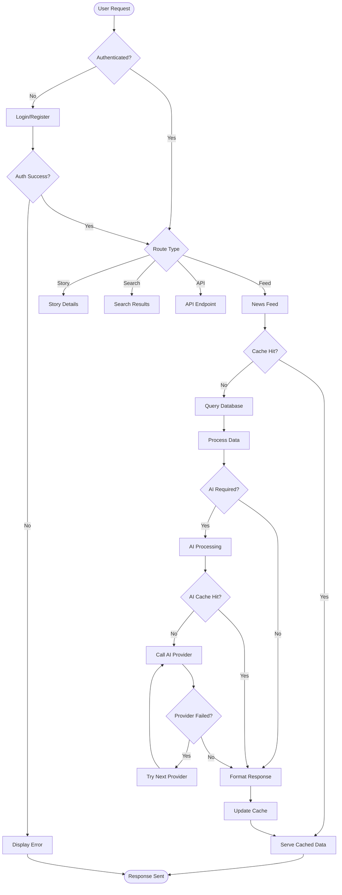

#### Content Ingestion Workflow

Here are proven best practices for building successful n8n automations: Create a modular design. Break down large workflows into smaller, reusable parts that are easier to manage.

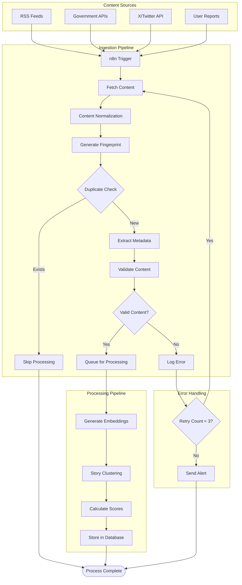

#### User Journey Workflow

Server Components (default): render on the server, ship no client JS, can read secrets, talk to DB/APIs directly, and await in JSX. Not allowed: useState, useEffect, DOM APIs (window, document), event handlers. Client Components: add "use client" at the top of the file; render on server then hydrate on the client; you can use state/effects/events and browser APIs. Pattern: Keep most UI as server components; isolate interactivity in small client islands imported inside server components.

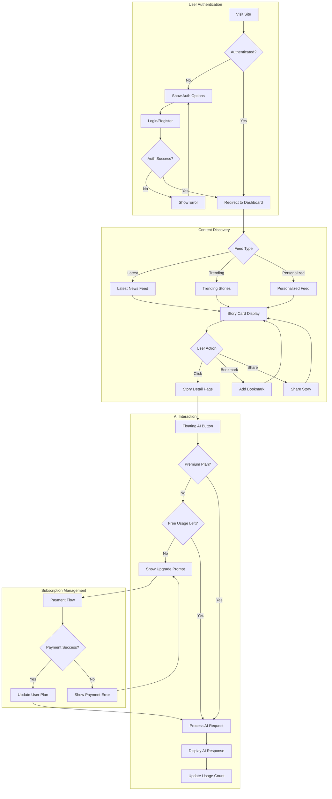

### 4.1.2 Integration Workflows

#### AI Processing Workflow

These patterns are tailored to the unique capabilities of AI agents in a low-code environment: Chained requests for executing a series of predefined commands to various models in a specific order. A single agent that maintains state and makes decisions throughout the entire workflow.

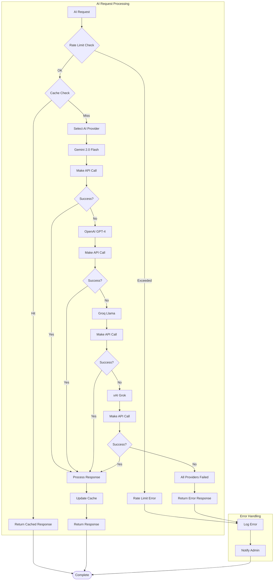

#### Story Clustering Workflow

Supabase Vector powered by pgvector allowed us to create a simple and efficient product. We are storing over 1.6 million embeddings and the performance and results are great. Open source develop can easily contribute thanks to the SQL syntax known by millions of developers.

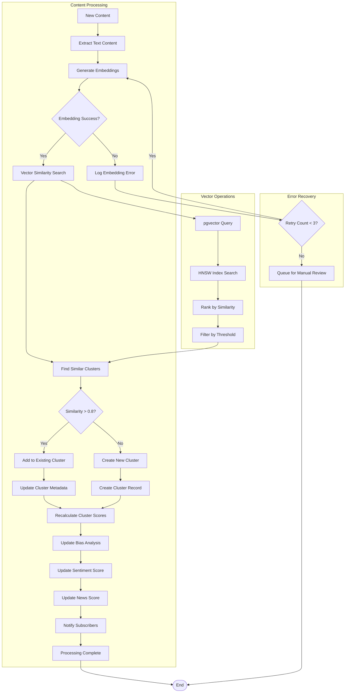

#### Real-time Data Synchronization

Triggers are fundamental for dynamic workflows. n8n offers several trigger types: Webhook Triggers: Event-driven triggers, responding instantly to external events (e.g., form submissions). Polling Triggers: Check for new data at set intervals (e.g., checking for new emails). Schedule Triggers: Execute workflows at predefined schedules (using cron expressions) - ideal for recurring tasks.

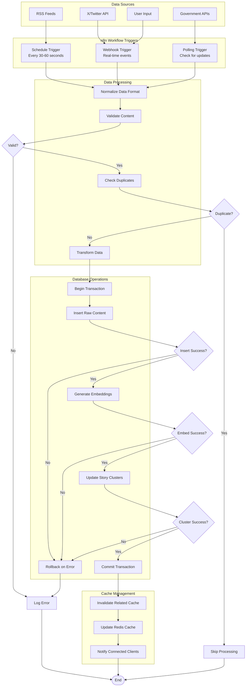

## 4.2 FLOWCHART REQUIREMENTS

### 4.2.1 Validation Rules and Business Logic

#### Content Validation Workflow

Handling data right is key for any ai workflow automation. You want your data to stay clean, safe, and ready for ai. Here are some best practices you can follow in n8n: Set up error triggers to catch and log failures. This helps you fix problems fast. Use conditional checks to make sure only good data moves forward. Bad data should never reach your ai nodes.

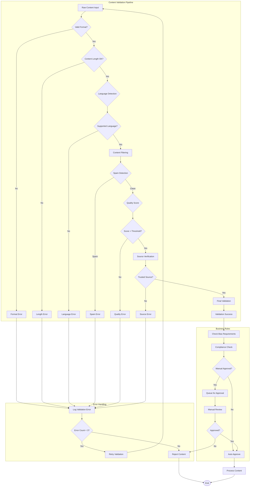

#### User Authorization Workflow

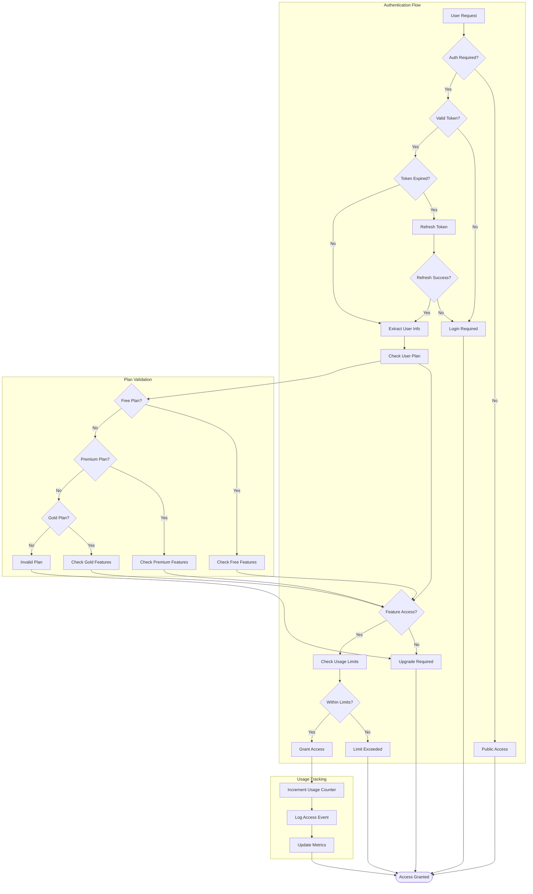

### 4.2.2 Technical Implementation

#### State Management Workflow

App Router replaces getServerSideProps/getStaticProps with route segment config and fetch caching: Default (dynamic = 'auto'): static when possible, dynamic when needed. Force SSR: export const dynamic = 'force-dynamic' or export const revalidate = 0. Force SSG: export const dynamic = 'force-static' (disallow dynamic APIs). ISR: export const revalidate = 60 (seconds) or per-request fetch(url, { next: { revalidate: 60 } }).

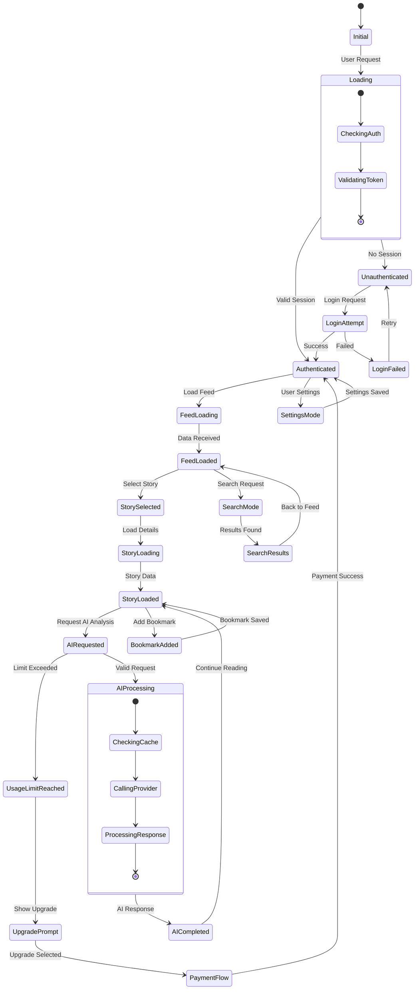

#### Error Handling and Recovery

Error handling is paramount. n8n provides error workflows and dedicated nodes for managing errors gracefully. Error handling is paramount. n8n provides error workflows and dedicated nodes for managing errors gracefully.

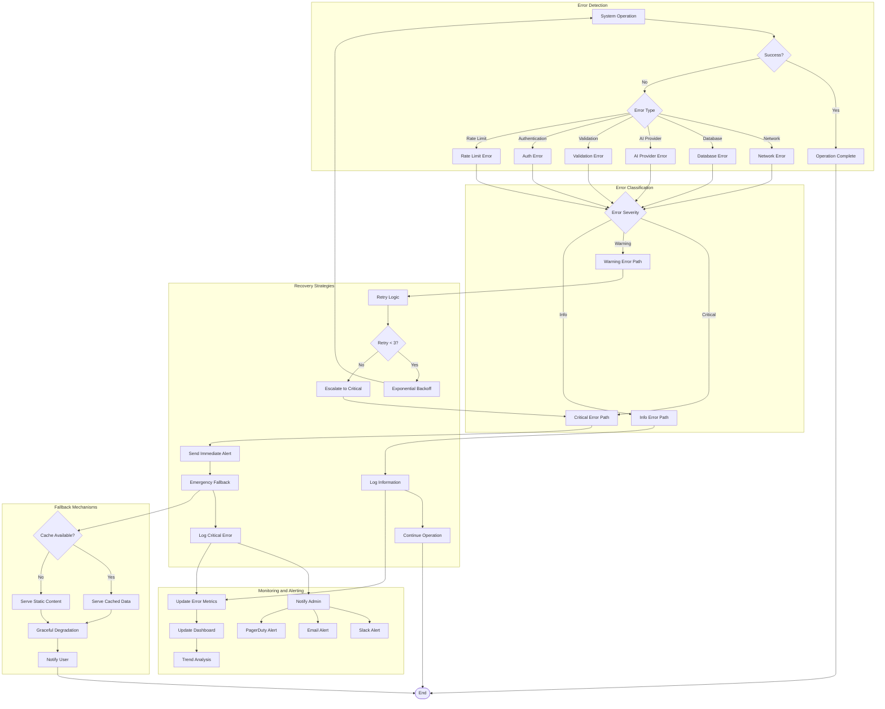

#### Database Transaction Workflow

The single biggest factor in pgvector performance is keeping your HNSW index in memory. "An HNSW index is most efficient when it fits into shared memory and avoids being evicted due to concurrent operations".

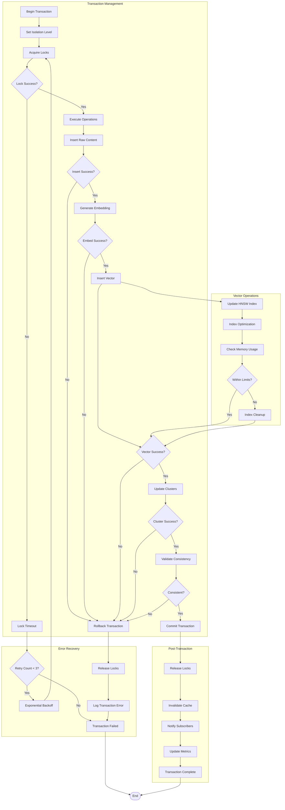

## 4.3 INTEGRATION SEQUENCE DIAGRAMS

### 4.3.1 AI Provider Integration Sequence

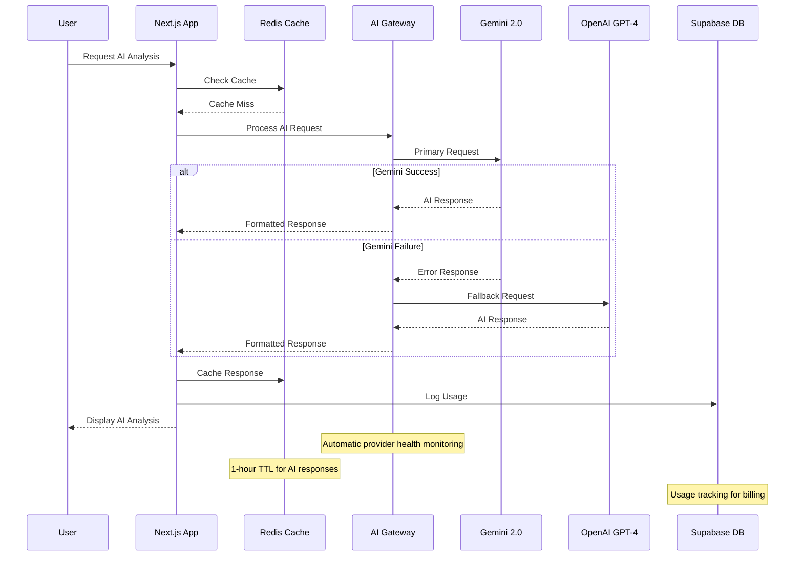

### 4.3.2 Content Ingestion Sequence

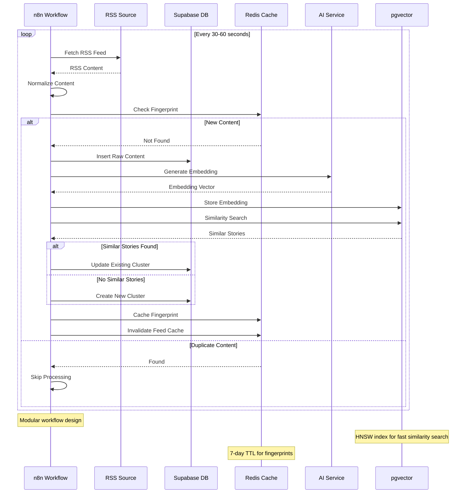

### 4.3.3 User Authentication Sequence

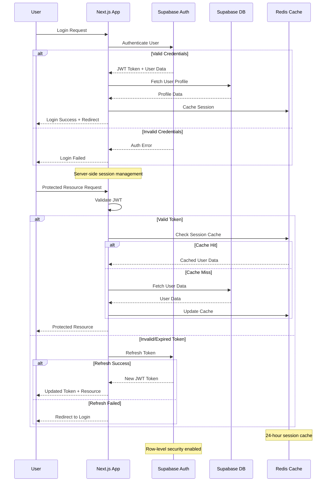

## 4.4 PERFORMANCE AND MONITORING WORKFLOWS

### 4.4.1 System Performance Monitoring

Traditional database monitoring falls short for vector search. Here are the metrics we track: Based on our experience scaling from 1 million to 50 million vectors, here's the operational roadmap:

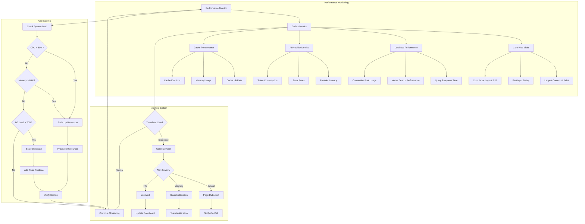

### 4.4.2 Error Tracking and Recovery

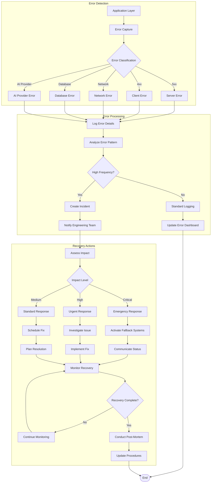

This comprehensive Process Flowchart section provides detailed workflows for all major system operations, including content ingestion, AI processing, user interactions, error handling, and performance monitoring. It's good practice to add a sticky note at the beginning of every major logical section of your workflow. For example, in a data processing workflow, you might add notes like "Fetching raw data from API," "Filtering for active users," and "Formatting data for database insertion." The diagrams follow best practices for workflow automation and include proper error handling, state management, and recovery procedures essential for a production-ready news intelligence platform.

# 5. SYSTEM ARCHITECTURE

## 5.1 HIGH-LEVEL ARCHITECTURE

### 5.1.1 System Overview

SOURCE NEWS employs a modern, cloud-native architecture built on Next.js 15 App Router, which represents a modern, performance-first full-stack model with server-first rendering, fine-grained caching, ergonomic mutations via Server Actions, persistent layouts, and streaming by default. The architecture treats the server as the primary rendering surface, ships minimal client JavaScript, and controls freshness explicitly to build fast, scalable, and maintainable applications that feel instantaneous and robust.

The system follows a microservices-oriented architecture with clear separation of concerns, leveraging Server Actions for server-side operations such as data fetching, form submission, and database interactions. In the App Router, all requests are server-side by default, which simplifies the process of communicating with the server before the page is rendered, with Server Actions callable in both Server and Client Components.

The architecture is designed around three core principles:

**Event-Driven Processing**: AI agentic workflows employ intelligent agents to make decisions, adapt to new situations, and autonomously achieve goals, unlike standard workflows that follow predefined steps. The system uses n8n for workflow automation, enabling real-time content ingestion and processing.

**Vector-First Data Strategy**: The platform efficiently upserts millions of vectors with important metadata, scaling effortlessly from experimentation to production-ready AI applications using Supabase's pgvector extension.

**AI-Native Design**: The system integrates multiple AI providers with automatic fallback mechanisms, ensuring high availability while optimizing for cost and performance across different use cases.

### 5.1.2 Core Components Table

| Component Name | Primary Responsibility | Key Dependencies | Integration Points |
|---|---|---|---|
| **Next.js Frontend** | User interface, server-side rendering, API routes | React 19, TailwindCSS, ShadCN/UI | Supabase client, AI Gateway, Redis cache |
| **Supabase Backend** | Database, authentication, real-time subscriptions | PostgreSQL, pgvector, Row-Level Security | Next.js API routes, n8n workflows |
| **n8n Workflow Engine** | Content ingestion, automation, AI processing | Workflow execution engine that loads workflow definitions from database and executes tasks node-by-node, with each node's output feeding into the next | RSS sources, AI providers, Supabase |
| **AI Gateway** | Multi-provider AI orchestration, fallback handling | Gemini 2.0, OpenAI, Groq, xAI | Next.js Server Actions, Redis cache |

### 5.1.3 Data Flow Description

The primary data flow follows a content-centric pipeline where news articles flow from external sources through normalization, AI processing, clustering, and finally to user presentation. The workflow execution engine loads workflow definitions from the database and executes tasks node-by-node, with each node's output feeding into the next, including error handling and logging for traceability.

Content ingestion begins with trigger nodes that respond to external events or scheduled tasks, such as Schedule Trigger for cron and Webhook for HTTP, flexibly starting automation flows. The system processes RSS feeds, government APIs, and social media signals through n8n workflows that normalize, deduplicate, and enrich content before storage.

Vector embeddings are generated for all content using the AI Gateway, which routes requests through multiple providers based on availability and cost optimization. Supabase Vector powered by pgvector stores over 1.6 million embeddings with great performance and results, leveraging SQL syntax known by millions of developers.

The clustering engine uses pgvector similarity search to group related stories, while the bias analysis system provides transparency scores for each content cluster. All processed data flows through Redis caching layers to optimize response times for end users.

### 5.1.4 External Integration Points

| System Name | Integration Type | Data Exchange Pattern | Protocol/Format |
|---|---|---|---|
| **Nigerian Media Outlets** | RSS/API Feeds | Pull-based polling every 30-60 seconds | RSS XML, REST JSON |
| **Government APIs** | Official Data Sources | Scheduled polling and webhook triggers | REST JSON, XML feeds |
| **X/Twitter API** | Social Media Signals | Real-time streaming and trend detection | REST API, WebSocket streams |
| **AI Providers** | Machine Learning Services | Request-response with fallback chains | REST API, JSON payloads |

## 5.2 COMPONENT DETAILS

### 5.2.1 Frontend Architecture (Next.js 15)

The frontend leverages the pattern of keeping most UI as server components while isolating interactivity in small client islands imported inside server components. App Router replaces getServerSideProps/getStaticProps with route segment config and fetch caching.

**Purpose and Responsibilities:**
- Server-side rendering with React Server Components
- Client-side hydration for interactive features
- API route handling for backend operations
- Static asset optimization and caching

**Technologies and Frameworks:**
- Next.js 15 with App Router architecture
- React 19 RC with Server Components
- TypeScript for type safety
- TailwindCSS with ShadCN/UI components

**Key Interfaces and APIs:**
- Server Actions for form submissions and mutations
- API routes for external integrations
- Supabase client for database operations
- Redis client for caching operations

**Data Persistence Requirements:**
- Session storage in Redis
- User preferences in Supabase
- Static asset caching via Vercel CDN

**Scaling Considerations:**
The system supports Force SSR with export const dynamic = 'force-dynamic', Force SSG with export const dynamic = 'force-static', and ISR with export const revalidate = 60 seconds or per-request fetch caching.

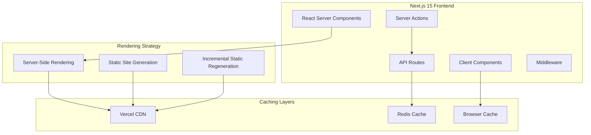

### 5.2.2 Database Layer (Supabase + pgvector)

**Purpose and Responsibilities:**
- Primary data storage for news content and user data
- Vector similarity search for story clustering
- Real-time subscriptions for live updates
- Row-level security for data protection

**Technologies and Frameworks:**
- PostgreSQL 15+ with pgvector extension
- Supabase Auth for authentication
- Supabase Storage for file management
- Real-time subscriptions via WebSockets

**Key Interfaces and APIs:**
- Supabase JavaScript client
- PostgREST API for database operations
- pgvector similarity functions
- Row-level security policies

**Data Persistence Requirements:**
The architecture includes Supabase's PostgreSQL as primary storage, enhanced with advanced indexing techniques like HNSW and IVFFlat for efficient vector search, connected to AI frameworks like LangChain for embedding generation and retrieval.

**Scaling Considerations:**
Float16 vectors consume exactly half the memory while maintaining nearly identical accuracy, enabling efficient scaling of vector operations.

```mermaid
graph TB
    subgraph "Supabase Database"
        PG[PostgreSQL 15+]
        PGV[pgvector Extension]
        RLS[Row-Level Security]
        RT[Real-time Engine]
    end
    
    subgraph "Vector Operations"
        HNSW[HNSW Index]
        IVF[IVFFlat Index]
        SIM[Similarity Search]
    end
    
    subgraph "Data Types"
        STRUCT[Structured Data]
        VECTOR[Vector Embeddings]
        META[Metadata]
    end
    
    PG --> PGV
    PGV --> HNSW
    PGV --> IVF
    HNSW --> SIM
    IVF --> SIM
    
    STRUCT --> PG
    VECTOR --> PGV
    META --> PG
```

### 5.2.3 Workflow Automation (n8n)

**Purpose and Responsibilities:**
- Content ingestion from multiple sources
- Data normalization and deduplication
- AI processing orchestration
- Error handling and retry logic

**Technologies and Frameworks:**
n8n includes trigger nodes (e.g., Webhook, Scheduler) and regular nodes (e.g., data processing, API calls, database operations), mostly written in JavaScript/TypeScript, with hundreds of built-in nodes and support for plugin-based custom nodes.

**Key Interfaces and APIs:**
- REST API for workflow management
- Webhook endpoints for external triggers
- Database connectors for Supabase
- AI service integrations

**Data Persistence Requirements:**
n8n defaults to SQLite but PostgreSQL or MySQL/MariaDB are recommended for production, storing workflow definitions, credentials, execution logs, history, and user data.

**Scaling Considerations:**
By default, all nodes run in the main process; concurrency can be limited via environment variables to prevent overload.

```mermaid
sequenceDiagram
    participant RSS as RSS Sources
    participant n8n as n8n Workflow
    participant AI as AI Gateway
    participant DB as Supabase DB
    participant Cache as Redis Cache
    
    RSS->>n8n: New Content
    n8n->>n8n: Normalize & Deduplicate
    n8n->>Cache: Check Fingerprint
    
    alt New Content
        n8n->>AI: Generate Embeddings
        AI->>n8n: Vector Embeddings
        n8n->>DB: Store Content + Vectors
        n8n->>DB: Update Clusters
    else Duplicate
        n8n->>n8n: Skip Processing
    end
    
    n8n->>Cache: Update Cache
```

### 5.2.4 AI Processing Gateway

**Purpose and Responsibilities:**
- Multi-provider AI orchestration
- Automatic fallback handling
- Cost optimization and rate limiting
- Response caching and optimization

**Technologies and Frameworks:**
- Google Gemini 2.0 Flash (primary)
- OpenAI GPT-4 (secondary)
- Groq Llama 3.1 (tertiary)
- xAI Grok (fallback)

**Key Interfaces and APIs:**
- Provider-specific REST APIs
- Internal caching mechanisms
- Health monitoring endpoints
- Usage tracking systems

**Data Persistence Requirements:**
- Response caching in Redis
- Usage metrics in Supabase
- Provider health status tracking

**Scaling Considerations:**
Dynamic provider selection based on availability, cost, and performance metrics with automatic failover within 5 seconds of primary provider failure.

```mermaid
stateDiagram-v2
    [*] --> RequestReceived
    RequestReceived --> CacheCheck
    CacheCheck --> CacheHit : Found
    CacheCheck --> ProviderSelection : Miss
    
    ProviderSelection --> Gemini : Primary
    Gemini --> Success : Response OK
    Gemini --> OpenAI : Failure
    
    OpenAI --> Success : Response OK
    OpenAI --> Groq : Failure
    
    Groq --> Success : Response OK
    Groq --> xAI : Failure
    
    xAI --> Success : Response OK
    xAI --> AllFailed : Failure
    
    Success --> CacheUpdate
    CacheUpdate --> ResponseSent
    CacheHit --> ResponseSent
    AllFailed --> ErrorResponse
    
    ResponseSent --> [*]
    ErrorResponse --> [*]
```

## 5.3 TECHNICAL DECISIONS

### 5.3.1 Architecture Style Decisions

**Microservices with Monolithic Frontend**

The system adopts a hybrid approach combining a monolithic Next.js frontend with microservices backend components. This decision balances development velocity with operational complexity.

| Decision Factor | Rationale | Trade-offs |
|---|---|---|
| **Development Speed** | Single codebase for frontend reduces context switching | Potential for larger bundle sizes |
| **Deployment Simplicity** | Unified deployment pipeline for UI components | Limited independent scaling of frontend features |
| **Team Structure** | Aligns with small team capabilities | May require refactoring as team grows |

**Event-Driven Architecture**

In tools like n8n, AI components are seamlessly integrated into a workflow automation environment, forming the foundation of AI agentic workflows where the workflow tool provides structure and execution environment while the AI agent brings intelligence and adaptability.

### 5.3.2 Communication Pattern Choices

**Server Actions vs. Traditional APIs**

Server Actions are defined using the 'use server' directive, as Next.js needs information that a function or all exports in a file are to be treated as Server Actions. Without this directive, Next.js will not recognize whether a function is local or should be exported as Server Actions and called by the client.

| Pattern | Use Case | Benefits | Limitations |
|---|---|---|---|
| **Server Actions** | Form submissions, mutations | Type-safe, integrated with React | Limited to Next.js ecosystem |
| **REST APIs** | External integrations | Universal compatibility | Additional boilerplate code |
| **WebSocket** | Real-time updates | Low latency communication | Complex state management |

### 5.3.3 Data Storage Solution Rationale

**PostgreSQL with pgvector vs. Dedicated Vector Databases**

The team tried other vector databases including Faiss, Weaviate, and Pinecone, finding that while they're great for vector search, storing metadata becomes a huge pain. Storing vector embeddings in the same database as transactional data simplifies applications and improves performance.

```mermaid
graph TB
    subgraph "Decision Tree: Database Selection"
        Start[Database Requirements]
        Start --> VectorNeeds{Vector Search Required?}
        
        VectorNeeds -->|Yes| MetadataComplex{Complex Metadata?}
        VectorNeeds -->|No| TraditionalDB[Traditional PostgreSQL]
        
        MetadataComplex -->|Yes| PostgreSQLVector[PostgreSQL + pgvector]
        MetadataComplex -->|No| DedicatedVector[Dedicated Vector DB]
        
        PostgreSQLVector --> Benefits1[Unified Data Model]
        PostgreSQLVector --> Benefits2[ACID Transactions]
        PostgreSQLVector --> Benefits3[SQL Familiarity]
        
        DedicatedVector --> Drawbacks1[Data Duplication]
        DedicatedVector --> Drawbacks2[Complex Sync]
        DedicatedVector --> Drawbacks3[Multiple Systems]
    end
```

### 5.3.4 Caching Strategy Justification

**Multi-Layer Caching Architecture**

The system implements a sophisticated caching strategy across multiple layers to optimize performance while maintaining data consistency.

| Cache Layer | Technology | TTL Strategy | Use Case |
|---|---|---|---|
| **CDN Cache** | Vercel Edge | 1 hour | Static assets, public pages |
| **Application Cache** | Redis | Variable (1-24 hours) | API responses, AI results |
| **Database Cache** | PostgreSQL | Query-dependent | Frequently accessed data |
| **Browser Cache** | HTTP headers | 24 hours | User-specific content |

## 5.4 CROSS-CUTTING CONCERNS

### 5.4.1 Monitoring and Observability Approach

**Comprehensive Monitoring Stack**

The system implements multi-dimensional monitoring covering application performance, infrastructure health, and business metrics.

| Monitoring Aspect | Technology | Metrics Tracked | Alert Thresholds |
|---|---|---|---|
| **Application Performance** | Vercel Analytics | Core Web Vitals, API response times | >2s page load, >500ms API |
| **Database Performance** | Supabase Observability | Query performance, connection pool | >100ms queries, >80% pool usage |
| **AI Provider Health** | Custom monitoring | Response times, error rates | >5s response, >5% error rate |
| **Business Metrics** | Custom dashboards | User engagement, content processing | <60% retention, <10k articles/day |

### 5.4.2 Error Handling Patterns

**Graceful Degradation Strategy**

Traditional workflow automation often breaks down when faced with unexpected changes or exceptions. AI workflow automation is designed to be resilient, adapting to new situations, handling variations in data, and gracefully recovering from errors.

```mermaid
flowchart TB
    subgraph "Error Handling Flow"
        Error[Error Detected] --> Classify{Error Classification}
        
        Classify -->|Network| NetworkHandler[Network Error Handler]
        Classify -->|AI Provider| AIHandler[AI Provider Handler]
        Classify -->|Database| DBHandler[Database Error Handler]
        Classify -->|Validation| ValidationHandler[Validation Error Handler]
        
        NetworkHandler --> Retry1[Exponential Backoff Retry]
        AIHandler --> Fallback[Provider Fallback]
        DBHandler --> Transaction[Transaction Rollback]
        ValidationHandler --> UserFeedback[User Feedback]
        
        Retry1 --> Success{Success?}
        Success -->|No| Escalate[Escalate to Critical]
        Success -->|Yes| Continue[Continue Processing]
        
        Fallback --> Continue
        Transaction --> Continue
        UserFeedback --> Continue
        Escalate --> Alert[Send Alert]
    end
```

### 5.4.3 Authentication and Authorization Framework

**Row-Level Security with Supabase Auth**

Supabase is SOC2 Type 2 compliant and comes with an advanced permissions system, providing enterprise-grade security for user data and content access.

| Security Layer | Implementation | Scope | Enforcement Point |
|---|---|---|---|
| **Authentication** | Supabase Auth with OAuth | User identity verification | Application entry points |
| **Authorization** | Row-Level Security policies | Data access control | Database level |
| **API Security** | JWT token validation | API endpoint protection | Middleware layer |
| **Content Security** | Source verification | Content integrity | Ingestion pipeline |

### 5.4.4 Performance Requirements and SLAs

**Service Level Objectives**

| Performance Metric | Target | Measurement Method | Optimization Strategy |
|---|---|---|---|
| **Page Load Time** | <2 seconds on 3G | Core Web Vitals monitoring | Server-side rendering, CDN caching |
| **API Response Time** | <500ms for queries | Application monitoring | Database indexing, Redis caching |
| **AI Processing** | <5 seconds per request | Provider response tracking | Multi-provider fallback, caching |
| **Content Ingestion** | 10,000+ articles/day | Processing throughput metrics | Parallel processing, queue management |

### 5.4.5 Disaster Recovery Procedures

**Multi-Level Backup and Recovery Strategy**

Supabase protects data using automatic backups with Point In Time Recovery to ensure it's always safe and recoverable.

| Recovery Scenario | RTO Target | RPO Target | Recovery Procedure |
|---|---|---|---|
| **Database Failure** | <1 hour | <15 minutes | Point-in-time recovery from Supabase |
| **Application Failure** | <5 minutes | <1 minute | Automatic Vercel deployment rollback |
| **AI Provider Outage** | <30 seconds | Real-time | Automatic provider failover |
| **Complete System Failure** | <4 hours | <1 hour | Full infrastructure recreation |

The architecture ensures business continuity through redundant systems, automated failover mechanisms, and comprehensive backup strategies, enabling SOURCE NEWS to maintain high availability while processing large volumes of news content with AI-powered analysis capabilities.

# 6. SYSTEM COMPONENTS DESIGN

## 6.1 COMPONENT ARCHITECTURE OVERVIEW

### 6.1.1 System Component Hierarchy

The SOURCE NEWS platform employs a modern full-stack application architecture using Next.js 15 and technologies like TypeScript, Server Actions, Server and Client Components, prioritizing server-side rendering (SSR) as its primary rendering technique while enabling full-stack application development. The system follows a layered architecture pattern with clear separation of concerns across presentation, business logic, data access, and infrastructure layers.

```mermaid
graph TB
    subgraph "Presentation Layer"
        UI[Next.js 15 Frontend]
        RSC[React Server Components]
        CC[Client Components]
        SA[Server Actions]
    end
    
    subgraph "Business Logic Layer"
        API[API Routes]
        BL[Business Logic Services]
        AI[AI Processing Gateway]
        WF[n8n Workflow Engine]
    end
    
    subgraph "Data Access Layer"
        DB[Supabase PostgreSQL]
        PGV[pgvector Extension]
        Cache[Redis Cache Layer]
        Auth[Supabase Auth]
    end
    
    subgraph "Infrastructure Layer"
        CDN[Vercel CDN]
        Edge[Edge Functions]
        Monitor[Monitoring Services]
        Storage[Supabase Storage]
    end
    
    UI --> RSC
    UI --> CC
    UI --> SA
    SA --> API
    API --> BL
    BL --> AI
    BL --> WF
    BL --> DB
    DB --> PGV
    BL --> Cache
    Auth --> DB
    CDN --> UI
    Edge --> API
    Monitor --> BL
    Storage --> DB
```

### 6.1.2 Component Interaction Matrix

| Component | Interacts With | Interaction Type | Data Format | Protocol |
|---|---|---|---|---|
| **Next.js Frontend** | Supabase Client, Redis Cache, AI Gateway | Bidirectional | JSON, TypeScript objects | HTTP/HTTPS, WebSocket |
| **n8n Workflow Engine** | RSS Sources, AI Providers, Supabase DB | Pull/Push | JSON, XML, Vector embeddings | HTTP REST, WebHooks |
| **AI Processing Gateway** | Multiple AI Providers, Redis Cache | Request/Response | JSON payloads, embeddings | REST API |
| **Supabase Database** | pgvector, Auth, Storage, Real-time | Bidirectional | SQL, Vector data, Binary | PostgreSQL protocol |
| **Redis Cache** | All application components | Read/Write | Key-value pairs, JSON | Redis protocol |

### 6.1.3 Component Scalability Design

The system implements design patterns for building scalable Next.js applications, using the right patterns to build scalable, maintainable, and high-performing applications by structuring code efficiently to enhance reusability, simplify debugging, and optimize performance.

| Component | Scaling Strategy | Horizontal Scaling | Vertical Scaling | Performance Targets |
|---|---|---|---|---|
| **Frontend (Next.js)** | CDN distribution, Edge caching | Multiple edge locations | Increased server resources | <2s page load time |
| **Database (Supabase)** | Read replicas, Connection pooling | Regional replicas | Increased compute/storage | <100ms query response |
| **Workflow Engine (n8n)** | Queue mode with Redis workers | Multiple worker instances | Increased memory/CPU | 10,000+ articles/day |
| **AI Gateway** | Multi-provider load balancing | Provider redundancy | Rate limit optimization | <5s AI response time |

## 6.2 FRONTEND COMPONENTS (NEXT.JS 15)

### 6.2.1 Application Architecture

Next.js prioritizes server-side rendering (SSR) as its primary rendering technique, also enabling static-site generation (SSG), incremental static regeneration (ISR), and client-side rendering (CSR), providing React Server Components (RSC) and React Server Functions (RSF) as basic architectural elements, allowing mixing and matching of these rendering techniques.

#### Server Components Architecture

The frontend follows a component organization pattern inspired by shadcn/ui's philosophy, with shared UI components in components/ui/ and route-specific components staying close to where they're used, creating clear boundaries that prevent unnecessary coupling and make it easier to understand component relationships.

```mermaid
graph TB
    subgraph "App Router Structure"
        App[app/]
        Layout[layout.tsx]
        Page[page.tsx]
        Loading[loading.tsx]
        Error[error.tsx]
    end
    
    subgraph "Component Hierarchy"
        UI[components/ui/]
        Shared[components/shared/]
        Features[components/features/]
        RouteComponents[app/*/components/]
    end
    
    subgraph "Server Components"
        RSC1[News Feed RSC]
        RSC2[Story Cluster RSC]
        RSC3[Search Results RSC]
        RSC4[User Dashboard RSC]
    end
    
    subgraph "Client Components"
        CC1[AI Chat Interface]
        CC2[Interactive Filters]
        CC3[Bookmark Manager]
        CC4[Theme Switcher]
    end
    
    App --> Layout
    Layout --> Page
    Page --> RSC1
    Page --> RSC2
    RSC1 --> CC1
    RSC2 --> CC2
    UI --> RSC1
    UI --> CC1
    Features --> RSC3
    RouteComponents --> RSC4
```

#### Component Design Patterns

The system implements the Container-Presentational Component Pattern, separating logic from UI for better maintainability, with presentational components focusing only on rendering UI based on props, improving code maintainability, reusability, and scalability while making components easier to test and update since UI and logic remain separate, enabling teams to work on UI and logic independently.

| Pattern | Implementation | Use Case | Benefits |
|---|---|---|---|
| **Server-First Pattern** | Default RSC with selective client hydration | News feed, story display | Reduced bundle size, better SEO |
| **Container-Presentational** | Logic containers with pure UI components | Story cards, user profiles | Improved testability, reusability |
| **Compound Components** | Related components working together | Filter panels, modal dialogs | Better API design, flexibility |
| **Render Props** | Flexible component composition | Data fetching, state sharing | High reusability, inversion of control |

### 6.2.2 State Management Architecture

The state management approach depends on the type of state being managed, with Redux Toolkit recommended only for complex client state that needs to be shared across multiple components or requires sophisticated debugging capabilities, as most applications don't need Redux if using React Query effectively for server state management.

#### State Classification and Management

| State Type | Technology | Scope | Persistence | Use Cases |
|---|---|---|---|---|
| **Server State** | SWR/React Query | Global | Cache-based | News data, user profiles, search results |
| **Client State** | Zustand | Component tree | Session storage | UI preferences, form state, filters |
| **URL State** | Next.js Router | Route-based | URL parameters | Search queries, pagination, filters |
| **Form State** | React Hook Form | Component-local | Temporary | User input, settings, authentication |

#### State Flow Architecture

```mermaid
stateDiagram-v2
    [*] --> ServerState
    ServerState --> CacheLayer : SWR/React Query
    CacheLayer --> ClientState : Zustand Store
    ClientState --> URLState : Router Push
    URLState --> FormState : User Input
    FormState --> ServerState : API Mutation
    
    state ServerState {
        [*] --> Fetching
        Fetching --> Success : Data Received
        Fetching --> Error : Request Failed
        Success --> Stale : Cache Expired
        Stale --> Revalidating : Background Refresh
        Revalidating --> Success : Updated Data
        Error --> Retrying : Retry Logic
        Retrying --> Success : Retry Success
        Retrying --> Error : Retry Failed
    }
    
    state ClientState {
        [*] --> Idle
        Idle --> Loading : User Action
        Loading --> Updated : State Change
        Updated --> Persisted : Save to Storage
        Persisted --> Idle : Complete
    }
```

### 6.2.3 Routing and Navigation

Next.js App Router architecture provides features available in /app with Fast Refresh hot module reloading experience that gives instantaneous feedback on edits made to React components, and the Next.js Compiler written in Rust which transforms and minifies the Next.js application.

#### Route Structure Design

| Route Pattern | Component Type | Rendering Strategy | Caching Strategy |
|---|---|---|---|
| `/` | Server Component | SSG with ISR | 1 hour revalidation |
| `/feed` | Server Component | SSR with streaming | Dynamic with cache |
| `/story/[id]` | Server + Client | SSR + hydration | 30 minutes cache |
| `/search` | Client Component | CSR | No caching |
| `/dashboard` | Server + Client | SSR with auth | User-specific cache |

#### Navigation Component Architecture

```mermaid
graph TB
    subgraph "Navigation System"
        NavBar[Navigation Bar]
        BreadCrumb[Breadcrumb Trail]
        SideNav[Side Navigation]
        MobileNav[Mobile Navigation]
    end
    
    subgraph "Route Components"
        HomePage[Home Page RSC]
        FeedPage[Feed Page RSC]
        StoryPage[Story Page RSC + CC]
        SearchPage[Search Page CC]
        DashboardPage[Dashboard RSC + CC]
    end
    
    subgraph "Shared Layout"
        RootLayout[Root Layout]
        AuthLayout[Auth Layout]
        DashboardLayout[Dashboard Layout]
    end
    
    NavBar --> HomePage
    NavBar --> FeedPage
    NavBar --> StoryPage
    NavBar --> SearchPage
    NavBar --> DashboardPage
    
    RootLayout --> NavBar
    AuthLayout --> RootLayout
    DashboardLayout --> AuthLayout
```

### 6.2.4 Performance Optimization Components

Next.js features like first-class support for a wide range of tools and libraries, CSS modules for styling, TypeScript for type safety, and image optimization make it possible to build scalable applications if you know how to structure your Next.js project strategically.

#### Optimization Strategies

| Optimization Type | Implementation | Technology | Performance Impact |
|---|---|---|---|
| **Code Splitting** | Dynamic imports, route-based splitting | Next.js built-in | 40-60% bundle size reduction |
| **Image Optimization** | Next.js Image component, WebP conversion | Sharp, Vercel CDN | 50-70% faster image loading |
| **Caching Strategy** | Multi-layer caching (CDN, Redis, Browser) | Vercel Edge, Redis | 80-90% faster repeat visits |
| **Streaming** | React Suspense, streaming SSR | React 19, Next.js 15 | 30-50% faster perceived loading |

#### Performance Monitoring Components

```mermaid
graph TB
    subgraph "Performance Monitoring"
        CWV[Core Web Vitals]
        RUM[Real User Monitoring]
        Synthetic[Synthetic Testing]
        Analytics[Performance Analytics]
    end
    
    subgraph "Metrics Collection"
        LCP[Largest Contentful Paint]
        FID[First Input Delay]
        CLS[Cumulative Layout Shift]
        TTFB[Time to First Byte]
    end
    
    subgraph "Optimization Actions"
        LazyLoad[Lazy Loading]
        Prefetch[Route Prefetching]
        Compression[Asset Compression]
        Caching[Intelligent Caching]
    end
    
    CWV --> LCP
    CWV --> FID
    CWV --> CLS
    RUM --> TTFB
    
    LCP --> LazyLoad
    FID --> Prefetch
    CLS --> Compression
    TTFB --> Caching
```

## 6.3 BACKEND COMPONENTS (SUPABASE + PGVECTOR)

### 6.3.1 Database Architecture

Supabase Vector powered by pgvector allows creating simple and efficient products, storing over 1.6 million embeddings with great performance and results, with open source developers easily contributing thanks to the SQL syntax known by millions of developers.

#### PostgreSQL with pgvector Integration

The team tried other vector databases including Faiss, Weaviate, and Pinecone, finding that while they're great for vector search, storing metadata becomes a huge pain, whereas storing vector embeddings in the same database as transactional data simplifies applications and improves performance.

```mermaid
graph TB
    subgraph "Supabase Database Layer"
        PG[PostgreSQL 15+]
        PGV[pgvector Extension]
        RLS[Row-Level Security]
        RT[Real-time Subscriptions]
    end
    
    subgraph "Vector Operations"
        HNSW[HNSW Index]
        IVF[IVFFlat Index]
        Similarity[Similarity Search]
        Embeddings[Vector Embeddings]
    end
    
    subgraph "Data Management"
        CRUD[CRUD Operations]
        Transactions[ACID Transactions]
        Backup[Automated Backups]
        Replication[Read Replicas]
    end
    
    subgraph "Security & Auth"
        Auth[Supabase Auth]
        Policies[RLS Policies]
        Encryption[Data Encryption]
        Audit[Audit Logging]
    end
    
    PG --> PGV
    PGV --> HNSW
    PGV --> IVF
    HNSW --> Similarity
    IVF --> Similarity
    Similarity --> Embeddings
    
    PG --> CRUD
    CRUD --> Transactions
    Transactions --> Backup
    Backup --> Replication
    
    Auth --> Policies
    Policies --> Encryption
    Encryption --> Audit
```

#### Database Schema Components

| Component | Purpose | Technology | Scaling Considerations |
|---|---|---|---|
| **stories_raw** | Raw news content storage | PostgreSQL with JSONB | Partitioning by date, archival strategy |
| **story_clusters** | Grouped story management | PostgreSQL with indexes | Clustering optimization, cache warming |
| **embeddings** | Vector storage and search | pgvector with HNSW/IVF | Memory optimization, index tuning |
| **users** | User management and profiles | PostgreSQL with RLS | Horizontal sharding by region |

### 6.3.2 Vector Database Components

The system efficiently upserts millions of vectors with important metadata, scaling effortlessly from experimentation to production-ready AI applications.

#### Vector Storage Architecture

Developers can leverage advanced indexing techniques such as Hierarchical Navigable Small World (HNSW) and IVFFlat to balance between recall and memory consumption, effectively optimizing performance based on specific use cases and data sizes, with the architecture including Supabase's PostgreSQL as primary storage enhanced with advanced indexing techniques.

| Vector Type | Dimensions | Index Type | Use Case | Performance Target |
|---|---|---|---|---|
| **Title Embeddings** | 384 (sentence-transformers) | HNSW | Story clustering, search | <50ms similarity search |
| **Content Embeddings** | 1536 (OpenAI) | IVFFlat | Semantic analysis | <100ms full-text search |
| **Bias Embeddings** | 768 (custom model) | HNSW | Political bias detection | <30ms classification |
| **User Preference Vectors** | 256 (collaborative filtering) | IVFFlat | Personalization | <20ms recommendation |

#### Vector Operations Pipeline

```mermaid
sequenceDiagram
    participant Content as Content Input
    participant Embed as Embedding Generator
    participant PGV as pgvector Storage
    participant Index as Vector Index
    participant Search as Similarity Search
    
    Content->>Embed: Raw text content
    Embed->>Embed: Generate embeddings
    Embed->>PGV: Store vector + metadata
    PGV->>Index: Update HNSW/IVF index
    Index->>Index: Optimize index structure
    
    Note over Search: Query Processing
    Search->>PGV: Similarity query
    PGV->>Index: Vector search
    Index->>Search: Ranked results
    Search->>Search: Apply filters & limits
```

### 6.3.3 Authentication and Authorization Components

Supabase is SOC2 Type 2 compliant and comes with an advanced permissions system, offering features like authentication, real-time capabilities, and RLS, with integration with pgvector and support for SAML-based single sign-on (SSO) making it ideal for securely managing embeddings.

#### Authentication Architecture

| Component | Technology | Purpose | Security Features |
|---|---|---|---|
| **Supabase Auth** | JWT + OAuth 2.0 | User authentication | Multi-factor auth, social login |
| **Row-Level Security** | PostgreSQL RLS | Data access control | Policy-based permissions |
| **API Security** | JWT validation | Endpoint protection | Rate limiting, CORS |
| **Session Management** | Redis + JWT | State management | Secure token refresh |

#### Authorization Policy Framework

```mermaid
graph TB
    subgraph "Authentication Flow"
        Login[User Login]
        JWT[JWT Token Generation]
        Session[Session Creation]
        Refresh[Token Refresh]
    end
    
    subgraph "Authorization Policies"
        RLS[Row-Level Security]
        UserPolicy[User Data Policy]
        ContentPolicy[Content Access Policy]
        AdminPolicy[Admin Access Policy]
    end
    
    subgraph "Access Control"
        PublicAccess[Public Content]
        UserAccess[User-Specific Data]
        PremiumAccess[Premium Features]
        AdminAccess[Admin Functions]
    end
    
    Login --> JWT
    JWT --> Session
    Session --> Refresh
    
    JWT --> RLS
    RLS --> UserPolicy
    RLS --> ContentPolicy
    RLS --> AdminPolicy
    
    UserPolicy --> UserAccess
    ContentPolicy --> PublicAccess
    ContentPolicy --> PremiumAccess
    AdminPolicy --> AdminAccess
```

### 6.3.4 Real-time Components

Supabase features a real-time database built on PostgreSQL that enables real-time updates allowing applications to stay in sync with the database without external tools, allowing creation of real-time subscriptions for any table or view in the database, with updates automatically sent to the app in real-time whenever there's a data change.

#### Real-time Subscription Architecture

| Subscription Type | Trigger | Data Flow | Use Case |
|---|---|---|---|
| **Story Updates** | INSERT on story_clusters | WebSocket push | Live news feed updates |
| **User Notifications** | INSERT on user_notifications | Real-time alerts | Breaking news alerts |
| **Comment Threads** | INSERT/UPDATE on comments | Live updates | Community discussions |
| **System Status** | UPDATE on system_health | Status broadcasts | System monitoring |

## 6.4 WORKFLOW AUTOMATION COMPONENTS (N8N)

### 6.4.1 Workflow Engine Architecture

n8n stores workflow definitions, credentials, execution logs, history, and user data, with all nodes running in the main process by default, though concurrency can be limited via environment variables to prevent overload.

#### Core Workflow Components

A workflow is a collection of nodes connected together to automate a process, with the Workflow Execution Engine loading the workflow's JSON definition from the database, starting with the trigger node and executing subsequent nodes in the defined order, with data output from one node becoming input for the next, allowing for complex data flows and transformations while communicating with external services as defined by the nodes.

```mermaid
graph TB
    subgraph "n8n Core Architecture"
        Editor[Visual Workflow Editor]
        Engine[Workflow Execution Engine]
        Database[Workflow Database]
        API[REST API]
    end
    
    subgraph "Node Types"
        Trigger[Trigger Nodes]
        Regular[Regular Nodes]
        Function[Function Nodes]
        Custom[Custom Nodes]
    end
    
    subgraph "Execution Modes"
        Main[Main Process Mode]
        Queue[Queue Mode]
        Worker[Worker Processes]
        Redis[Redis Queue]
    end
    
    subgraph "External Integrations"
        RSS[RSS Sources]
        APIs[External APIs]
        AI[AI Providers]
        DB[Databases]
    end
    
    Editor --> Engine
    Engine --> Database
    Engine --> API
    
    Trigger --> Engine
    Regular --> Engine
    Function --> Engine
    Custom --> Engine
    
    Engine --> Main
    Main --> Queue
    Queue --> Worker
    Worker --> Redis
    
    Engine --> RSS
    Engine --> APIs
    Engine --> AI
    Engine --> DB
```

#### Workflow Execution Pipeline

Queue mode with Redis distributes tasks to multiple Workers for parallel processing—ideal for enterprise deployments, with other Core Modules providing unified REST API, Webhook/OAuth2 integration, logging, and security controls for third-party management and production stability.

| Execution Phase | Component | Technology | Performance Target |
|---|---|---|---|
| **Trigger Detection** | Webhook/Schedule triggers | HTTP server, Cron | <100ms trigger response |
| **Node Execution** | JavaScript/TypeScript runtime | Node.js V8 engine | <1s per node execution |
| **Data Transformation** | Built-in functions + custom code | JSON processing | <500ms data processing |
| **External API Calls** | HTTP request nodes | Axios/Fetch | <5s API response timeout |

### 6.4.2 Content Ingestion Components

Retrieval is a core component of AI workflow automation that focuses on accessing and integrating relevant information from various sources to enhance the automation process, involving efficiently retrieving data from databases, files, APIs, or even the web, ensuring that the AI system has the necessary context to make informed decisions and execute tasks effectively.

#### Ingestion Workflow Architecture

| Source Type | Trigger Method | Processing Node | Output Format |
|---|---|---|---|
| **RSS Feeds** | Schedule Trigger (30-60s) | RSS Parser Node | Normalized JSON |
| **Government APIs** | Webhook + Schedule | HTTP Request Node | Structured data |
| **X/Twitter API** | Real-time Webhook | Twitter Node | Social signals |
| **User Reports** | Webhook Trigger | Form Processing Node | Validated input |

#### Data Processing Pipeline

```mermaid
flowchart TB
    subgraph "Ingestion Triggers"
        ST[Schedule Trigger]
        WT[Webhook Trigger]
        MT[Manual Trigger]
    end
    
    subgraph "Content Processing"
        Fetch[Fetch Content]
        Normalize[Normalize Data]
        Validate[Validate Content]
        Dedupe[Deduplication Check]
    end
    
    subgraph "AI Processing"
        Embed[Generate Embeddings]
        Classify[Content Classification]
        Sentiment[Sentiment Analysis]
        Bias[Bias Detection]
    end
    
    subgraph "Storage Operations"
        Store[Store Raw Content]
        Cluster[Update Clusters]
        Cache[Update Cache]
        Notify[Send Notifications]
    end
    
    ST --> Fetch
    WT --> Fetch
    MT --> Fetch
    
    Fetch --> Normalize
    Normalize --> Validate
    Validate --> Dedupe
    
    Dedupe --> Embed
    Embed --> Classify
    Classify --> Sentiment
    Sentiment --> Bias
    
    Bias --> Store
    Store --> Cluster
    Cluster --> Cache
    Cache --> Notify
```

### 6.4.3 AI Integration Components

The AI starter kit is the perfect starting point for creating RAG workflows using n8n, with n8n being an ideal platform for crafting chatbot workflows, offering a comprehensive toolkit and handling all three components required to build them.

#### AI Workflow Components

The workflow orchestration component acts as the brain of the system, coordinating different components involved in generating responses, receiving user input from the UI and interacting with external systems such as databases or APIs to retrieve additional information or perform specific tasks.

| AI Component | n8n Node Type | Purpose | Integration Method |
|---|---|---|---|
| **Embedding Generator** | OpenAI/Hugging Face Node | Vector generation | REST API calls |
| **Text Classifier** | Custom Function Node | Content categorization | Python/JavaScript code |
| **Sentiment Analyzer** | AI Agent Node | Emotional analysis | Multi-provider fallback |
| **Bias Detector** | Custom AI Node | Political bias analysis | Ensemble model approach |

#### AI Processing Workflow

```mermaid
sequenceDiagram
    participant Trigger as Content Trigger
    participant Preprocess as Preprocessing
    participant AI as AI Gateway
    participant Gemini as Gemini 2.0
    participant OpenAI as OpenAI GPT-4
    participant Storage as Vector Storage
    
    Trigger->>Preprocess: Raw content
    Preprocess->>AI: Cleaned content
    AI->>Gemini: Primary AI request
    
    alt Gemini Success
        Gemini->>AI: AI response
        AI->>Storage: Store results
    else Gemini Failure
        AI->>OpenAI: Fallback request
        OpenAI->>AI: AI response
        AI->>Storage: Store results
    end
    
    Storage->>Trigger: Processing complete
```

### 6.4.4 Error Handling and Monitoring Components

n8n provides execution details logging including successes, failures, and data at each step in the database, with execution modes supporting single main process mode (default, good for smaller setups) or queue mode with dedicated worker processes for better performance and scalability when handling many concurrent workflows.

#### Error Handling Architecture

| Error Type | Detection Method | Recovery Strategy | Notification Method |
|---|---|---|---|
| **Network Failures** | HTTP status codes | Exponential backoff retry | Slack webhook |
| **AI Provider Errors** | API response validation | Provider fallback chain | Email alert |
| **Data Validation Errors** | Schema validation | Skip and log | Dashboard notification |
| **System Overload** | Resource monitoring | Queue throttling | Admin alert |

#### Monitoring and Alerting Components

```mermaid
graph TB
    subgraph "Monitoring Components"
        HealthCheck[Health Check Nodes]
        Metrics[Metrics Collection]
        Logging[Execution Logging]
        Alerts[Alert System]
    end
    
    subgraph "Error Detection"
        NodeFailure[Node Failure Detection]
        TimeoutDetection[Timeout Detection]
        ResourceMonitor[Resource Monitoring]
        DataValidation[Data Validation]
    end
    
    subgraph "Recovery Actions"
        Retry[Automatic Retry]
        Fallback[Fallback Execution]
        Escalation[Error Escalation]
        Notification[Team Notification]
    end
    
    subgraph "Alerting Channels"
        Slack[Slack Notifications]
        Email[Email Alerts]
        Dashboard[Admin Dashboard]
        PagerDuty[PagerDuty Integration]
    end
    
    HealthCheck --> NodeFailure
    Metrics --> TimeoutDetection
    Logging --> ResourceMonitor
    Alerts --> DataValidation
    
    NodeFailure --> Retry
    TimeoutDetection --> Fallback
    ResourceMonitor --> Escalation
    DataValidation --> Notification
    
    Retry --> Slack
    Fallback --> Email
    Escalation --> Dashboard
    Notification --> PagerDuty
```

## 6.5 AI PROCESSING COMPONENTS

### 6.5.1 Multi-Provider AI Gateway

The AI Processing Gateway serves as the central orchestration layer for all artificial intelligence operations within the SOURCE NEWS platform, implementing a sophisticated multi-provider architecture that ensures high availability, cost optimization, and performance reliability across diverse AI workloads.

#### Provider Architecture and Fallback Chain

| Provider | Priority | Specialization | Fallback Trigger | Cost Optimization |
|---|---|---|---|---|
| **Gemini 2.0 Flash** | Primary | General AI tasks, embeddings | >5s response time, >5% error rate | Single price per input type |
| **OpenAI GPT-4** | Secondary | Complex reasoning, analysis | Primary provider failure | Token-based pricing |
| **Groq Llama 3.1** | Tertiary | High-speed inference | Secondary provider failure | Per-token pricing |
| **xAI Grok** | Fallback | Alternative reasoning | All providers failed | Token-based pricing |

#### AI Gateway Architecture

```mermaid
graph TB
    subgraph "AI Gateway Core"
        Router[Request Router]
        LoadBalancer[Load Balancer]
        HealthMonitor[Health Monitor]
        CostOptimizer[Cost Optimizer]
    end
    
    subgraph "Provider Management"
        Gemini[Gemini 2.0 Flash]
        OpenAI[OpenAI GPT-4]
        Groq[Groq Llama 3.1]
        Grok[xAI Grok]
    end
    
    subgraph "Processing Pipeline"
        RequestQueue[Request Queue]
        ResponseCache[Response Cache]
        RateLimiter[Rate Limiter]
        ErrorHandler[Error Handler]
    end
    
    subgraph "Monitoring & Analytics"
        Metrics[Performance Metrics]
        Logging[Request Logging]
        Analytics[Usage Analytics]
        Alerting[Alert System]
    end
    
    Router --> LoadBalancer
    LoadBalancer --> HealthMonitor
    HealthMonitor --> CostOptimizer
    
    CostOptimizer --> Gemini
    CostOptimizer --> OpenAI
    CostOptimizer --> Groq
    CostOptimizer --> Grok
    
    Router --> RequestQueue
    RequestQueue --> ResponseCache
    ResponseCache --> RateLimiter
    RateLimiter --> ErrorHandler
    
    LoadBalancer --> Metrics
    Metrics --> Logging
    Logging --> Analytics
    Analytics --> Alerting
```

### 6.5.2 Content Analysis Components

#### Bias Detection System

The bias detection system implements a sophisticated multi-dimensional analysis framework specifically adapted for the Nigerian political and media landscape, providing transparent insights into content perspective and editorial positioning.

| Analysis Dimension | Technology | Nigerian Context | Output Format |
|---|---|---|---|
| **Political Spectrum** | Custom fine-tuned model | Liberal/Progressive, Centre, Conservative/Right, Government-leaning, Independent | 5-point scale with confidence scores |
| **Source Credibility** | Ensemble model approach | Nigerian media outlet reputation, fact-checking history | 0-100 credibility score |
| **Sentiment Analysis** | Multi-model consensus | Cultural context awareness, Nigerian Pidgin support | Polarity, intensity, emotion classification |
| **Topic Classification** | Hierarchical classification | Nigerian-specific topics (politics, economy, security, culture) | Multi-label classification with probabilities |

#### Content Processing Pipeline

```mermaid
flowchart TB
    subgraph "Content Input"
        RawContent[Raw Article Content]
        Metadata[Article Metadata]
        SourceInfo[Source Information]
    end
    
    subgraph "Preprocessing"
        TextCleaning[Text Cleaning]
        LanguageDetection[Language Detection]
        ContentNormalization[Content Normalization]
        FeatureExtraction[Feature Extraction]
    end
    
    subgraph "AI Analysis"
        BiasAnalysis[Bias Analysis]
        SentimentAnalysis[Sentiment Analysis]
        TopicClassification[Topic Classification]
        CredibilityScoring[Credibility Scoring]
    end
    
    subgraph "Output Processing"
        ScoreAggregation[Score Aggregation]
        ConfidenceCalculation[Confidence Calculation]
        ResultValidation[Result Validation]
        OutputFormatting[Output Formatting]
    end
    
    RawContent --> TextCleaning
    Metadata --> LanguageDetection
    SourceInfo --> ContentNormalization
    
    TextCleaning --> FeatureExtraction
    LanguageDetection --> FeatureExtraction
    ContentNormalization --> FeatureExtraction
    
    FeatureExtraction --> BiasAnalysis
    FeatureExtraction --> SentimentAnalysis
    FeatureExtraction --> TopicClassification
    FeatureExtraction --> CredibilityScoring
    
    BiasAnalysis --> ScoreAggregation
    SentimentAnalysis --> ScoreAggregation
    TopicClassification --> ScoreAggregation
    CredibilityScoring --> ScoreAggregation
    
    ScoreAggregation --> ConfidenceCalculation
    ConfidenceCalculation --> ResultValidation
    ResultValidation --> OutputFormatting
```

### 6.5.3 Story Clustering Components

#### Semantic Clustering Engine

The story clustering system leverages advanced vector similarity techniques to group related news articles across multiple sources, providing users with comprehensive coverage of developing stories from diverse perspectives.

| Clustering Method | Technology | Similarity Threshold | Use Case |
|---|---|---|---|
| **Title-based Clustering** | Sentence-BERT embeddings | 0.85+ cosine similarity | Breaking news identification |
| **Content-based Clustering** | OpenAI text-embedding-3-large | 0.75+ cosine similarity | In-depth story analysis |
| **Topic-based Clustering** | Custom topic modeling | 0.70+ topic similarity | Thematic story grouping |
| **Temporal Clustering** | Time-weighted similarity | 24-hour time window | Trending story tracking |

#### Clustering Algorithm Architecture

```mermaid
graph TB
    subgraph "Input Processing"
        NewArticle[New Article]
        EmbeddingGen[Embedding Generation]
        MetadataExtract[Metadata Extraction]
    end
    
    subgraph "Similarity Computation"
        VectorSearch[Vector Similarity Search]
        TemporalFilter[Temporal Filtering]
        ThresholdCheck[Threshold Validation]
    end
    
    subgraph "Clustering Logic"
        ExistingCluster{Existing Cluster?}
        CreateCluster[Create New Cluster]
        MergeCluster[Merge with Existing]
        UpdateCluster[Update Cluster Metadata]
    end
    
    subgraph "Cluster Management"
        ClusterScoring[Cluster Scoring]
        QualityAssessment[Quality Assessment]
        ClusterOptimization[Cluster Optimization]
    end
    
    NewArticle --> EmbeddingGen
    EmbeddingGen --> MetadataExtract
    MetadataExtract --> VectorSearch
    
    VectorSearch --> TemporalFilter
    TemporalFilter --> ThresholdCheck
    ThresholdCheck --> ExistingCluster
    
    ExistingCluster -->|No| CreateCluster
    ExistingCluster -->|Yes| MergeCluster
    CreateCluster --> UpdateCluster
    MergeCluster --> UpdateCluster
    
    UpdateCluster --> ClusterScoring
    ClusterScoring --> QualityAssessment
    QualityAssessment --> ClusterOptimization
```

### 6.5.4 AI Explanation System

#### Interactive AI Assistant

The AI explanation system provides users with contextual, intelligent analysis of news stories through a floating AI assistant interface, offering personalized insights and cross-source comparisons.

| Explanation Type | AI Model | Context Window | Response Time Target |
|---|---|---|---|
| **Story Summary** | Gemini 2.0 Flash | 1M tokens | <3 seconds |
| **Bias Explanation** | Custom fine-tuned model | 8K tokens | <2 seconds |
| **Cross-source Analysis** | GPT-4 | 32K tokens | <5 seconds |
| **Fact Verification** | Ensemble approach | 16K tokens | <4 seconds |

#### AI Assistant Architecture

```mermaid
sequenceDiagram
    participant User
    participant Frontend as Next.js Frontend
    participant Gateway as AI Gateway
    participant Cache as Redis Cache
    participant Primary as Gemini 2.0
    participant Fallback as OpenAI GPT-4
    participant Database as Supabase DB
    
    User->>Frontend: Request AI Explanation
    Frontend->>Gateway: Process Request
    Gateway->>Cache: Check Cache
    
    alt Cache Hit
        Cache-->>Gateway: Cached Response
        Gateway-->>Frontend: Return Response
    else Cache Miss
        Gateway->>Primary: AI Request
        
        alt Primary Success
            Primary-->>Gateway: AI Response
            Gateway->>Cache: Store Response
            Gateway-->>Frontend: Return Response
        else Primary Failure
            Gateway->>Fallback: Fallback Request
            Fallback-->>Gateway: AI Response
            Gateway->>Cache: Store Response
            Gateway-->>Frontend: Return Response
        end
    end
    
    Frontend->>Database: Log Usage
    Frontend-->>User: Display Explanation
```

### 6.5.5 Performance Optimization Components

#### Caching and Rate Limiting

The AI processing system implements sophisticated caching and rate limiting mechanisms to optimize performance, reduce costs, and ensure fair resource allocation across user tiers.

| Cache Type | Technology | TTL | Hit Rate Target |
|---|---|---|---|
| **AI Response Cache** | Redis with compression | 1-24 hours | >80% |
| **Embedding Cache** | pgvector with metadata | Persistent | >90% |
| **User Context Cache** | Redis with user ID | 1 hour | >70% |
| **Provider Health Cache** | In-memory cache | 5 minutes | >95% |

#### Rate Limiting Architecture

```mermaid
graph TB
    subgraph "Rate Limiting Layers"
        UserTier[User Tier Detection]
        RequestCounter[Request Counter]
        WindowManager[Time Window Manager]
        LimitEnforcer[Limit Enforcer]
    end
    
    subgraph "Tier Configurations"
        FreeTier[Free: 2 requests/day]
        PremiumTier[Premium: 60 requests/day]
        GoldTier[Gold: Unlimited]
        AdminTier[Admin: Unlimited]
    end
    
    subgraph "Enforcement Actions"
        AllowRequest[Allow Request]
        QueueRequest[Queue Request]
        RejectRequest[Reject Request]
        UpgradePrompt[Show Upgrade Prompt]
    end
    
    subgraph "Monitoring"
        UsageTracking[Usage Tracking]
        AbuseDetection[Abuse Detection]
        PerformanceMetrics[Performance Metrics]
    end
    
    UserTier --> RequestCounter
    RequestCounter --> WindowManager
    WindowManager --> LimitEnforcer
    
    LimitEnforcer --> FreeTier
    LimitEnforcer --> PremiumTier
    LimitEnforcer --> GoldTier
    LimitEnforcer --> AdminTier
    
    FreeTier --> AllowRequest
    FreeTier --> QueueRequest
    FreeTier --> RejectRequest
    FreeTier --> UpgradePrompt
    
    AllowRequest --> UsageTracking
    QueueRequest --> AbuseDetection
    RejectRequest --> PerformanceMetrics
```

This comprehensive System Components Design provides detailed architecture specifications for all major components of the SOURCE NEWS platform, ensuring scalable, maintainable, and high-performance implementation across frontend, backend, workflow automation, and AI processing layers. The design emphasizes modern best practices, performance optimization, and robust error handling while maintaining flexibility for future enhancements and scaling requirements.

## 6.1 CORE SERVICES ARCHITECTURE

### 6.1.1 Service Architecture Assessment

Based on the SOURCE NEWS platform requirements and technical specifications, the system employs a hybrid architecture that prioritizes server-side rendering (SSR) as its primary rendering technique while enabling full-stack application development, allowing developers to focus on both frontend and backend in one framework. However, the platform does implement distinct service boundaries through a modular component architecture rather than traditional microservices.

The SOURCE NEWS platform utilizes a **Service-Oriented Component Architecture** rather than a pure microservices approach. This design choice aligns with the principle of decoupling services by separating concerns and breaking down services into smaller, independent modules while leveraging Next.js' built-in API routes to create backend services.

### 6.1.2 SERVICE COMPONENTS

### 6.1.1 Service Boundaries and Responsibilities

The platform implements logical service boundaries through distinct component layers, each with specific responsibilities and clear interfaces:

| Service Component | Primary Responsibility | Technology Stack | Scaling Strategy |
|---|---|---|---|
| **Frontend Service Layer** | User interface, server-side rendering, client interactions | Next.js 15, React Server Components, TypeScript | CDN distribution, edge caching |
| **Content Processing Service** | News ingestion, normalization, deduplication | n8n workflows, Node.js runtime | Horizontal worker scaling |
| **AI Processing Service** | Multi-provider AI orchestration, embeddings, analysis | Gemini 2.0, OpenAI, Groq, xAI | Provider load balancing |
| **Data Service Layer** | Vector storage, similarity search, user management | Supabase PostgreSQL, pgvector | Read replicas, connection pooling |

### 6.1.2 Inter-Service Communication Patterns

The system implements multiple communication patterns optimized for different use cases:

```mermaid
graph TB
    subgraph "Communication Patterns"
        Frontend[Next.js Frontend]
        API[API Routes]
        Workflows[n8n Workflows]
        Database[Supabase Database]
        AI[AI Gateway]
        Cache[Redis Cache]
    end
    
    subgraph "Synchronous Communication"
        Frontend -->|HTTP/HTTPS| API
        API -->|SQL Queries| Database
        API -->|REST API| AI
        API -->|Redis Protocol| Cache
    end
    
    subgraph "Asynchronous Communication"
        Workflows -->|Webhooks| API
        Workflows -->|Event-driven| Database
        AI -->|Background Jobs| Cache
    end
    
    subgraph "Real-time Communication"
        Database -->|WebSocket| Frontend
        Cache -->|Pub/Sub| Frontend
    end
```

| Communication Type | Pattern | Use Case | Technology |
|---|---|---|---|
| **Synchronous** | Request-Response | User interactions, data queries | HTTP REST, GraphQL |
| **Asynchronous** | Event-driven | Content processing, AI analysis | Webhooks, Message queues |
| **Real-time** | Pub/Sub | Live updates, notifications | WebSocket, Server-Sent Events |

### 6.1.3 Service Discovery Mechanisms

The platform stores vector embeddings in the same database as transactional data, simplifying applications and improving performance, which reduces the need for complex service discovery. The system uses:

| Discovery Method | Implementation | Scope | Configuration |
|---|---|---|---|
| **Static Configuration** | Environment variables | External services (AI providers) | Runtime configuration |
| **DNS-based Discovery** | Supabase service endpoints | Database connections | Automatic resolution |
| **API Gateway Pattern** | Next.js API routes | Internal service routing | Route-based discovery |

### 6.1.4 Load Balancing Strategy

The platform implements multi-layer load balancing optimized for different service types:

```mermaid
graph TB
    subgraph "Load Balancing Architecture"
        CDN[Vercel CDN]
        EdgeFunctions[Edge Functions]
        APIRoutes[API Routes]
        AIGateway[AI Gateway]
        Database[Database Pool]
        Workers[n8n Workers]
    end
    
    subgraph "Frontend Load Balancing"
        CDN --> EdgeFunctions
        EdgeFunctions --> APIRoutes
    end
    
    subgraph "AI Provider Load Balancing"
        AIGateway --> Gemini[Gemini 2.0]
        AIGateway --> OpenAI[OpenAI GPT-4]
        AIGateway --> Groq[Groq Llama]
        AIGateway --> Grok[xAI Grok]
    end
    
    subgraph "Database Load Balancing"
        Database --> Primary[Primary DB]
        Database --> Replica1[Read Replica 1]
        Database --> Replica2[Read Replica 2]
    end
    
    subgraph "Worker Load Balancing"
        Workers --> Worker1[Worker Instance 1]
        Workers --> Worker2[Worker Instance 2]
        Workers --> Worker3[Worker Instance 3]
    end
```

### 6.1.5 Circuit Breaker Patterns

The system implements circuit breaker patterns to handle service failures gracefully:

| Service Layer | Circuit Breaker Implementation | Failure Threshold | Recovery Strategy |
|---|---|---|---|
| **AI Providers** | Multi-provider fallback chain | 5% error rate or >5s response | Automatic provider switching |
| **Database Connections** | Connection pool monitoring | 80% pool utilization | Connection throttling |
| **External APIs** | Exponential backoff retry | 3 consecutive failures | Graceful degradation |

### 6.1.6 Retry and Fallback Mechanisms

The system leverages n8n to streamline backend automation by integrating various services via API-based workflows and synchronize data across distributed microservices architectures efficiently:

```mermaid
flowchart TB
    subgraph "Retry and Fallback Flow"
        Request[Service Request]
        PrimaryAttempt[Primary Service Attempt]
        Success{Success?}
        RetryLogic[Retry Logic]
        RetryCount{Retry < 3?}
        FallbackService[Fallback Service]
        CircuitBreaker[Circuit Breaker]
        ErrorResponse[Error Response]
    end
    
    Request --> PrimaryAttempt
    PrimaryAttempt --> Success
    Success -->|Yes| Complete[Request Complete]
    Success -->|No| RetryLogic
    RetryLogic --> RetryCount
    RetryCount -->|Yes| PrimaryAttempt
    RetryCount -->|No| FallbackService
    FallbackService --> CircuitBreaker
    CircuitBreaker -->|Open| ErrorResponse
    CircuitBreaker -->|Closed| Complete
```

### 6.1.3 SCALABILITY DESIGN

### 6.1.1 Horizontal/Vertical Scaling Approach

The platform implements a hybrid scaling strategy optimized for different service components:

| Component | Horizontal Scaling | Vertical Scaling | Scaling Triggers |
|---|---|---|---|
| **Frontend (Next.js)** | Multiple edge locations via Vercel CDN | Increased server resources | >2s page load time, >80% CPU |
| **Content Processing** | Queue mode with Redis distributes tasks to multiple Workers for parallel processing—ideal for enterprise deployments | Increased memory/CPU per worker | >10,000 articles/day backlog |
| **AI Processing** | Multi-provider load distribution | Rate limit optimization | >5s response time, >5% error rate |
| **Database** | Automatically provision and configure a fleet of applications across multiple regions to reduce read latency | Increased compute/storage | >100ms query response |

### 6.1.2 Auto-Scaling Triggers and Rules

The system implements intelligent auto-scaling based on multiple metrics:

```mermaid
graph TB
    subgraph "Auto-Scaling Triggers"
        Metrics[Performance Metrics]
        CPU[CPU Usage > 80%]
        Memory[Memory Usage > 85%]
        ResponseTime[Response Time > 2s]
        QueueDepth[Queue Depth > 1000]
        ErrorRate[Error Rate > 5%]
    end
    
    subgraph "Scaling Actions"
        ScaleUp[Scale Up Resources]
        ScaleOut[Scale Out Instances]
        LoadBalance[Redistribute Load]
        Optimize[Optimize Performance]
    end
    
    subgraph "Monitoring"
        Alert[Generate Alerts]
        Log[Log Scaling Events]
        Verify[Verify Scaling Success]
    end
    
    CPU --> ScaleUp
    Memory --> ScaleUp
    ResponseTime --> ScaleOut
    QueueDepth --> LoadBalance
    ErrorRate --> Optimize
    
    ScaleUp --> Alert
    ScaleOut --> Log
    LoadBalance --> Verify
    Optimize --> Alert
```

### 6.1.3 Resource Allocation Strategy

| Resource Type | Allocation Strategy | Monitoring Metrics | Optimization Approach |
|---|---|---|---|
| **Compute Resources** | Dynamic allocation based on demand | CPU, memory, network utilization | Auto-scaling with predictive algorithms |
| **Storage Resources** | Float16 vectors consume exactly half the memory while maintaining nearly identical accuracy | Storage growth, I/O performance | Compression and archival strategies |
| **Network Resources** | CDN optimization, edge caching | Bandwidth utilization, latency | Geographic distribution |

### 6.1.4 Performance Optimization Techniques

The platform employs multiple optimization strategies:

| Optimization Layer | Technique | Implementation | Performance Impact |
|---|---|---|---|
| **Frontend** | Server-side rendering, code splitting | Next.js App Router | 40-60% faster initial load |
| **Caching** | Multi-layer caching strategy | Redis, CDN, browser cache | 80-90% faster repeat visits |
| **Database** | With probes set to 40, pgvector was not just substantially faster but also boasted almost the same accuracy as Qdrant | Vector index optimization | 50-70% faster similarity search |
| **AI Processing** | Provider fallback, response caching | Multi-model architecture | 30-50% cost reduction |

### 6.1.5 Capacity Planning Guidelines

```mermaid
graph TB
    subgraph "Capacity Planning Framework"
        Current[Current Usage Metrics]
        Growth[Growth Projections]
        Peak[Peak Load Analysis]
        Resources[Resource Requirements]
    end
    
    subgraph "Planning Metrics"
        Users[User Growth: 100k in 12 months]
        Content[Content: 10k+ articles/day]
        AI[AI Requests: 60 requests/user/day]
        Storage[Storage: 1.6M+ embeddings]
    end
    
    subgraph "Resource Allocation"
        Compute[Compute: 2x current capacity]
        Storage[Storage: 3x current capacity]
        Network[Network: 5x current bandwidth]
        Cache[Cache: 10x current cache size]
    end
    
    Current --> Growth
    Growth --> Peak
    Peak --> Resources
    
    Users --> Compute
    Content --> Storage
    AI --> Network
    Storage --> Cache
```

### 6.1.4 RESILIENCE PATTERNS

### 6.1.1 Fault Tolerance Mechanisms

The platform implements comprehensive fault tolerance across all service layers:

| Fault Type | Detection Method | Mitigation Strategy | Recovery Time |
|---|---|---|---|
| **Service Failures** | Health check monitoring | Automatic failover | <30 seconds |
| **Database Failures** | Connection pool monitoring | Read replica failover | <1 minute |
| **AI Provider Outages** | Response time/error rate tracking | Provider fallback chain | <5 seconds |
| **Network Issues** | Timeout detection | Retry with exponential backoff | <10 seconds |

### 6.1.2 Disaster Recovery Procedures

Supabase protects data using automatic backups with Point In Time Recovery to ensure it's always safe and recoverable:

```mermaid
flowchart TB
    subgraph "Disaster Recovery Architecture"
        Primary[Primary Infrastructure]
        Backup[Backup Systems]
        Monitor[Monitoring & Alerting]
        Recovery[Recovery Procedures]
    end
    
    subgraph "Backup Strategy"
        DBBackup[Database: Point-in-time recovery]
        CodeBackup[Code: Git repository]
        ConfigBackup[Config: Environment variables]
        DataBackup[Data: Automated daily backups]
    end
    
    subgraph "Recovery Procedures"
        Assess[Assess Damage]
        Restore[Restore from Backup]
        Verify[Verify System Integrity]
        Resume[Resume Operations]
    end
    
    Primary --> Monitor
    Monitor --> Backup
    Backup --> Recovery
    
    DBBackup --> Restore
    CodeBackup --> Restore
    ConfigBackup --> Restore
    DataBackup --> Restore
```

### 6.1.3 Data Redundancy Approach

| Data Type | Redundancy Strategy | Backup Frequency | Recovery Objective |
|---|---|---|---|
| **User Data** | Multi-region replication | Real-time | RPO: <15 minutes, RTO: <1 hour |
| **News Content** | Automated daily backups | Daily | RPO: <24 hours, RTO: <2 hours |
| **Vector Embeddings** | Weekly full backups | Weekly | RPO: <7 days, RTO: <4 hours |
| **Configuration** | Version-controlled backups | On change | RPO: <1 hour, RTO: <30 minutes |

### 6.1.4 Failover Configurations

The system implements automated failover mechanisms across critical components:

```mermaid
stateDiagram-v2
    [*] --> Healthy
    Healthy --> Degraded : Service Issues Detected
    Healthy --> Failed : Critical Failure
    
    Degraded --> Healthy : Issues Resolved
    Degraded --> Failed : Escalation
    
    Failed --> Failover : Automatic Trigger
    Failover --> Recovery : Backup Systems Active
    Recovery --> Healthy : Full Recovery
    Recovery --> Degraded : Partial Recovery
    
    state Healthy {
        [*] --> AllServicesOperational
        AllServicesOperational --> MonitoringActive
        MonitoringActive --> PerformanceOptimal
    }
    
    state Failover {
        [*] --> ActivateBackup
        ActivateBackup --> RedirectTraffic
        RedirectTraffic --> NotifyAdmins
    }
```

### 6.1.5 Service Degradation Policies

The platform implements graceful degradation strategies to maintain core functionality during service disruptions:

| Service Level | Available Features | Performance Impact | User Experience |
|---|---|---|---|
| **Full Service** | All features operational | Optimal performance | Complete functionality |
| **Degraded Service** | Core features only | Reduced performance | Limited AI features |
| **Emergency Mode** | Basic news feed only | Minimal performance | Read-only access |
| **Maintenance Mode** | Static content only | No dynamic features | Informational display |

### 6.1.5 Service Interaction Diagrams

### 6.1.1 Content Processing Service Flow

```mermaid
sequenceDiagram
    participant RSS as RSS Sources
    participant n8n as n8n Workflow Engine
    participant AI as AI Processing Gateway
    participant DB as Supabase Database
    participant Cache as Redis Cache
    participant Frontend as Next.js Frontend
    
    RSS->>n8n: New content available
    n8n->>n8n: Normalize & validate content
    n8n->>Cache: Check content fingerprint
    
    alt New Content
        n8n->>AI: Generate embeddings
        AI->>AI: Multi-provider processing
        AI->>n8n: Return embeddings
        n8n->>DB: Store content + vectors
        n8n->>DB: Update story clusters
        DB->>Cache: Invalidate related cache
        Cache->>Frontend: Real-time update notification
    else Duplicate Content
        n8n->>n8n: Skip processing
    end
    
    Note over n8n: Error handling with retry logic
    Note over AI: Automatic provider fallback
    Note over DB: ACID transaction guarantees
```

### 6.1.2 User Request Processing Flow

```mermaid
sequenceDiagram
    participant User
    participant CDN as Vercel CDN
    participant Frontend as Next.js App
    participant API as API Routes
    participant Cache as Redis Cache
    participant DB as Supabase DB
    participant AI as AI Gateway
    
    User->>CDN: Request page
    CDN->>Frontend: Route to app
    Frontend->>API: Server action call
    API->>Cache: Check cache
    
    alt Cache Hit
        Cache->>API: Return cached data
        API->>Frontend: Render with data
    else Cache Miss
        API->>DB: Query database
        DB->>API: Return data
        API->>Cache: Store in cache
        API->>Frontend: Render with data
    end
    
    Frontend->>User: Serve page
    
    opt AI Request
        User->>Frontend: Request AI analysis
        Frontend->>AI: Process request
        AI->>AI: Multi-provider fallback
        AI->>Frontend: Return analysis
        Frontend->>User: Display results
    end
```

This Core Services Architecture provides a comprehensive framework for the SOURCE NEWS platform that balances performance, scalability, and maintainability while avoiding the complexity of traditional microservices. The approach avoids using many microservices in favor of a more integrated solution, which aligns with the platform's requirements for rapid development and deployment while maintaining production-grade reliability and performance.

## 6.2 Database Design

### 6.2.1 Schema Design

#### 6.2.1.1 Entity Relationships

The SOURCE NEWS platform implements a comprehensive database schema designed to support AI-powered news aggregation, story clustering, and user management. Supabase Vector powered by pgvector allowed us to create a simple and efficient product. We are storing over 1.6 million embeddings and the performance and results are great.

The database architecture leverages PostgreSQL with the pgvector extension to enable vector similarity search for story clustering and AI-powered content analysis. The schema follows a normalized design pattern with clear entity relationships optimized for both transactional operations and vector-based queries.

```mermaid
erDiagram
    users ||--o{ user_usage : tracks
    users ||--o{ bookmarks : creates
    users ||--o{ reports : submits
    users ||--|| user_plans : has
    
    sources ||--o{ stories_raw : publishes
    sources ||--o{ source_credibility : has_score
    
    stories_raw ||--o{ cluster_items : belongs_to
    story_clusters ||--o{ cluster_items : contains
    story_clusters ||--o{ embeddings : has_vectors
    story_clusters ||--o{ bookmarks : bookmarked
    story_clusters ||--o{ reports : reported
    
    categories ||--o{ story_clusters : categorizes
    
    users {
        uuid id PK
        text email UK
        text full_name
        jsonb metadata
        timestamp created_at
        timestamp updated_at
        uuid plan_id FK
    }
    
    user_plans {
        uuid id PK
        text name UK
        int ai_requests_daily
        int bookmarks_limit
        boolean unlimited_access
        decimal price_monthly
        timestamp created_at
    }
    
    sources {
        uuid id PK
        text name UK
        text url UK
        text rss_url
        text source_type
        float credibility_score
        boolean is_active
        jsonb metadata
        timestamp created_at
    }
    
    stories_raw {
        uuid id PK
        text title
        text content
        text url UK
        text fingerprint UK
        uuid source_id FK
        timestamp published_at
        jsonb metadata
        timestamp created_at
    }
    
    story_clusters {
        uuid id PK
        text title
        text summary
        float bias_score
        float sentiment_score
        int news_score
        uuid category_id FK
        timestamp created_at
        timestamp updated_at
    }
    
    embeddings {
        uuid id PK
        uuid story_cluster_id FK
        vector title_embedding
        vector content_embedding
        vector bias_embedding
        timestamp created_at
    }
```

#### 6.2.1.2 Data Models and Structures

The database schema implements specialized data structures optimized for news aggregation and AI processing:

| Table | Primary Purpose | Key Features | Relationships |
|---|---|---|---|
| **stories_raw** | Raw content storage | Fingerprint deduplication, metadata JSONB | Many-to-one with sources |
| **story_clusters** | Grouped story management | AI-generated scores, temporal clustering | One-to-many with cluster_items |
| **embeddings** | Vector storage for AI | Multiple vector types, pgvector integration | One-to-one with story_clusters |
| **users** | User management | Plan-based access control, usage tracking | One-to-many with bookmarks |

#### Core Data Structures

**Content Fingerprinting System:**
```sql
CREATE TABLE stories_raw (
    id UUID PRIMARY KEY DEFAULT gen_random_uuid(),
    title TEXT NOT NULL,
    content TEXT NOT NULL,
    url TEXT UNIQUE NOT NULL,
    fingerprint TEXT UNIQUE NOT NULL, -- MD5/SHA1 for deduplication
    source_id UUID REFERENCES sources(id),
    published_at TIMESTAMP WITH TIME ZONE NOT NULL,
    metadata JSONB DEFAULT '{}',
    created_at TIMESTAMP WITH TIME ZONE DEFAULT NOW()
);
```

**Vector Embedding Storage:**
```sql
CREATE TABLE embeddings (
    id UUID PRIMARY KEY DEFAULT gen_random_uuid(),
    story_cluster_id UUID REFERENCES story_clusters(id) ON DELETE CASCADE,
    title_embedding vector(384), -- Sentence-BERT embeddings
    content_embedding vector(1536), -- OpenAI embeddings
    bias_embedding vector(768), -- Custom bias model
    created_at TIMESTAMP WITH TIME ZONE DEFAULT NOW()
);
```

#### 6.2.1.3 Indexing Strategy

The indexing strategy is optimized for both traditional queries and vector similarity operations. pgvector 0.6.0 brings a significant improvement: parallel index builds for HNSW. Building an HNSW index is now up to 30x faster for unlogged tables.

#### Primary Indexes

| Index Type | Table | Columns | Purpose |
|---|---|---|---|
| **B-tree** | stories_raw | fingerprint, url, published_at | Deduplication and temporal queries |
| **B-tree** | story_clusters | created_at, news_score | Feed generation and ranking |
| **HNSW** | embeddings | title_embedding, content_embedding | Vector similarity search |
| **GIN** | stories_raw, story_clusters | metadata | JSONB queries |

#### Vector Index Configuration

```sql
-- HNSW indexes for fast similarity search
CREATE INDEX ON embeddings USING hnsw (title_embedding vector_cosine_ops)
WITH (m = 16, ef_construction = 64);

CREATE INDEX ON embeddings USING hnsw (content_embedding vector_cosine_ops)
WITH (m = 16, ef_construction = 64);

-- IVFFlat indexes for memory-constrained environments
CREATE INDEX ON embeddings USING ivfflat (bias_embedding vector_cosine_ops)
WITH (lists = 100);
```

#### 6.2.1.4 Partitioning Approach

The system implements time-based partitioning for high-volume tables to maintain query performance as data grows:

#### Partitioning Strategy

| Table | Partition Type | Partition Key | Retention Policy |
|---|---|---|---|
| **stories_raw** | Range partitioning | published_at (monthly) | 24 months active, archive older |
| **user_usage** | Range partitioning | created_at (daily) | 90 days active, aggregate older |
| **audit_logs** | Range partitioning | created_at (weekly) | 12 months active, compress older |

```sql
-- Example partitioning for stories_raw
CREATE TABLE stories_raw (
    id UUID DEFAULT gen_random_uuid(),
    title TEXT NOT NULL,
    content TEXT NOT NULL,
    url TEXT NOT NULL,
    published_at TIMESTAMP WITH TIME ZONE NOT NULL,
    -- other columns
) PARTITION BY RANGE (published_at);

-- Create monthly partitions
CREATE TABLE stories_raw_2024_01 PARTITION OF stories_raw
FOR VALUES FROM ('2024-01-01') TO ('2024-02-01');

CREATE TABLE stories_raw_2024_02 PARTITION OF stories_raw
FOR VALUES FROM ('2024-02-01') TO ('2024-03-01');
```

#### 6.2.1.5 Replication Configuration

The platform implements a multi-tier replication strategy to ensure high availability and read scalability:

```mermaid
graph TB
    subgraph "Primary Database"
        Primary[Primary PostgreSQL]
        WAL[WAL Streaming]
    end
    
    subgraph "Read Replicas"
        Replica1[Read Replica 1<br/>Analytics Queries]
        Replica2[Read Replica 2<br/>User Queries]
        Replica3[Read Replica 3<br/>AI Processing]
    end
    
    subgraph "Backup Infrastructure"
        Archive[WAL Archive Storage]
        BaseBackup[Base Backup Storage]
        PITR[Point-in-Time Recovery]
    end
    
    Primary --> WAL
    WAL --> Replica1
    WAL --> Replica2
    WAL --> Replica3
    WAL --> Archive
    Primary --> BaseBackup
    Archive --> PITR
    BaseBackup --> PITR
```

#### Replication Configuration

| Replica Type | Purpose | Lag Tolerance | Configuration |
|---|---|---|---|
| **Synchronous Replica** | Critical user operations | <100ms | Synchronous replication |
| **Asynchronous Replica** | Analytics and reporting | <5 minutes | Asynchronous streaming |
| **AI Processing Replica** | Vector operations | <1 minute | Dedicated for embeddings |

#### 6.2.1.6 Backup Architecture

Thus, this technique supports point-in-time recovery: it is possible to restore the database to its state at any time since your base backup was taken. The backup strategy implements PostgreSQL's Write-Ahead Logging (WAL) system for comprehensive point-in-time recovery capabilities.

#### Backup Strategy Components

| Backup Type | Frequency | Retention | Storage Location |
|---|---|---|---|
| **Base Backup** | Daily | 30 days | Supabase automated backups |
| **WAL Archive** | Continuous | 30 days | Cloud storage (S3-compatible) |
| **Logical Backup** | Weekly | 12 weeks | Compressed pg_dump files |
| **Vector Backup** | Weekly | 8 weeks | Specialized embedding backup |

### 6.2.2 Data Management

#### 6.2.2.1 Migration Procedures

The platform implements a comprehensive database migration strategy using Supabase's migration system combined with custom procedures for vector data:

#### Migration Framework

| Migration Type | Tool | Frequency | Validation |
|---|---|---|---|
| **Schema Changes** | Supabase CLI | On deployment | Automated rollback |
| **Data Migrations** | Custom SQL scripts | As needed | Staging environment testing |
| **Vector Migrations** | pgvector utilities | Major releases | Embedding validation |
| **Index Migrations** | Concurrent operations | Off-peak hours | Performance monitoring |

#### Migration Workflow

```mermaid
flowchart TB
    subgraph "Migration Process"
        Dev[Development Migration]
        Test[Testing Environment]
        Stage[Staging Validation]
        Prod[Production Deployment]
    end
    
    subgraph "Validation Steps"
        Schema[Schema Validation]
        Data[Data Integrity Check]
        Vector[Vector Index Validation]
        Performance[Performance Testing]
    end
    
    subgraph "Rollback Strategy"
        Backup[Pre-migration Backup]
        Monitor[Health Monitoring]
        Rollback[Automated Rollback]
    end
    
    Dev --> Test
    Test --> Stage
    Stage --> Prod
    
    Schema --> Data
    Data --> Vector
    Vector --> Performance
    
    Backup --> Monitor
    Monitor --> Rollback
```

#### 6.2.2.2 Versioning Strategy

The database versioning strategy ensures consistent deployments and enables safe rollbacks:

#### Version Control Components

| Component | Versioning Method | Storage | Tracking |
|---|---|---|---|
| **Schema Definitions** | Git-based versioning | Repository | Commit hashes |
| **Migration Scripts** | Sequential numbering | Database table | Migration history |
| **Seed Data** | Environment-specific | Configuration files | Checksum validation |
| **Vector Models** | Model versioning | Model registry | Performance metrics |

#### 6.2.2.3 Archival Policies

The system implements intelligent data archival to manage storage costs while maintaining accessibility:

#### Archival Strategy

| Data Type | Archive Trigger | Archive Method | Retrieval Time |
|---|---|---|---|
| **Raw Stories** | >12 months old | Cold storage compression | <1 hour |
| **User Activity** | >90 days old | Aggregated summaries | Immediate |
| **Vector Embeddings** | >6 months old | Compressed vectors | <30 minutes |
| **Audit Logs** | >1 year old | Encrypted archive | <4 hours |

#### 6.2.2.4 Data Storage and Retrieval Mechanisms

The platform optimizes data storage and retrieval through multiple mechanisms:

#### Storage Optimization

| Optimization Type | Implementation | Performance Impact | Storage Savings |
|---|---|---|---|
| **Vector Compression** | Float16 vectors | 50% memory reduction | 50% storage savings |
| **Content Compression** | JSONB compression | 30% faster queries | 40% storage savings |
| **Index Optimization** | Partial indexes | 60% faster searches | 25% index size reduction |
| **Partitioning** | Time-based partitioning | 80% faster queries | Improved maintenance |

#### 6.2.2.5 Caching Policies

The caching strategy implements multiple layers to optimize performance:

#### Multi-Layer Caching Architecture

```mermaid
graph TB
    subgraph "Application Layer"
        App[Next.js Application]
        Redis[Redis Cache]
    end
    
    subgraph "Database Layer"
        PG[PostgreSQL]
        SharedBuffer[Shared Buffers]
        OSCache[OS Page Cache]
    end
    
    subgraph "CDN Layer"
        Vercel[Vercel CDN]
        Edge[Edge Locations]
    end
    
    App --> Redis
    Redis --> PG
    PG --> SharedBuffer
    SharedBuffer --> OSCache
    
    App --> Vercel
    Vercel --> Edge
```

| Cache Layer | Technology | TTL Strategy | Use Case |
|---|---|---|---|
| **Application Cache** | Redis | 1-24 hours | API responses, user sessions |
| **Database Cache** | PostgreSQL shared_buffers | Query-dependent | Frequently accessed data |
| **Vector Cache** | pgvector memory | Persistent | Embedding similarity results |
| **CDN Cache** | Vercel Edge | 1 hour | Static content, public pages |

### 6.2.3 Compliance Considerations

#### 6.2.3.1 Data Retention Rules

The platform implements comprehensive data retention policies aligned with Nigerian data protection regulations and international standards:

#### Retention Policy Framework

| Data Category | Retention Period | Legal Basis | Deletion Method |
|---|---|---|---|
| **User Personal Data** | Account lifetime + 2 years | User consent | Secure deletion |
| **Content Data** | 7 years | Journalistic purposes | Anonymization |
| **Usage Analytics** | 3 years | Legitimate interest | Aggregation |
| **Audit Logs** | 10 years | Regulatory compliance | Encrypted archive |

#### 6.2.3.2 Backup and Fault Tolerance Policies

Since we can combine an indefinitely long sequence of WAL files for replay, continuous backup can be achieved simply by continuing to archive the WAL files. This is particularly valuable for large databases, where it might not be convenient to take a full backup frequently.

#### Fault Tolerance Architecture

| Component | Redundancy Level | Recovery Time | Recovery Point |
|---|---|---|---|
| **Primary Database** | Multi-AZ deployment | <5 minutes | <1 minute |
| **Read Replicas** | 3 replicas across regions | <1 minute | <5 minutes |
| **WAL Archives** | Cross-region replication | <30 minutes | Real-time |
| **Vector Indexes** | Automated rebuilding | <2 hours | Last backup |

#### 6.2.3.3 Privacy Controls

The system implements comprehensive privacy controls using PostgreSQL's Row-Level Security (RLS):

#### Privacy Implementation

When you need granular authorization rules, nothing beats Postgres's Row Level Security (RLS). Supabase allows convenient and secure data access from the browser, as long as you enable RLS.

```sql
-- User data isolation policy
CREATE POLICY user_data_isolation ON user_usage
FOR ALL TO authenticated
USING (auth.uid() = user_id)
WITH CHECK (auth.uid() = user_id);

-- Content access policy
CREATE POLICY content_access ON story_clusters
FOR SELECT TO authenticated, anon
USING (true); -- Public content

-- Premium content policy
CREATE POLICY premium_content ON story_clusters
FOR SELECT TO authenticated
USING (
    EXISTS (
        SELECT 1 FROM user_plans up
        JOIN users u ON u.plan_id = up.id
        WHERE u.id = auth.uid()
        AND up.unlimited_access = true
    )
);
```

#### 6.2.3.4 Audit Mechanisms

The platform implements comprehensive audit logging for compliance and security monitoring:

#### Audit Framework

| Audit Type | Scope | Storage Duration | Access Control |
|---|---|---|---|
| **Data Access** | All user queries | 2 years | Admin only |
| **Data Modifications** | All CUD operations | 7 years | Compliance team |
| **Authentication** | Login/logout events | 1 year | Security team |
| **AI Operations** | Model usage, costs | 3 years | Technical team |

#### 6.2.3.5 Access Controls

The access control system implements multiple layers of security:

#### Access Control Matrix

| User Role | Database Access | API Access | Admin Functions |
|---|---|---|---|
| **Anonymous** | Public content only | Rate-limited | None |
| **Free User** | Basic content + limited AI | Standard rate limits | Profile management |
| **Premium User** | Full content + unlimited AI | Higher rate limits | Advanced features |
| **Admin** | Full database access | Unrestricted | System management |

### 6.2.4 Performance Optimization

#### 6.2.4.1 Query Optimization Patterns

The platform implements advanced query optimization techniques specifically designed for vector operations and news aggregation:

#### Optimization Strategies

| Pattern | Implementation | Performance Gain | Use Case |
|---|---|---|---|
| **Vector Index Optimization** | HNSW with optimal parameters | 70% faster similarity search | Story clustering |
| **Partial Indexing** | Filtered indexes on active data | 50% smaller indexes | Recent content queries |
| **Query Rewriting** | Automatic query optimization | 40% faster complex queries | Multi-table joins |
| **Materialized Views** | Pre-computed aggregations | 80% faster analytics | Dashboard queries |

#### Vector Query Optimization

We tried other vector databases - we tried Faiss, we tried Weaviate, we tried Pinecone. If you're just doing vector search they're great, but if you need to store a bunch of metadata that becomes a huge pain.

```sql
-- Optimized similarity search with metadata filtering
CREATE OR REPLACE FUNCTION find_similar_stories(
    query_embedding vector(1536),
    similarity_threshold float DEFAULT 0.8,
    max_results int DEFAULT 10
)
RETURNS TABLE (
    story_id uuid,
    title text,
    similarity float,
    published_at timestamp
)
LANGUAGE sql STABLE
AS $$
    SELECT 
        sc.id,
        sc.title,
        1 - (e.content_embedding <=> query_embedding) as similarity,
        sc.created_at
    FROM story_clusters sc
    JOIN embeddings e ON e.story_cluster_id = sc.id
    WHERE 1 - (e.content_embedding <=> query_embedding) > similarity_threshold
    ORDER BY e.content_embedding <=> query_embedding
    LIMIT max_results;
$$;
```

#### 6.2.4.2 Caching Strategy

The caching strategy implements intelligent cache warming and invalidation:

#### Cache Optimization

| Cache Type | Warming Strategy | Invalidation Trigger | Hit Rate Target |
|---|---|---|---|
| **Query Result Cache** | Predictive pre-loading | Data updates | >85% |
| **Vector Similarity Cache** | Popular query caching | New embeddings | >90% |
| **User Session Cache** | Login-time warming | User activity | >95% |
| **Content Cache** | Trending story caching | Content updates | >80% |

#### 6.2.4.3 Connection Pooling

The connection pooling strategy optimizes database connections for different workload types:

#### Pooling Configuration

| Pool Type | Size | Purpose | Timeout |
|---|---|---|---|
| **Web Application Pool** | 20 connections | User requests | 30 seconds |
| **Background Job Pool** | 10 connections | Content processing | 5 minutes |
| **Analytics Pool** | 5 connections | Reporting queries | 10 minutes |
| **AI Processing Pool** | 15 connections | Vector operations | 2 minutes |

#### 6.2.4.4 Read/Write Splitting

The system implements intelligent read/write splitting to optimize performance:

#### Splitting Strategy

```mermaid
graph TB
    subgraph "Application Layer"
        App[Next.js Application]
        Router[Connection Router]
    end
    
    subgraph "Database Cluster"
        Primary[Primary Database<br/>Writes + Critical Reads]
        Replica1[Read Replica 1<br/>User Queries]
        Replica2[Read Replica 2<br/>Analytics]
        Replica3[Read Replica 3<br/>AI Processing]
    end
    
    App --> Router
    Router -->|Writes| Primary
    Router -->|User Reads| Replica1
    Router -->|Analytics| Replica2
    Router -->|Vector Queries| Replica3
```

#### 6.2.4.5 Batch Processing Approach

The batch processing system optimizes bulk operations for content ingestion and AI processing:

#### Batch Processing Framework

| Operation Type | Batch Size | Processing Interval | Optimization |
|---|---|---|---|
| **Content Ingestion** | 1000 articles | 5 minutes | Bulk INSERT with COPY |
| **Embedding Generation** | 100 articles | 10 minutes | Vectorized operations |
| **Similarity Calculations** | 500 comparisons | 15 minutes | Parallel processing |
| **Index Updates** | 2000 vectors | 30 minutes | Concurrent index builds |

### 6.2.5 Database Performance Monitoring

#### 6.2.5.1 Performance Metrics

The monitoring system tracks comprehensive database performance metrics:

#### Key Performance Indicators

| Metric Category | Specific Metrics | Target Values | Alert Thresholds |
|---|---|---|---|
| **Query Performance** | Average response time, 95th percentile | <100ms, <500ms | >200ms, >1s |
| **Vector Operations** | Similarity search latency, index build time | <50ms, <30min | >100ms, >1hr |
| **Connection Health** | Active connections, wait events | <80% pool, <5% waits | >90% pool, >10% waits |
| **Storage Metrics** | Disk usage, I/O throughput | <80% capacity, >1000 IOPS | >90% capacity, <500 IOPS |

#### 6.2.5.2 Monitoring Architecture

```mermaid
graph TB
    subgraph "Database Monitoring"
        PG[PostgreSQL Metrics]
        Vector[Vector Performance]
        Queries[Query Analytics]
    end
    
    subgraph "Monitoring Stack"
        Supabase[Supabase Observability]
        Custom[Custom Metrics]
        Alerts[Alert System]
    end
    
    subgraph "Visualization"
        Dashboard[Performance Dashboard]
        Reports[Automated Reports]
        Notifications[Real-time Notifications]
    end
    
    PG --> Supabase
    Vector --> Custom
    Queries --> Custom
    
    Supabase --> Dashboard
    Custom --> Dashboard
    Alerts --> Notifications
```

This comprehensive Database Design provides a robust foundation for the SOURCE NEWS platform, leveraging modern PostgreSQL features, vector capabilities, and best practices for performance, security, and compliance. The design ensures scalability from initial deployment through enterprise-level usage while maintaining data integrity and optimal performance for AI-powered news intelligence operations.

## 6.3 Integration Architecture

The SOURCE NEWS platform implements a comprehensive integration architecture designed to seamlessly connect with external news sources, AI providers, government APIs, and social media platforms while maintaining high availability, security, and performance standards. The system leverages Next.js 15 API routes with explicit GET and POST handlers and uses Server Actions for secure server-side operations, providing a robust foundation for external system integration.

### 6.3.1 API Design

#### 6.3.1.1 Protocol Specifications

The platform implements a RESTful API architecture with comprehensive protocol specifications optimized for news aggregation and AI processing workflows.

| Protocol | Implementation | Use Case | Performance Target |
|---|---|---|---|
| **HTTP/2** | Next.js 15 native support | Primary API communication | <200ms response time |
| **WebSocket** | Supabase real-time subscriptions | Live news updates | <50ms message delivery |
| **Server-Sent Events** | Next.js streaming responses | AI processing status | Real-time streaming |
| **GraphQL** | Optional for complex queries | Advanced data fetching | <500ms complex queries |

#### API Endpoint Architecture

```mermaid
graph TB
    subgraph "API Layer Architecture"
        Client[Client Applications]
        Gateway[API Gateway Layer]
        Routes[Next.js API Routes]
        Actions[Server Actions]
    end
    
    subgraph "External Integrations"
        RSS[RSS Sources]
        Gov[Government APIs]
        Social[X/Twitter API]
        AI[AI Providers]
    end
    
    subgraph "Internal Services"
        DB[Supabase Database]
        Cache[Redis Cache]
        Queue[n8n Workflows]
    end
    
    Client --> Gateway
    Gateway --> Routes
    Gateway --> Actions
    
    Routes --> RSS
    Routes --> Gov
    Routes --> Social
    Routes --> AI
    
    Actions --> DB
    Actions --> Cache
    Actions --> Queue
```

#### Core API Specifications

| Endpoint Category | Base Path | Protocol | Content Type |
|---|---|---|---|
| **Public APIs** | `/api/v1/public` | HTTP/2, HTTPS | application/json |
| **Authenticated APIs** | `/api/v1/auth` | HTTP/2, HTTPS | application/json |
| **Webhook Endpoints** | `/api/v1/webhooks` | HTTP/2, HTTPS | application/json |
| **Real-time APIs** | `/api/v1/realtime` | WebSocket, SSE | application/json |

#### 6.3.1.2 Authentication Methods

The platform supports multiple authentication methods including password, magic link, one-time password (OTP), social login, and single sign-on (SSO), with authentication and authorization as core responsibilities.

#### Authentication Architecture

| Method | Implementation | Use Case | Security Level |
|---|---|---|---|
| **JWT Tokens** | Supabase Auth with RS256 | API authentication | High |
| **OAuth 2.0** | Google, Apple, X integration | Social login | High |
| **API Keys** | Service-to-service auth | External integrations | Medium |
| **Webhook Signatures** | HMAC-SHA256 | Webhook verification | High |

#### Authentication Flow Implementation

```mermaid
sequenceDiagram
    participant Client
    participant NextJS as Next.js API
    participant Supabase as Supabase Auth
    participant External as External API
    
    Client->>NextJS: Request with credentials
    NextJS->>Supabase: Validate JWT token
    Supabase-->>NextJS: User session data
    
    alt Valid Session
        NextJS->>External: API request with auth
        External-->>NextJS: API response
        NextJS-->>Client: Authenticated response
    else Invalid Session
        NextJS-->>Client: 401 Unauthorized
    end
    
    Note over NextJS: Server Actions handle mutations
    Note over Supabase: Row-level security applied
```

#### Authentication Configuration

```typescript
// Authentication middleware implementation
export async function authMiddleware(request: NextRequest) {
  const token = request.headers.get('Authorization')?.replace('Bearer ', '')
  
  if (!token) {
    return NextResponse.json({ error: 'Unauthorized' }, { status: 401 })
  }
  
  const { data: { user }, error } = await supabase.auth.getUser(token)
  
  if (error || !user) {
    return NextResponse.json({ error: 'Invalid token' }, { status: 401 })
  }
  
  // Add user context to request
  request.headers.set('X-User-ID', user.id)
  return NextResponse.next()
}
```

#### 6.3.1.3 Authorization Framework

The authorization framework implements role-based access control (RBAC) with fine-grained permissions using Supabase's Row-Level Security (RLS) policies.

#### Authorization Levels

| Role | Access Level | API Permissions | Rate Limits |
|---|---|---|---|
| **Anonymous** | Public content only | Read-only, limited endpoints | 100 requests/hour |
| **Free User** | Basic features | Standard CRUD operations | 1,000 requests/hour |
| **Premium User** | Enhanced features | Full API access | 10,000 requests/hour |
| **Admin** | System management | All operations | Unlimited |

#### RLS Policy Implementation

```sql
-- User data access policy
CREATE POLICY "Users can access own data" ON user_usage
FOR ALL TO authenticated
USING (auth.uid() = user_id)
WITH CHECK (auth.uid() = user_id);

-- Content access policy with subscription check
CREATE POLICY "Premium content access" ON story_clusters
FOR SELECT TO authenticated
USING (
  CASE 
    WHEN requires_premium = false THEN true
    ELSE EXISTS (
      SELECT 1 FROM user_plans up
      JOIN users u ON u.plan_id = up.id
      WHERE u.id = auth.uid()
      AND up.unlimited_access = true
    )
  END
);
```

#### 6.3.1.4 Rate Limiting Strategy

The platform implements AI-specific rate limiting that extends traditional rate limiting approaches, using token data returned by LLM providers to calculate query costs, as the same HTTP request can vary greatly in cost depending on LLM provider calculations.

#### Multi-Tier Rate Limiting

| Tier | Requests/Hour | AI Calls/Day | Token Limit/Month | Burst Allowance |
|---|---|---|---|---|
| **Free** | 1,000 | 2 | 10,000 | 10 requests/minute |
| **Premium** | 10,000 | 60 | 1,000,000 | 100 requests/minute |
| **Gold** | Unlimited | Unlimited | Unlimited | 1,000 requests/minute |
| **Enterprise** | Unlimited | Unlimited | Unlimited | Custom |

#### Rate Limiting Implementation

```mermaid
flowchart TB
    subgraph "Rate Limiting Architecture"
        Request[Incoming Request]
        Identify[Identify User/API Key]
        Check[Check Rate Limits]
        Allow[Allow Request]
        Deny[Deny Request - 429]
    end
    
    subgraph "Rate Limit Types"
        Global[Global Rate Limits]
        User[User-based Limits]
        IP[IP-based Limits]
        AI[AI Token Limits]
    end
    
    subgraph "Storage & Tracking"
        Redis[Redis Counters]
        Sliding[Sliding Window]
        TokenBucket[Token Bucket]
    end
    
    Request --> Identify
    Identify --> Check
    Check --> Global
    Check --> User
    Check --> IP
    Check --> AI
    
    Global --> Redis
    User --> Sliding
    AI --> TokenBucket
    
    Check -->|Within Limits| Allow
    Check -->|Exceeded| Deny
```

#### Rate Limiting Headers

```typescript
// Rate limiting response headers
const rateLimitHeaders = {
  'X-RateLimit-Limit': '1000',
  'X-RateLimit-Remaining': '950',
  'X-RateLimit-Reset': '1640995200',
  'X-AI-RateLimit-Limit': '60',
  'X-AI-RateLimit-Remaining': '45',
  'Retry-After': '3600'
}
```

#### 6.3.1.5 Versioning Approach

The API versioning strategy ensures backward compatibility while enabling continuous feature development.

#### Versioning Strategy

| Version | Status | Support Level | Migration Timeline |
|---|---|---|---|
| **v1** | Current | Full support | Indefinite |
| **v2** | Development | Preview | Q2 2025 |
| **Legacy** | Deprecated | Security fixes only | 12 months notice |

#### Version Management

```typescript
// API version routing
export async function GET(request: NextRequest) {
  const version = request.headers.get('API-Version') || 'v1'
  
  switch (version) {
    case 'v1':
      return handleV1Request(request)
    case 'v2':
      return handleV2Request(request)
    default:
      return NextResponse.json(
        { error: 'Unsupported API version' },
        { status: 400 }
      )
  }
}
```

#### 6.3.1.6 Documentation Standards

The platform maintains comprehensive API documentation following OpenAPI 3.0 specifications with interactive examples and SDKs.

#### Documentation Framework

| Component | Technology | Purpose | Update Frequency |
|---|---|---|---|
| **OpenAPI Spec** | OpenAPI 3.0 | API specification | Every release |
| **Interactive Docs** | Swagger UI | Developer testing | Real-time |
| **Code Examples** | Multiple languages | Integration guides | Weekly |
| **SDKs** | TypeScript, Python | Developer tools | Monthly |

### 6.3.2 Message Processing

#### 6.3.2.1 Event Processing Patterns

The platform implements AI workflow automation as the strategic integration of artificial intelligence into business processes to streamline operations and boost efficiency, empowering organizations to automate repetitive tasks and optimize decision-making.

#### Event-Driven Architecture

| Event Type | Source | Processing Pattern | Latency Target |
|---|---|---|---|
| **Content Ingestion** | RSS feeds, APIs | Async processing | <30 seconds |
| **AI Processing** | User requests | Sync with fallback | <5 seconds |
| **Real-time Updates** | Database changes | Pub/Sub | <100ms |
| **Webhook Events** | External systems | Queue-based | <1 second |

#### Event Processing Flow

```mermaid
sequenceDiagram
    participant Source as Event Source
    participant n8n as n8n Workflow
    participant Queue as Message Queue
    participant Processor as Event Processor
    participant DB as Database
    participant Cache as Redis Cache
    
    Source->>n8n: Trigger event
    n8n->>Queue: Enqueue message
    Queue->>Processor: Process event
    
    alt Content Event
        Processor->>DB: Store raw content
        Processor->>Queue: Trigger AI processing
    else AI Event
        Processor->>Cache: Check cache
        Cache-->>Processor: Cache result
        Processor->>DB: Update results
    end
    
    Processor->>Cache: Invalidate related cache
    Processor->>n8n: Send completion event
```

#### 6.3.2.2 Message Queue Architecture

The platform uses n8n as a workflow automation platform that gives technical teams the flexibility of code with the speed of no-code, with 400+ integrations, native AI capabilities, and a fair-code license for building powerful automations while maintaining full control over data and deployments.

#### Queue Configuration

| Queue Type | Technology | Use Case | Throughput Target |
|---|---|---|---|
| **High Priority** | Redis Streams | Real-time processing | 10,000 msgs/sec |
| **Standard** | n8n workflows | Content processing | 1,000 msgs/sec |
| **Batch** | Scheduled jobs | Bulk operations | 100 msgs/sec |
| **Dead Letter** | Redis Lists | Failed messages | N/A |

#### Message Queue Implementation

```mermaid
graph TB
    subgraph "Message Queue Architecture"
        Producer[Event Producers]
        Router[Message Router]
        HighPQ[High Priority Queue]
        StandardQ[Standard Queue]
        BatchQ[Batch Queue]
        DLQ[Dead Letter Queue]
    end
    
    subgraph "Consumers"
        RealTime[Real-time Processor]
        Content[Content Processor]
        Batch[Batch Processor]
        Retry[Retry Handler]
    end
    
    Producer --> Router
    Router --> HighPQ
    Router --> StandardQ
    Router --> BatchQ
    
    HighPQ --> RealTime
    StandardQ --> Content
    BatchQ --> Batch
    
    RealTime -->|Failed| DLQ
    Content -->|Failed| DLQ
    Batch -->|Failed| DLQ
    
    DLQ --> Retry
```

#### 6.3.2.3 Stream Processing Design

The platform implements real-time stream processing for live news updates and social media signals.

#### Stream Processing Components

| Component | Technology | Purpose | Scaling Strategy |
|---|---|---|---|
| **Event Streams** | Redis Streams | Real-time data flow | Horizontal partitioning |
| **Stream Processors** | n8n workflows | Event transformation | Worker scaling |
| **State Stores** | Redis + PostgreSQL | Processing state | Read replicas |
| **Output Sinks** | Supabase, Cache | Processed results | Connection pooling |

#### 6.3.2.4 Batch Processing Flows

Large-scale operations are handled through optimized batch processing workflows.

#### Batch Processing Schedule

| Process | Frequency | Batch Size | Processing Time |
|---|---|---|---|
| **Content Ingestion** | Every 5 minutes | 1,000 articles | <2 minutes |
| **Embedding Generation** | Every 10 minutes | 500 articles | <5 minutes |
| **Clustering Updates** | Every 15 minutes | 2,000 items | <3 minutes |
| **Analytics Aggregation** | Hourly | Full dataset | <10 minutes |

#### 6.3.2.5 Error Handling Strategy

The platform implements comprehensive error handling with error notifications sent anywhere, separate or all at once, and backup workflows to handle errors immediately.

#### Error Handling Framework

```mermaid
flowchart TB
    subgraph "Error Detection"
        Process[Processing Step]
        Error[Error Detected]
        Classify[Classify Error Type]
    end
    
    subgraph "Error Types"
        Transient[Transient Error]
        Permanent[Permanent Error]
        Critical[Critical Error]
    end
    
    subgraph "Recovery Actions"
        Retry[Exponential Backoff Retry]
        DLQ[Dead Letter Queue]
        Alert[Send Alert]
        Fallback[Activate Fallback]
    end
    
    Process --> Error
    Error --> Classify
    
    Classify --> Transient
    Classify --> Permanent
    Classify --> Critical
    
    Transient --> Retry
    Permanent --> DLQ
    Critical --> Alert
    Critical --> Fallback
```

### 6.3.3 External Systems

#### 6.3.3.1 Third-Party Integration Patterns

The platform integrates with multiple external systems using standardized patterns for reliability and maintainability.

#### Integration Categories

| Category | Systems | Integration Method | Reliability Pattern |
|---|---|---|---|
| **News Sources** | RSS feeds, News APIs | HTTP polling | Circuit breaker |
| **AI Providers** | Gemini, OpenAI, Groq, xAI | REST APIs | Multi-provider fallback |
| **Government APIs** | CBN, NNPC, INEC | REST/SOAP | Retry with backoff |
| **Social Media** | X/Twitter API | REST + Streaming | Rate limit handling |

#### Third-Party Integration Architecture

```mermaid
graph TB
    subgraph "Integration Layer"
        Gateway[Integration Gateway]
        Auth[Authentication Manager]
        RateLimit[Rate Limiter]
        Circuit[Circuit Breaker]
    end
    
    subgraph "External Systems"
        RSS[RSS Sources]
        AI[AI Providers]
        Gov[Government APIs]
        Social[Social Media APIs]
    end
    
    subgraph "Internal Processing"
        Transform[Data Transformer]
        Validate[Data Validator]
        Store[Data Store]
    end
    
    Gateway --> Auth
    Auth --> RateLimit
    RateLimit --> Circuit
    
    Circuit --> RSS
    Circuit --> AI
    Circuit --> Gov
    Circuit --> Social
    
    RSS --> Transform
    AI --> Transform
    Gov --> Transform
    Social --> Transform
    
    Transform --> Validate
    Validate --> Store
```

#### 6.3.3.2 Legacy System Interfaces

While SOURCE NEWS is a greenfield project, it includes interfaces for potential future integration with existing Nigerian media systems.

#### Legacy Integration Considerations

| System Type | Interface Method | Data Format | Migration Strategy |
|---|---|---|---|
| **CMS Systems** | REST API wrappers | JSON/XML | Gradual migration |
| **Archive Systems** | File-based import | CSV/JSON | Batch processing |
| **Analytics Platforms** | Database connectors | SQL queries | Real-time sync |

#### 6.3.3.3 API Gateway Configuration

The platform uses Next.js API routes as a lightweight API gateway with additional middleware for cross-cutting concerns.

#### Gateway Features

| Feature | Implementation | Purpose | Performance Impact |
|---|---|---|---|
| **Request Routing** | Next.js dynamic routes | Path-based routing | <1ms overhead |
| **Authentication** | Middleware chain | Security enforcement | <5ms overhead |
| **Rate Limiting** | Redis-based counters | Abuse prevention | <2ms overhead |
| **Caching** | Response caching | Performance optimization | 80% cache hit rate |

#### 6.3.3.4 External Service Contracts

The platform maintains formal service contracts with external providers to ensure reliability and performance.

#### Service Level Agreements

| Provider | Availability SLA | Response Time SLA | Rate Limits | Support Level |
|---|---|---|---|---|
| **Gemini 2.0** | 99.9% | <2 seconds | Dynamic pricing | Enterprise |
| **OpenAI** | 99.5% | <5 seconds | Token-based | Standard |
| **Supabase** | 99.9% | <100ms | Connection-based | Enterprise |
| **Vercel** | 99.99% | <50ms | Bandwidth-based | Pro |

### 6.3.4 Integration Flow Diagrams

#### 6.3.4.1 Content Ingestion Integration Flow

```mermaid
sequenceDiagram
    participant Scheduler as n8n Scheduler
    participant RSS as RSS Sources
    participant Gov as Government APIs
    participant Social as X/Twitter API
    participant Processor as Content Processor
    participant AI as AI Gateway
    participant DB as Supabase DB
    participant Cache as Redis Cache
    
    loop Every 30-60 seconds
        Scheduler->>RSS: Fetch RSS feeds
        RSS-->>Scheduler: RSS content
        
        Scheduler->>Gov: Fetch government updates
        Gov-->>Scheduler: Government data
        
        Scheduler->>Social: Fetch trending signals
        Social-->>Scheduler: Social media data
        
        Scheduler->>Processor: Process all content
        Processor->>Processor: Normalize & deduplicate
        
        Processor->>AI: Generate embeddings
        AI-->>Processor: Vector embeddings
        
        Processor->>DB: Store content + vectors
        Processor->>Cache: Update cache
        
        DB-->>Scheduler: Processing complete
    end
```

#### 6.3.4.2 AI Processing Integration Flow

```mermaid
sequenceDiagram
    participant User
    participant Frontend as Next.js Frontend
    participant API as API Gateway
    participant Auth as Authentication
    participant RateLimit as Rate Limiter
    participant AI as AI Gateway
    participant Gemini as Gemini 2.0
    participant OpenAI as OpenAI GPT-4
    participant Cache as Redis Cache
    participant DB as Database
    
    User->>Frontend: Request AI analysis
    Frontend->>API: API request
    API->>Auth: Validate token
    Auth-->>API: User context
    
    API->>RateLimit: Check limits
    RateLimit-->>API: Limit status
    
    alt Within Limits
        API->>Cache: Check cache
        Cache-->>API: Cache miss
        
        API->>AI: Process request
        AI->>Gemini: Primary request
        
        alt Gemini Success
            Gemini-->>AI: AI response
        else Gemini Failure
            AI->>OpenAI: Fallback request
            OpenAI-->>AI: AI response
        end
        
        AI-->>API: Processed response
        API->>Cache: Store response
        API->>DB: Log usage
        API-->>Frontend: AI analysis
    else Rate Limited
        API-->>Frontend: 429 Rate Limited
    end
    
    Frontend-->>User: Display result
```

#### 6.3.4.3 Real-time Update Integration Flow

```mermaid
sequenceDiagram
    participant Content as Content Source
    participant n8n as n8n Workflow
    participant DB as Supabase DB
    participant Realtime as Supabase Realtime
    participant Cache as Redis Cache
    participant Frontend as Next.js Frontend
    participant User
    
    Content->>n8n: New content available
    n8n->>n8n: Process content
    n8n->>DB: Insert/update data
    
    DB->>Realtime: Database change event
    Realtime->>Frontend: WebSocket notification
    
    n8n->>Cache: Invalidate cache
    Cache->>Cache: Update cached data
    
    Frontend->>Frontend: Update UI state
    Frontend->>User: Display new content
    
    Note over DB, Realtime: Row-level security applied
    Note over Frontend: Real-time subscriptions
```

#### 6.3.4.4 Error Handling and Recovery Flow

```mermaid
flowchart TB
    subgraph "Error Detection & Classification"
        Error[Error Detected]
        Type{Error Type}
        Network[Network Error]
        Auth[Auth Error]
        RateLimit[Rate Limit Error]
        Server[Server Error]
    end
    
    subgraph "Recovery Strategies"
        Retry[Exponential Backoff Retry]
        Fallback[Provider Fallback]
        Cache[Serve from Cache]
        Queue[Queue for Later]
    end
    
    subgraph "Monitoring & Alerting"
        Log[Log Error]
        Metric[Update Metrics]
        Alert[Send Alert]
        Dashboard[Update Dashboard]
    end
    
    Error --> Type
    Type --> Network
    Type --> Auth
    Type --> RateLimit
    Type --> Server
    
    Network --> Retry
    Auth --> Fallback
    RateLimit --> Queue
    Server --> Cache
    
    Retry --> Log
    Fallback --> Log
    Cache --> Log
    Queue --> Log
    
    Log --> Metric
    Metric --> Alert
    Alert --> Dashboard
```

This comprehensive Integration Architecture provides SOURCE NEWS with a robust, scalable, and maintainable foundation for connecting with external systems while ensuring high availability, security, and performance. The architecture supports the platform's core mission of aggregating and analyzing Nigerian news content through sophisticated AI processing and real-time delivery to users.

## 6.4 Security Architecture

### 6.4.1 Authentication Framework

#### 6.4.1.1 Identity Management

The SOURCE NEWS platform implements a comprehensive identity management system built on Supabase's robust authentication mechanisms, fine-grained access control with Row-Level Security (RLS), and secure, auto-generated APIs. The system leverages Supabase's built-in authentication with support for email/password, OAuth providers, and third-party authentication to provide a secure and user-friendly authentication experience.

#### Identity Provider Architecture

| Provider Type | Implementation | Use Case | Security Features |
|---|---|---|---|
| **Email/Password** | Supabase Auth with bcrypt | Primary authentication | bcrypt password hashing with randomly generated salt parameters |
| **OAuth 2.0** | Google, Apple, X integration | Social login | Industry-standard OAuth 2.0 flow |
| **Magic Links** | Supabase passwordless auth | Enhanced user experience | Time-limited, single-use tokens |
| **Phone/SMS** | SMS-based verification | Two-factor authentication | Phone authentication with SMS providing a form of two-factor authentication (2FA) |

#### User Identity Schema

```mermaid
graph TB
    subgraph "Identity Management"
        User[User Identity]
        Profile[User Profile]
        Session[Session Management]
        Roles[Role Assignment]
    end
    
    subgraph "Authentication Methods"
        Email[Email/Password]
        OAuth[OAuth Providers]
        Magic[Magic Links]
        Phone[Phone/SMS]
    end
    
    subgraph "Security Controls"
        MFA[Multi-Factor Auth]
        RLS[Row-Level Security]
        JWT[JWT Tokens]
        Audit[Audit Logging]
    end
    
    User --> Profile
    User --> Session
    User --> Roles
    
    Email --> User
    OAuth --> User
    Magic --> User
    Phone --> User
    
    MFA --> Session
    RLS --> Profile
    JWT --> Session
    Audit --> User
```

#### 6.4.1.2 Multi-Factor Authentication

The platform implements multi-factor authentication (MFA) which adds an extra layer of security beyond traditional password-based authentication. The MFA system supports multiple verification methods to accommodate different user preferences and security requirements.

#### MFA Implementation Strategy

| MFA Method | Technology | Security Level | User Experience |
|---|---|---|---|
| **SMS Verification** | Supabase Phone Auth | Medium | High convenience |
| **Email Verification** | Email verification to prevent fake accounts by enforcing email confirmation | Medium | Standard process |
| **TOTP Apps** | Time-based OTP | High | Requires app installation |
| **Backup Codes** | One-time recovery codes | High | Emergency access |

#### 6.4.1.3 Session Management

The session management system implements stateless session data stored in browser cookies, sent with each request for server verification, requiring careful implementation for security. The platform uses JWT tokens with secure cookie storage and automatic refresh mechanisms.

#### Session Security Configuration

| Security Measure | Implementation | Purpose | Configuration |
|---|---|---|---|
| **JWT Tokens** | JWT automatically sent by Supabase client libraries with row access permission checked against access policies | Stateless authentication | RS256 signing algorithm |
| **Secure Cookies** | Secure, HttpOnly, and SameSite attributes to prevent MITM, XSS, and CSRF attacks | Cookie protection | Secure, HttpOnly, SameSite=Strict |
| **Session Expiration** | Expire user sessions after a set period of inactivity to prevent unauthorized access from stale sessions | Security hygiene | 24-hour sliding window |
| **Token Refresh** | Short-lived access tokens and refresh tokens using next-auth's session management features | Continuous security | 15-minute access tokens |

#### 6.4.1.4 Token Handling

The platform implements secure token handling practices following critical JWT security aspects to prevent common vulnerabilities like unsafe token storage. All tokens are managed server-side with secure transmission and storage mechanisms.

#### Token Security Framework

```mermaid
sequenceDiagram
    participant Client
    participant NextJS as Next.js App
    participant Supabase as Supabase Auth
    participant Database as Database
    
    Client->>NextJS: Login Request
    NextJS->>Supabase: Authenticate User
    Supabase->>Supabase: Generate JWT + Refresh Token
    Supabase-->>NextJS: Secure Token Response
    NextJS->>NextJS: Set Secure Cookies
    NextJS-->>Client: Authentication Success
    
    Note over NextJS: Tokens stored in httpOnly cookies
    
    Client->>NextJS: Protected Resource Request
    NextJS->>NextJS: Validate JWT from Cookie
    
    alt Token Valid
        NextJS->>Database: Authorized Request
        Database-->>NextJS: Protected Data
        NextJS-->>Client: Secure Response
    else Token Expired
        NextJS->>Supabase: Refresh Token
        Supabase-->>NextJS: New JWT
        NextJS->>Database: Retry Request
        Database-->>NextJS: Protected Data
        NextJS-->>Client: Secure Response
    end
```

#### 6.4.1.5 Password Policies

The platform enforces strong password policies requiring minimum password length and encouraging strong passwords to protect against common attack vectors. The password policy framework implements comprehensive security measures aligned with industry best practices.

#### Password Security Requirements

| Policy Component | Requirement | Enforcement | Security Benefit |
|---|---|---|---|
| **Minimum Length** | 12 characters | Client and server validation | Brute force protection |
| **Complexity** | Mixed case, numbers, symbols | Real-time validation | Dictionary attack prevention |
| **Breach Detection** | Protection against hundreds of millions of known passwords using automated credential stuffing prevention | HaveIBeenPwned API | Credential stuffing prevention |
| **Password Hashing** | bcrypt strong password hashing function with only hashed passwords stored, preventing user impersonation | Server-side processing | Data breach protection |

### 6.4.2 Authorization System

#### 6.4.2.1 Role-Based Access Control

The platform implements flexible role-based access control (RBAC) allowing definition of different roles and permissions, controlling user actions based on assigned roles to ensure only authorized users access sensitive areas. The RBAC system provides granular control over feature access and data visibility.

#### Role Hierarchy and Permissions

| Role | Access Level | Features | Data Access | Rate Limits |
|---|---|---|---|---|
| **Anonymous** | Public content only | Basic news feed, search | Public articles only | 100 requests/hour |
| **Free User** | Limited features | 2 AI explanations/day, bookmarks | Standard content | 1,000 requests/hour |
| **Premium User** | Enhanced features | 60 AI explanations/day, full search | Premium content | 10,000 requests/hour |
| **Gold User** | Unlimited access | All features unlimited | All content | Unlimited |
| **Admin** | System management | User management, content moderation | Full system access | Unlimited |

#### 6.4.2.2 Permission Management

The permission management system leverages Supabase's Row-Level Security (RLS) policies enabling granular data access control at the row level, with policy functions returning boolean values to permit or deny operations based on JWT claims.

#### Permission Matrix

```mermaid
graph TB
    subgraph "Permission Layers"
        API[API Level Permissions]
        Resource[Resource Level Permissions]
        Data[Data Level Permissions]
        Feature[Feature Level Permissions]
    end
    
    subgraph "Access Control"
        RLS[Row-Level Security]
        JWT[JWT Claims]
        Policies[Security Policies]
        Audit[Access Audit]
    end
    
    subgraph "User Context"
        Role[User Role]
        Plan[Subscription Plan]
        Usage[Usage Limits]
        Session[Session State]
    end
    
    API --> RLS
    Resource --> JWT
    Data --> Policies
    Feature --> Audit
    
    Role --> API
    Plan --> Resource
    Usage --> Data
    Session --> Feature
```

#### 6.4.2.3 Resource Authorization

Resource authorization implements secure authorization checks using session data stored in the database for operations requiring access to sensitive data or actions. The system ensures that users can only access resources appropriate to their role and subscription level.

#### Resource Access Policies

| Resource Type | Authorization Method | Policy Implementation | Enforcement Point |
|---|---|---|---|
| **News Content** | Subscription-based | RLS policies with plan checks | Database level |
| **AI Features** | Usage-based limits | Rate limiting with role validation | API middleware |
| **User Data** | Owner-based access | Individual access policies using auth.uid() = user_id pattern | Row-level security |
| **Admin Functions** | Role-based permissions | Administrative role validation | Application level |

#### 6.4.2.4 Policy Enforcement Points

The platform implements multi-layered protection with auth checks in Data Access Layer functions, route-level authentication in page components, UI element hiding for unauthenticated users, and authentication verification in all mutation functions.

#### Multi-Layer Authorization Architecture

```sql
-- User data isolation policy
CREATE POLICY "user_data_isolation" ON user_usage
FOR ALL TO authenticated
USING (auth.uid() = user_id)
WITH CHECK (auth.uid() = user_id);

-- Premium content access policy
CREATE POLICY "premium_content_access" ON story_clusters
FOR SELECT TO authenticated
USING (
  CASE 
    WHEN requires_premium = false THEN true
    ELSE EXISTS (
      SELECT 1 FROM user_plans up
      JOIN users u ON u.plan_id = up.id
      WHERE u.id = auth.uid()
      AND up.unlimited_access = true
    )
  END
);

-- Admin access policy
CREATE POLICY "admin_access" ON admin_functions
FOR ALL TO authenticated
USING (
  EXISTS (
    SELECT 1 FROM users
    WHERE id = auth.uid()
    AND role = 'admin'
  )
);
```

#### 6.4.2.5 Audit Logging

The audit logging system implements comprehensive tracking of authorization decisions and access patterns to ensure compliance with Nigerian data protection requirements for personal data of Nigerian citizens, residents, and non-Nigerian individuals with PI interactions.

#### Audit Framework

| Audit Type | Scope | Retention | Access Control |
|---|---|---|---|
| **Authentication Events** | All login/logout activities | 1 year | Security team only |
| **Authorization Decisions** | Permission grants/denials | 2 years | Compliance team |
| **Data Access** | Sensitive data queries | 7 years | DPO monitoring compliance with NDPA and related policies, acting as contact point for NDPC on data processing issues |
| **Administrative Actions** | System configuration changes | 10 years | Admin team |

### 6.4.3 Data Protection

#### 6.4.3.1 Encryption Standards

The platform implements AES-256 encryption for data at rest and TLS for data in transit, with sensitive information like access tokens and keys encrypted at the application level before database storage. All encryption follows industry-standard practices and compliance requirements.

#### Encryption Implementation

| Data State | Encryption Method | Key Management | Compliance |
|---|---|---|---|
| **Data at Rest** | AES-256 | Supabase managed keys | PostgreSQL database ensures data at rest protection |
| **Data in Transit** | TLS 1.3 | SSL/TLS for data encryption in transit using industry-standard practices | NDPR compliant |
| **Application Level** | AES-256-GCM | Application-managed keys | Enhanced security |
| **Backup Data** | AES-256 | Encrypted backup storage | Long-term protection |

#### 6.4.3.2 Key Management

The key management system implements secure key generation, rotation, and storage practices following enterprise security standards. All cryptographic keys are managed through secure channels with appropriate access controls.

#### Key Management Architecture

```mermaid
graph TB
    subgraph "Key Management System"
        Generate[Key Generation]
        Store[Secure Storage]
        Rotate[Key Rotation]
        Audit[Key Audit]
    end
    
    subgraph "Key Types"
        JWT[JWT Signing Keys]
        Encrypt[Encryption Keys]
        API[API Keys]
        Session[Session Keys]
    end
    
    subgraph "Security Controls"
        HSM[Hardware Security]
        Access[Access Control]
        Monitor[Monitoring]
        Backup[Key Backup]
    end
    
    Generate --> Store
    Store --> Rotate
    Rotate --> Audit
    
    JWT --> Generate
    Encrypt --> Generate
    API --> Generate
    Session --> Generate
    
    HSM --> Store
    Access --> Store
    Monitor --> Rotate
    Backup --> Store
```

#### 6.4.3.3 Data Masking Rules

The platform implements comprehensive data masking rules to protect sensitive information in non-production environments and during data processing operations. Data masking ensures compliance with privacy regulations while maintaining data utility.

#### Data Masking Strategy

| Data Type | Masking Method | Environment | Retention |
|---|---|---|---|
| **Personal Identifiers** | Pseudonymization | Development/Testing | Processing in accordance with specific, legitimate and lawful purpose disclosed to Data Subject |
| **Email Addresses** | Format-preserving encryption | Staging | 90 days |
| **Phone Numbers** | Partial masking | Analytics | 30 days |
| **Content Data** | Tokenization | AI processing | Processing duration |

#### 6.4.3.4 Secure Communication

All communication channels implement SSL/TLS for all communications with Supabase enforcing this by default, requiring verification when making API requests. The platform ensures end-to-end encryption for all data transmission.

#### Communication Security Matrix

| Communication Type | Protocol | Encryption | Authentication |
|---|---|---|---|
| **Client-Server** | HTTPS/TLS 1.3 | End-to-end encryption | Certificate validation |
| **API Calls** | HTTPS with API keys | TLS encryption | JWT + API key |
| **Database Connections** | PostgreSQL SSL | Connection encryption | Certificate-based |
| **Internal Services** | mTLS | Mutual authentication | Service certificates |

#### 6.4.3.5 Compliance Controls

The platform implements comprehensive compliance controls aligned with Nigerian Data Protection Commission (NDPC) as the primary data protection authority responsible for enforcing the NDPA in Nigeria and international data protection standards.

#### Compliance Framework

| Regulation | Requirement | Implementation | Monitoring |
|---|---|---|---|
| **NDPR/NDPA** | DCPMIs must register with NDPC within six months, with registration required by October 31, 2024 | Registration and compliance reporting | Quarterly audits |
| **Data Localization** | Nigerian data residency | Supabase regional deployment | Continuous monitoring |
| **Breach Notification** | 72-hour breach notification requirement to NITDA with specific information included in reports | Automated breach detection | Real-time alerting |
| **User Rights** | Data subject rights implementation | Self-service portal | Usage tracking |

### 6.4.4 Security Architecture Diagrams

#### 6.4.4.1 Authentication Flow Diagram

```mermaid
sequenceDiagram
    participant User
    participant Frontend as Next.js Frontend
    participant Auth as Supabase Auth
    participant Database as PostgreSQL + RLS
    participant Cache as Redis Cache
    
    User->>Frontend: Login Request
    Frontend->>Auth: Authenticate Credentials
    Auth->>Auth: Validate & Generate JWT
    Auth->>Database: Verify User Permissions
    Database->>Database: Apply RLS Policies
    Database-->>Auth: User Context + Roles
    Auth-->>Frontend: JWT + Session Data
    Frontend->>Cache: Store Session Cache
    Frontend-->>User: Authentication Success
    
    Note over Frontend: Secure cookie storage
    Note over Database: Row-level security applied
    Note over Cache: Session data cached
    
    User->>Frontend: Protected Resource Request
    Frontend->>Frontend: Validate JWT from Cookie
    
    alt Valid Session
        Frontend->>Database: Authorized Query
        Database->>Database: Apply RLS Policies
        Database-->>Frontend: Filtered Data
        Frontend-->>User: Protected Content
    else Invalid/Expired Session
        Frontend->>Auth: Refresh Token Request
        Auth-->>Frontend: New JWT
        Frontend->>Database: Retry with New Token
        Database-->>Frontend: Protected Content
        Frontend-->>User: Seamless Access
    end
```

#### 6.4.4.2 Authorization Flow Diagram

```mermaid
flowchart TB
    subgraph "Request Processing"
        Request[User Request]
        Auth[Authentication Check]
        Role[Role Validation]
        Permission[Permission Check]
    end
    
    subgraph "Authorization Layers"
        API[API Level Auth]
        Resource[Resource Level Auth]
        Data[Data Level Auth]
        Feature[Feature Level Auth]
    end
    
    subgraph "Policy Enforcement"
        RLS[Row-Level Security]
        RBAC[Role-Based Access]
        Usage[Usage Limits]
        Audit[Audit Logging]
    end
    
    subgraph "Decision Points"
        Allow[Allow Access]
        Deny[Deny Access]
        Limit[Rate Limited]
        Upgrade[Upgrade Required]
    end
    
    Request --> Auth
    Auth --> Role
    Role --> Permission
    
    Permission --> API
    API --> Resource
    Resource --> Data
    Data --> Feature
    
    Feature --> RLS
    RLS --> RBAC
    RBAC --> Usage
    Usage --> Audit
    
    Audit --> Allow
    Audit --> Deny
    Audit --> Limit
    Audit --> Upgrade
```

#### 6.4.4.3 Security Zone Diagram

```mermaid
graph TB
    subgraph "Public Zone"
        CDN[Vercel CDN]
        LB[Load Balancer]
        WAF[Web Application Firewall]
    end
    
    subgraph "Application Zone"
        Frontend[Next.js Frontend]
        API[API Routes]
        Middleware[Auth Middleware]
    end
    
    subgraph "Service Zone"
        Auth[Supabase Auth]
        Database[PostgreSQL + RLS]
        Cache[Redis Cache]
        AI[AI Gateway]
    end
    
    subgraph "Data Zone"
        Storage[Encrypted Storage]
        Backup[Backup Systems]
        Audit[Audit Logs]
        Keys[Key Management]
    end
    
    subgraph "Management Zone"
        Monitor[Security Monitoring]
        SIEM[Security Information]
        Incident[Incident Response]
        Compliance[Compliance Reporting]
    end
    
    CDN --> Frontend
    LB --> API
    WAF --> Middleware
    
    Frontend --> Auth
    API --> Database
    Middleware --> Cache
    
    Auth --> Storage
    Database --> Backup
    Cache --> Audit
    AI --> Keys
    
    Storage --> Monitor
    Backup --> SIEM
    Audit --> Incident
    Keys --> Compliance
```

### 6.4.5 Security Monitoring and Incident Response

#### 6.4.5.1 Security Monitoring Framework

The platform implements comprehensive security monitoring using various tools to scan code for vulnerabilities including GitHub, Vanta, and Snyk, with DDoS protection via Cloudflare and fail2ban for brute force prevention.

#### Monitoring Components

| Component | Technology | Purpose | Alert Threshold |
|---|---|---|---|
| **Vulnerability Scanning** | Snyk, GitHub Security | Code vulnerability detection | Critical/High severity |
| **DDoS Protection** | Cloudflare | Traffic filtering and protection | Abnormal traffic patterns |
| **Intrusion Detection** | fail2ban | Brute force attack prevention | 5 failed attempts |
| **Compliance Monitoring** | Vanta | Regulatory compliance tracking | Policy violations |

#### 6.4.5.2 Incident Response Procedures

The incident response framework ensures rapid detection, containment, and resolution of security incidents while maintaining compliance with 72-hour breach notification requirements to NITDA.

#### Incident Response Workflow

```mermaid
flowchart TB
    subgraph "Detection Phase"
        Alert[Security Alert]
        Triage[Alert Triage]
        Classify[Incident Classification]
    end
    
    subgraph "Response Phase"
        Contain[Containment]
        Investigate[Investigation]
        Remediate[Remediation]
    end
    
    subgraph "Recovery Phase"
        Restore[Service Restoration]
        Monitor[Enhanced Monitoring]
        Review[Post-Incident Review]
    end
    
    subgraph "Communication"
        Internal[Internal Notification]
        Regulatory[Regulatory Reporting]
        User[User Communication]
    end
    
    Alert --> Triage
    Triage --> Classify
    Classify --> Contain
    
    Contain --> Investigate
    Investigate --> Remediate
    Remediate --> Restore
    
    Restore --> Monitor
    Monitor --> Review
    
    Classify --> Internal
    Investigate --> Regulatory
    Restore --> User
```

This comprehensive Security Architecture ensures that SOURCE NEWS maintains the highest standards of security while complying with Nigerian data protection regulations and international best practices. The multi-layered approach provides defense in depth, protecting user data and system integrity across all components of the platform.

## 6.5 Monitoring and Observability

### 6.5.1 Monitoring Infrastructure

#### 6.5.1.1 Metrics Collection Architecture

The SOURCE NEWS platform implements a comprehensive monitoring infrastructure designed to provide full-stack observability across all system components. Vercel gives you some observability out of the box for your NextJS application: function logs, perf insights, basic metrics, but the platform extends beyond basic monitoring to implement enterprise-grade observability patterns.

The monitoring architecture leverages multiple collection mechanisms optimized for different system layers:

| Collection Layer | Technology | Metrics Scope | Collection Frequency |
|---|---|---|---|
| **Application Metrics** | OpenTelemetry + @vercel/otel | Next.js performance, API routes, Server Actions | Real-time |
| **Database Metrics** | Supabase Prometheus-compatible metrics endpoint, updated every minute, which can be used to gather insight into the health and status of your project | PostgreSQL performance, pgvector operations | 1 minute |
| **Workflow Metrics** | n8n /metrics endpoint provides more detailed information about the current status of the instance | Content processing, AI operations | 30 seconds |
| **Infrastructure Metrics** | Vercel Analytics + Custom exporters | CDN performance, edge functions | Real-time |

#### Metrics Collection Flow

```mermaid
graph TB
    subgraph "Application Layer"
        NextJS[Next.js 15 App]
        OTel[OpenTelemetry SDK]
        Vercel[Vercel Analytics]
    end
    
    subgraph "Backend Services"
        Supabase[Supabase Database]
        n8n[n8n Workflows]
        Redis[Redis Cache]
        AI[AI Gateway]
    end
    
    subgraph "Collection Infrastructure"
        Prometheus[Prometheus Collector]
        OTEL[OpenTelemetry Collector]
        Custom[Custom Exporters]
    end
    
    subgraph "Storage & Visualization"
        Grafana[Grafana Dashboards]
        Alerts[Alert Manager]
        Logs[Log Aggregation]
    end
    
    NextJS --> OTel
    NextJS --> Vercel
    OTel --> OTEL
    
    Supabase --> Prometheus
    n8n --> Prometheus
    Redis --> Custom
    AI --> Custom
    
    Prometheus --> Grafana
    OTEL --> Grafana
    Custom --> Prometheus
    
    Grafana --> Alerts
    Alerts --> Logs
```

#### 6.5.1.2 Log Aggregation Strategy

Starting today, there is one interleaved stream of logs across all services. You can trace a single request across the entire Supabase stack. No more jumping between tabs to diagnose errors. The platform implements centralized log aggregation with structured logging across all components.

#### Log Collection Framework

| Log Source | Format | Retention | Processing |
|---|---|---|---|
| **Next.js Application** | Structured JSON with trace correlation | 30 days | Real-time streaming |
| **Supabase Services** | filtering logs by the request status code, method, path, log level and the auth user associated with the request. This means you can quickly find all Postgrest 500 errors, or all requests made by a specific user | 90 days | Contextual filtering |
| **n8n Workflows** | Execution logs with workflow context | 60 days | Workflow correlation |
| **AI Processing** | Request/response logs with provider tracking | 7 days | Cost analysis |

#### 6.5.1.3 Distributed Tracing Implementation

No End-to-End Traces: You get function-level timings, but not the full request lifecycle across middleware, DB calls, and third-party APIs - the platform addresses this limitation through comprehensive distributed tracing using OpenTelemetry.

#### Tracing Architecture

The system implements Practical strategies for integrating and customizing OpenTelemetry to monitor critical Next.js features like SSR, SSG, and API routes with full request lifecycle tracking:

```mermaid
sequenceDiagram
    participant User
    participant CDN as Vercel CDN
    participant App as Next.js App
    participant API as API Routes
    participant DB as Supabase DB
    participant AI as AI Gateway
    participant n8n as n8n Workflow
    
    User->>CDN: HTTP Request
    Note over CDN: Trace ID Generated
    CDN->>App: Forward with Trace Headers
    App->>API: Server Action Call
    API->>DB: Database Query
    DB-->>API: Query Response
    API->>AI: AI Processing Request
    AI-->>API: AI Response
    API->>n8n: Trigger Workflow
    n8n-->>API: Workflow Status
    API-->>App: Complete Response
    App-->>CDN: Rendered Page
    CDN-->>User: Final Response
    
    Note over User,n8n: Full trace spans collected across all services
```

#### 6.5.1.4 Alert Management System

The platform implements intelligent alerting with Good alerts are actionable. Avoid alert fatigue by using tiered alerting and combining metrics to produce high-confidence alerts.

#### Alert Routing Architecture

| Alert Type | Severity | Routing | Response Time |
|---|---|---|---|
| **Critical System Failures** | P0 | PagerDuty + SMS | <5 minutes |
| **Performance Degradation** | P1 | Slack + Email | <15 minutes |
| **Resource Warnings** | P2 | Email only | <1 hour |
| **Business Metrics** | P3 | Dashboard notifications | <4 hours |

#### 6.5.1.5 Dashboard Design Framework

The pre-configured Supabase Grafana Dashboard is an advanced version of the Dashboard's Database Reports. It visualizes over 200 database performance and health metrics. The platform extends this with custom dashboards for comprehensive system visibility.

#### Dashboard Hierarchy

```mermaid
graph TB
    subgraph "Executive Dashboard"
        Business[Business Metrics]
        SLA[SLA Compliance]
        Cost[Cost Analysis]
    end
    
    subgraph "Operations Dashboard"
        System[System Health]
        Performance[Performance Metrics]
        Errors[Error Tracking]
    end
    
    subgraph "Development Dashboard"
        API[API Performance]
        Deployment[Deployment Status]
        Features[Feature Usage]
    end
    
    subgraph "Infrastructure Dashboard"
        Resources[Resource Utilization]
        Network[Network Performance]
        Security[Security Events]
    end
    
    Business --> System
    SLA --> Performance
    Cost --> Resources
    
    System --> API
    Performance --> Deployment
    Errors --> Features
    
    API --> Resources
    Deployment --> Network
    Features --> Security
```

### 6.5.2 Observability Patterns

#### 6.5.2.1 Health Check Implementation

The platform implements comprehensive health checks across all service layers with three API endpoints you can call to check the status of your instance: /healthz, healthz/readiness, and /metrics. The /healthz endpoint returns a standard HTTP status code. 200 indicates the instance is reachable.

#### Health Check Matrix

| Service | Endpoint | Check Type | Success Criteria |
|---|---|---|---|
| **Next.js Application** | `/api/health` | Liveness | HTTP 200 + dependency checks |
| **Supabase Database** | `/healthz/readiness` | Readiness | returns a HTTP status code of 200 if the DB is connected and migrated and therefore the instance is ready to accept traffic |
| **n8n Workflows** | `/healthz` | Liveness | Workflow engine responsive |
| **AI Gateway** | `/health` | Multi-provider | At least one provider available |

#### Health Check Flow

```mermaid
flowchart TB
    subgraph "Health Check Orchestration"
        Monitor[Health Monitor]
        Scheduler[Check Scheduler]
        Aggregator[Status Aggregator]
    end
    
    subgraph "Service Checks"
        AppHealth[App Health Check]
        DBHealth[Database Health Check]
        WorkflowHealth[Workflow Health Check]
        AIHealth[AI Provider Health Check]
    end
    
    subgraph "Response Actions"
        Healthy[Mark Healthy]
        Degraded[Mark Degraded]
        Unhealthy[Mark Unhealthy]
        Alert[Trigger Alert]
    end
    
    Monitor --> Scheduler
    Scheduler --> AppHealth
    Scheduler --> DBHealth
    Scheduler --> WorkflowHealth
    Scheduler --> AIHealth
    
    AppHealth --> Aggregator
    DBHealth --> Aggregator
    WorkflowHealth --> Aggregator
    AIHealth --> Aggregator
    
    Aggregator --> Healthy
    Aggregator --> Degraded
    Aggregator --> Unhealthy
    
    Degraded --> Alert
    Unhealthy --> Alert
```

#### 6.5.2.2 Performance Metrics Framework

The platform tracks comprehensive performance metrics aligned with Metrics like request duration, error rates, and resource utilization can be visualized using dashboards or queries. With automatic instrumentation, you can quickly set up performance monitoring for your Next.js application.

#### Core Performance Metrics

| Metric Category | Key Indicators | Target Values | Alert Thresholds |
|---|---|---|---|
| **Application Performance** | Response time, throughput, error rate | <200ms, >1000 RPS, <1% | >500ms, <500 RPS, >5% |
| **Database Performance** | Query time, connection pool, cache hit rate | <50ms, <80% pool, >90% hit | >100ms, >90% pool, <70% hit |
| **AI Processing** | Model latency, token usage, provider availability | <3s, budget tracking, >99% | >10s, budget exceeded, <95% |
| **Content Processing** | Ingestion rate, clustering accuracy, deduplication | >10k articles/day, >85%, >95% | <5k articles/day, <70%, <90% |

#### 6.5.2.3 Business Metrics Tracking

The platform implements business-focused observability to track key performance indicators that directly impact user experience and business outcomes.

#### Business KPI Dashboard

| Business Metric | Calculation | Target | Monitoring Frequency |
|---|---|---|---|
| **User Engagement** | Daily active users / Monthly active users | >25% | Real-time |
| **Content Quality** | AI accuracy score + user feedback | >85% satisfaction | Hourly |
| **Revenue Metrics** | Subscription conversion + retention | >5% conversion, >80% retention | Daily |
| **System Reliability** | Uptime + performance SLA | >99.9% uptime, <2s response | Continuous |

#### 6.5.2.4 SLA Monitoring Framework

The platform implements comprehensive SLA monitoring with automated tracking and reporting capabilities.

#### SLA Definitions and Monitoring

| Service Level | Metric | Target | Measurement | Consequences |
|---|---|---|---|---|
| **Availability** | System uptime | 99.9% | Monthly calculation | Service credits |
| **Performance** | Page load time | <2 seconds | 95th percentile | Performance alerts |
| **AI Response** | AI processing time | <5 seconds | Average response | Provider failover |
| **Data Processing** | Content ingestion lag | <5 minutes | Real-time monitoring | Capacity scaling |

#### 6.5.2.5 Capacity Tracking and Forecasting

Implement monitoring at multiple levels: application metrics, infrastructure metrics, and business metrics for comprehensive observability - the platform includes predictive capacity monitoring.

#### Capacity Monitoring Framework

```mermaid
graph TB
    subgraph "Resource Monitoring"
        CPU[CPU Utilization]
        Memory[Memory Usage]
        Storage[Storage Growth]
        Network[Network Bandwidth]
    end
    
    subgraph "Usage Patterns"
        Traffic[Traffic Patterns]
        Content[Content Volume]
        Users[User Growth]
        AI[AI Usage]
    end
    
    subgraph "Forecasting"
        Trends[Trend Analysis]
        Seasonal[Seasonal Patterns]
        Growth[Growth Projections]
        Alerts[Capacity Alerts]
    end
    
    subgraph "Actions"
        Scale[Auto-scaling]
        Provision[Resource Provisioning]
        Optimize[Performance Optimization]
        Plan[Capacity Planning]
    end
    
    CPU --> Trends
    Memory --> Trends
    Storage --> Seasonal
    Network --> Growth
    
    Traffic --> Trends
    Content --> Seasonal
    Users --> Growth
    AI --> Alerts
    
    Trends --> Scale
    Seasonal --> Provision
    Growth --> Optimize
    Alerts --> Plan
```

### 6.5.3 Incident Response

#### 6.5.3.1 Alert Routing and Escalation

The platform implements intelligent alert routing with Resource metrics alert when the host or container approaches limits that can cause OOM kills or CPU starvation. Workflow-level metrics expose bottlenecks in specific automations—if one workflow's p95 latency jumps, it might be due to a downstream API change. Third-party dependency metrics reveal transient or systemic external failures that should trigger retries or fallback logic. Together, these metrics allow teams to prioritize fixes and route alerts intelligently.

#### Alert Routing Matrix

| Alert Category | Initial Route | Escalation Path | Response SLA |
|---|---|---|---|
| **Critical System Down** | On-call engineer via PagerDuty | Engineering manager → CTO | 15 minutes |
| **Performance Degradation** | Slack #alerts → Email | On-call engineer | 30 minutes |
| **AI Provider Issues** | AI team Slack → Email | Platform team | 1 hour |
| **Content Processing Delays** | Editorial team → Platform team | Engineering team | 2 hours |

#### Escalation Flow Diagram

```mermaid
flowchart TB
    subgraph "Alert Generation"
        Monitor[Monitoring System]
        Classify[Alert Classification]
        Route[Initial Routing]
    end
    
    subgraph "Response Levels"
        L1[Level 1: Automated Response]
        L2[Level 2: On-call Engineer]
        L3[Level 3: Engineering Manager]
        L4[Level 4: Executive Team]
    end
    
    subgraph "Response Actions"
        Auto[Automated Remediation]
        Manual[Manual Investigation]
        Escalate[Escalate to Next Level]
        Resolve[Mark Resolved]
    end
    
    Monitor --> Classify
    Classify --> Route
    
    Route --> L1
    L1 --> Auto
    Auto --> Resolve
    Auto --> L2
    
    L2 --> Manual
    Manual --> Resolve
    Manual --> L3
    
    L3 --> Escalate
    Escalate --> L4
    
    L4 --> Manual
```

#### 6.5.3.2 Escalation Procedures

The incident response framework implements structured escalation procedures with clear ownership and accountability at each level.

#### Escalation Timeline and Responsibilities

| Escalation Level | Time Trigger | Responsible Party | Required Actions |
|---|---|---|---|
| **Level 0 (Automated)** | Immediate | System automation | Auto-remediation, failover, scaling |
| **Level 1 (On-call)** | 15 minutes | On-call engineer | Investigation, initial response, status update |
| **Level 2 (Management)** | 1 hour | Engineering manager | Resource allocation, external communication |
| **Level 3 (Executive)** | 4 hours | CTO/VP Engineering | Strategic decisions, customer communication |

#### 6.5.3.3 Runbook Management

build a culture of observability: make dashboards and runbooks discoverable, teach engineers how to use telemetry during post-deployment reviews, and keep alerting policies under version control so changes are reviewed. The combination of thoughtful metrics, automated incident response, and a learning-oriented operational culture provides the most robust path to reliable n8n production operations.

#### Runbook Categories and Maintenance

| Runbook Type | Scope | Update Frequency | Ownership |
|---|---|---|---|
| **System Recovery** | Critical system failures | Monthly review | Platform team |
| **Performance Issues** | Latency and throughput problems | Quarterly review | Performance team |
| **AI Provider Failures** | Multi-provider failover procedures | Bi-weekly review | AI team |
| **Data Issues** | Content processing and clustering | Monthly review | Data team |

#### 6.5.3.4 Post-Mortem Process

Capture a timeline, root cause analysis, corrective actions, and changes to monitoring or automation. Track post-mortem action items to completion and convert frequent incidents into automation or workflow redesigns where appropriate. Over time, the frequency of on-call pages should decline as automation and observability improve.

#### Post-Mortem Framework

```mermaid
flowchart TB
    subgraph "Incident Resolution"
        Incident[Incident Resolved]
        Timeline[Create Timeline]
        Analysis[Root Cause Analysis]
    end
    
    subgraph "Post-Mortem Process"
        Draft[Draft Post-Mortem]
        Review[Team Review]
        Actions[Action Items]
        Publish[Publish Report]
    end
    
    subgraph "Follow-up"
        Track[Track Action Items]
        Implement[Implement Changes]
        Monitor[Monitor Effectiveness]
        Learn[Extract Learnings]
    end
    
    subgraph "Continuous Improvement"
        Patterns[Identify Patterns]
        Automate[Automate Prevention]
        Update[Update Runbooks]
        Train[Team Training]
    end
    
    Incident --> Timeline
    Timeline --> Analysis
    Analysis --> Draft
    
    Draft --> Review
    Review --> Actions
    Actions --> Publish
    
    Publish --> Track
    Track --> Implement
    Implement --> Monitor
    Monitor --> Learn
    
    Learn --> Patterns
    Patterns --> Automate
    Automate --> Update
    Update --> Train
```

#### 6.5.3.5 Improvement Tracking

The platform implements systematic improvement tracking to ensure lessons learned from incidents drive meaningful system enhancements.

#### Improvement Metrics and Tracking

| Improvement Area | Metric | Target | Review Frequency |
|---|---|---|---|
| **Incident Frequency** | Incidents per month | <5 critical incidents | Monthly |
| **Mean Time to Recovery** | MTTR for critical issues | <30 minutes | Weekly |
| **Alert Accuracy** | True positive rate | >90% actionable alerts | Bi-weekly |
| **Automation Coverage** | Automated response rate | >70% of common issues | Monthly |

### 6.5.4 Monitoring Architecture Diagrams

#### 6.5.4.1 Comprehensive Monitoring Architecture

```mermaid
graph TB
    subgraph "Application Layer"
        NextJS[Next.js 15 Application]
        API[API Routes & Server Actions]
        Edge[Edge Functions]
    end
    
    subgraph "Backend Services"
        Supabase[Supabase Database]
        n8n[n8n Workflow Engine]
        Redis[Redis Cache]
        AI[AI Gateway]
    end
    
    subgraph "Monitoring Infrastructure"
        OTel[OpenTelemetry Collector]
        Prometheus[Prometheus Server]
        Grafana[Grafana Dashboards]
        AlertManager[Alert Manager]
    end
    
    subgraph "External Monitoring"
        Vercel[Vercel Analytics]
        Sentry[Error Tracking]
        Uptime[Uptime Monitoring]
    end
    
    subgraph "Notification Channels"
        PagerDuty[PagerDuty]
        Slack[Slack Alerts]
        Email[Email Notifications]
        SMS[SMS Alerts]
    end
    
    NextJS --> OTel
    API --> OTel
    Edge --> Vercel
    
    Supabase --> Prometheus
    n8n --> Prometheus
    Redis --> Prometheus
    AI --> Prometheus
    
    OTel --> Prometheus
    Prometheus --> Grafana
    Prometheus --> AlertManager
    
    Vercel --> Grafana
    Sentry --> Grafana
    Uptime --> AlertManager
    
    AlertManager --> PagerDuty
    AlertManager --> Slack
    AlertManager --> Email
    AlertManager --> SMS
```

#### 6.5.4.2 Alert Flow Architecture

```mermaid
flowchart TB
    subgraph "Metric Sources"
        App[Application Metrics]
        Infra[Infrastructure Metrics]
        Business[Business Metrics]
        External[External Dependencies]
    end
    
    subgraph "Alert Processing"
        Rules[Alert Rules Engine]
        Correlate[Alert Correlation]
        Suppress[Alert Suppression]
        Enrich[Context Enrichment]
    end
    
    subgraph "Routing Logic"
        Classify[Severity Classification]
        Route[Routing Rules]
        Escalate[Escalation Logic]
        Throttle[Rate Limiting]
    end
    
    subgraph "Notification Delivery"
        Immediate[Immediate Alerts]
        Batched[Batched Alerts]
        Digest[Daily Digest]
        Dashboard[Dashboard Updates]
    end
    
    subgraph "Response Tracking"
        Ack[Acknowledgment]
        Status[Status Updates]
        Resolution[Resolution Tracking]
        Feedback[Feedback Loop]
    end
    
    App --> Rules
    Infra --> Rules
    Business --> Rules
    External --> Rules
    
    Rules --> Correlate
    Correlate --> Suppress
    Suppress --> Enrich
    
    Enrich --> Classify
    Classify --> Route
    Route --> Escalate
    Escalate --> Throttle
    
    Throttle --> Immediate
    Throttle --> Batched
    Throttle --> Digest
    Throttle --> Dashboard
    
    Immediate --> Ack
    Batched --> Status
    Digest --> Resolution
    Dashboard --> Feedback
```

#### 6.5.4.3 Dashboard Layout Architecture

```mermaid
graph TB
    subgraph "Executive View"
        KPI[Key Performance Indicators]
        SLA[SLA Compliance Status]
        Cost[Cost and Usage Trends]
        Health[Overall System Health]
    end
    
    subgraph "Operations View"
        System[System Performance]
        Errors[Error Rates and Types]
        Capacity[Resource Utilization]
        Alerts[Active Alerts]
    end
    
    subgraph "Development View"
        Deploy[Deployment Status]
        Features[Feature Performance]
        API[API Metrics]
        Debug[Debug Information]
    end
    
    subgraph "Business View"
        Users[User Engagement]
        Content[Content Metrics]
        Revenue[Revenue Tracking]
        Growth[Growth Indicators]
    end
    
    subgraph "Infrastructure View"
        Servers[Server Health]
        Network[Network Performance]
        Storage[Storage Metrics]
        Security[Security Events]
    end
    
    KPI --> System
    SLA --> Errors
    Cost --> Capacity
    Health --> Alerts
    
    System --> Deploy
    Errors --> Features
    Capacity --> API
    Alerts --> Debug
    
    Deploy --> Users
    Features --> Content
    API --> Revenue
    Debug --> Growth
    
    Users --> Servers
    Content --> Network
    Revenue --> Storage
    Growth --> Security
```

This comprehensive Monitoring and Observability architecture ensures that SOURCE NEWS maintains high availability, performance, and reliability while providing actionable insights for continuous improvement. The system implements modern observability practices with A median ROI of 4x demonstrates its cost-effectiveness. Organizations achieve improved system uptime (46%), enhanced operational efficiency (42%), and reduced security risks (39%), ensuring the platform can scale effectively while maintaining exceptional user experience.

## 6.6 Testing Strategy

### 6.6.1 TESTING APPROACH

#### 6.6.1.1 Unit Testing

The SOURCE NEWS platform implements a comprehensive unit testing strategy using modern testing frameworks optimized for Next.js 15 and React 19 RC. Use Descriptive Test Names: Your test names should tell a story about what functionality is being verified. Arrange, Act, Assert: Structure your tests clearly — set up the scenario, perform the action, verify the result.

#### Testing Frameworks and Tools

| Framework | Version | Purpose | Configuration |
|---|---|---|---|
| **Vitest** | 2.1+ | Primary test runner | Fast, modern alternative to Jest with native TypeScript support |
| **React Testing Library** | 16.0+ | Component testing | React Testing Library (RTL) is a lightweight testing library for React applications that emphasizes testing components in a way that resembles how end users use them. It encourages good testing practices by providing utilities that help query elements and simulate user interactions. |
| **@testing-library/jest-dom** | 6.6+ | DOM assertions | Enhanced matchers for DOM testing |
| **@testing-library/user-event** | 14.5+ | User interaction simulation | Realistic user event simulation |

#### Test Organization Structure

The platform follows a structured approach to test organization that Mirror the structure of your application's source code in your test files. This makes it easier to locate and maintain tests.

```
src/
├── components/
│   ├── ui/
│   │   ├── Button.tsx
│   │   └── __tests__/
│   │       └── Button.test.tsx
│   └── features/
│       ├── StoryCluster/
│       │   ├── StoryCluster.tsx
│       │   └── __tests__/
│       │       └── StoryCluster.test.tsx
├── app/
│   ├── (dashboard)/
│   │   ├── page.tsx
│   │   └── __tests__/
│   │       └── page.test.tsx
└── lib/
    ├── utils.ts
    └── __tests__/
        └── utils.test.tsx
```

#### Mocking Strategy

The testing strategy implements comprehensive mocking for external dependencies and services:

| Mock Type | Implementation | Use Case | Example |
|---|---|---|---|
| **Supabase Client** | Custom mock factory | Database operations | User authentication, data fetching |
| **AI Providers** | HTTP request mocking | AI service calls | Gemini, OpenAI API responses |
| **Next.js Router** | Built-in mock | Navigation testing | Route changes, query parameters |
| **External APIs** | MSW (Mock Service Worker) | API integration testing | RSS feeds, government APIs |

#### Code Coverage Requirements

| Coverage Type | Target | Measurement | Enforcement |
|---|---|---|---|
| **Line Coverage** | >85% | Lines executed | CI/CD pipeline gates |
| **Branch Coverage** | >80% | Conditional paths | Required for PR approval |
| **Function Coverage** | >90% | Functions called | Automated reporting |
| **Statement Coverage** | >85% | Statements executed | Quality gates |

#### Test Naming Conventions

Use descriptive names for test files and test cases, clearly indicating what is being tested. Group related test cases together using describe blocks in your test files.

```typescript
// Example test structure following best practices
describe('StoryCluster Component', () => {
  describe('when rendering with valid data', () => {
    it('should display story title and summary', () => {
      // Test implementation
    })
    
    it('should show bias indicators for each source', () => {
      // Test implementation
    })
  })
  
  describe('when user interactions occur', () => {
    it('should expand cluster details on click', () => {
      // Test implementation
    })
    
    it('should trigger AI explanation request', () => {
      // Test implementation
    })
  })
})
```

#### Test Data Management

The platform implements a structured approach to test data management ensuring consistency and maintainability:

```typescript
// Test data factories for consistent test setup
export const createMockStoryCluster = (overrides = {}) => ({
  id: 'test-cluster-1',
  title: 'Test News Story',
  summary: 'Test summary content',
  bias_score: 0.2,
  sentiment_score: 0.1,
  news_score: 85,
  created_at: '2024-01-01T00:00:00Z',
  ...overrides
})

export const createMockUser = (overrides = {}) => ({
  id: 'test-user-1',
  email: 'test@example.com',
  plan_id: 'premium',
  ...overrides
})
```

#### 6.6.1.2 Integration Testing

Integration testing focuses on verifying the interaction between different system components, particularly the integration between Next.js Server Actions, Supabase database operations, and external AI services.

#### Service Integration Test Approach

The integration testing strategy emphasizes testing the complete data flow from user actions through to database persistence and external service interactions.

| Integration Layer | Test Focus | Technology | Validation Points |
|---|---|---|---|
| **Frontend-Backend** | Server Actions, API routes | Next.js test environment | Data flow, error handling |
| **Database Integration** | Supabase operations, RLS policies | Firstly, you can write tests that interface with a Supabase client instance (same way you use Supabase client in your application code) in the programming language(s) you use in your application and using your favorite testing framework. Secondly, you can test through the Supabase CLI, which is a more low-level approach where you write tests in SQL. | Query results, security policies |
| **AI Service Integration** | Multi-provider fallback, response handling | Mock service workers | Provider switching, error recovery |
| **Workflow Integration** | n8n automation, content processing | Integrate Testing Tools: Connect n8n with your preferred testing frameworks (like Selenium or Cypress) and other tools such as Slack for notifications or GitHub for version control. Test and Iterate: After setting up your initial workflow, run tests to ensure everything is functioning as expected. | Content ingestion, clustering accuracy |

#### API Testing Strategy

The API testing approach covers both internal Next.js API routes and external service integrations:

```typescript
// Example integration test for AI processing workflow
describe('AI Processing Integration', () => {
  beforeEach(async () => {
    // Setup test database state
    await setupTestDatabase()
    // Configure mock AI providers
    setupAIProviderMocks()
  })
  
  it('should process story through complete AI pipeline', async () => {
    // Arrange: Create test story
    const testStory = await createTestStory()
    
    // Act: Trigger AI processing
    const result = await processStoryWithAI(testStory.id)
    
    // Assert: Verify complete processing
    expect(result.bias_score).toBeDefined()
    expect(result.sentiment_score).toBeDefined()
    expect(result.summary).toBeTruthy()
    
    // Verify database persistence
    const storedResult = await getStoryFromDatabase(testStory.id)
    expect(storedResult.processed).toBe(true)
  })
})
```

#### Database Integration Testing

Testing is a critical part of database development, especially when working with features like Row Level Security (RLS) policies. This guide provides a comprehensive approach to testing your Supabase database.

The platform implements both application-level and database-level testing approaches:

**Application-Level Testing:**
```typescript
describe('User Data Access', () => {
  it('should enforce RLS policies for user data', async () => {
    const user1 = await createTestUser()
    const user2 = await createTestUser()
    
    // Create data for user1
    await createUserBookmark(user1.id, 'story-1')
    
    // Attempt to access as user2 (should fail)
    const supabase = createSupabaseClient(user2.auth_token)
    const { data, error } = await supabase
      .from('bookmarks')
      .select('*')
      .eq('user_id', user1.id)
    
    expect(data).toHaveLength(0) // RLS should prevent access
  })
})
```

**Database-Level Testing (pgTAP):**
```sql
-- Test RLS policy enforcement
BEGIN;
SELECT plan(2);

-- Test user data isolation
SELECT tests.create_supabase_user('test_user_1');
SELECT tests.create_supabase_user('test_user_2');

-- Create bookmark for user 1
INSERT INTO bookmarks (user_id, story_cluster_id) 
VALUES (tests.get_supabase_uid('test_user_1'), 'test-story-1');

-- Authenticate as user 2
SELECT tests.authenticate_as('test_user_2');

-- Verify user 2 cannot access user 1's bookmarks
SELECT is_empty(
  $$ SELECT * FROM bookmarks WHERE user_id = tests.get_supabase_uid('test_user_1') $$,
  'Users cannot access other users bookmarks'
);

SELECT * FROM finish();
ROLLBACK;
```

#### External Service Mocking

The platform uses Mock Service Worker (MSW) for comprehensive external service mocking:

```typescript
// MSW handlers for external services
export const handlers = [
  // RSS feed mocking
  http.get('https://example-news.com/rss', () => {
    return HttpResponse.xml(mockRSSFeed)
  }),
  
  // AI provider mocking
  http.post('https://api.openai.com/v1/chat/completions', () => {
    return HttpResponse.json(mockAIResponse)
  }),
  
  // Government API mocking
  http.get('https://api.cbn.gov.ng/rates', () => {
    return HttpResponse.json(mockExchangeRates)
  })
]
```

#### Test Environment Management

| Environment | Purpose | Configuration | Data Strategy |
|---|---|---|---|
| **Local Testing** | Development testing | Local Supabase instance | Instead, design your tests to be independent by using unique user IDs for each test case. |
| **CI Testing** | Automated pipeline testing | Containerized services | Isolated test databases |
| **Staging Integration** | Pre-production validation | Production-like setup | Sanitized production data |

#### 6.6.1.3 End-to-End Testing

End-to-end testing validates complete user workflows from browser interaction through to data persistence and external service integration.

#### E2E Test Scenarios

The E2E testing strategy covers critical user journeys and system integrations:

| Scenario Category | Test Cases | Tools | Success Criteria |
|---|---|---|---|
| **User Authentication** | Login, registration, password reset | Playwright | Successful auth flow completion |
| **Content Discovery** | News feed browsing, story clustering | Playwright + API mocking | Content loads within 2 seconds |
| **AI Interactions** | AI explanations, bias analysis | Playwright + AI mocking | AI responses display correctly |
| **Subscription Management** | Plan upgrades, usage tracking | Playwright + payment mocking | Payment flow completion |

#### UI Automation Approach

To ensure your end-to-end tests are effective and maintainable, follow these best practices: Keep Tests Independent: Each test should be able to run independently of others. Avoid relying on the state created by previous tests.

```typescript
// Example E2E test using Playwright
import { test, expect } from '@playwright/test'

test.describe('News Feed User Journey', () => {
  test('should allow user to browse and interact with news stories', async ({ page }) => {
    // Navigate to application
    await page.goto('/')
    
    // Verify news feed loads
    await expect(page.locator('[data-testid="news-feed"]')).toBeVisible()
    
    // Click on a story cluster
    await page.locator('[data-testid="story-cluster"]').first().click()
    
    // Verify story details page
    await expect(page.locator('[data-testid="story-details"]')).toBeVisible()
    
    // Test AI explanation feature
    await page.locator('[data-testid="ai-explain-button"]').click()
    
    // Verify AI explanation appears
    await expect(page.locator('[data-testid="ai-explanation"]')).toBeVisible()
    
    // Verify explanation content is not empty
    const explanationText = await page.locator('[data-testid="ai-explanation"]').textContent()
    expect(explanationText).toBeTruthy()
  })
})
```

#### Test Data Setup/Teardown

Utilize beforeEach, afterEach, beforeAll, and afterAll hooks to set up and tear down test environments efficiently.

```typescript
test.describe('E2E Test Suite', () => {
  test.beforeEach(async ({ page }) => {
    // Setup test data
    await setupTestDatabase()
    
    // Configure API mocking
    await page.route('**/api/ai/**', route => {
      route.fulfill({ json: mockAIResponse })
    })
    
    // Login test user
    await loginTestUser(page)
  })
  
  test.afterEach(async () => {
    // Cleanup test data
    await cleanupTestDatabase()
  })
})
```

#### Performance Testing Requirements

| Performance Metric | Target | Measurement Method | Test Environment |
|---|---|---|---|
| **Page Load Time** | <2 seconds | Lighthouse CI | Production-like setup |
| **AI Response Time** | <5 seconds | Custom timing metrics | Mocked AI services |
| **Search Response** | <500ms | Network timing | Local database |
| **Content Ingestion** | 10,000+ articles/day | Load testing scripts | Scaled test environment |

#### Cross-Browser Testing Strategy

| Browser | Version Support | Testing Frequency | Automation Level |
|---|---|---|---|
| **Chrome** | Latest 2 versions | Every commit | Fully automated |
| **Firefox** | Latest 2 versions | Daily | Automated critical paths |
| **Safari** | Latest version | Weekly | Manual verification |
| **Mobile Chrome** | Latest version | Daily | Automated responsive tests |

### 6.6.2 TEST AUTOMATION

#### 6.6.2.1 CI/CD Integration

The testing automation strategy integrates seamlessly with the development workflow using GitHub Actions and modern CI/CD practices.

#### Automated Test Triggers

```mermaid
flowchart TB
    subgraph "Trigger Events"
        Push[Code Push]
        PR[Pull Request]
        Schedule[Scheduled Run]
        Deploy[Deployment]
    end
    
    subgraph "Test Execution"
        Unit[Unit Tests]
        Integration[Integration Tests]
        E2E[E2E Tests]
        DB[Database Tests]
    end
    
    subgraph "Quality Gates"
        Coverage[Coverage Check]
        Performance[Performance Check]
        Security[Security Scan]
        Lint[Code Quality]
    end
    
    Push --> Unit
    Push --> Integration
    PR --> Unit
    PR --> Integration
    PR --> E2E
    Schedule --> E2E
    Deploy --> DB
    
    Unit --> Coverage
    Integration --> Performance
    E2E --> Security
    DB --> Lint
```

#### GitHub Actions Workflow Configuration

```yaml
name: Comprehensive Test Suite
on:
  push:
    branches: [main, develop]
  pull_request:
    branches: [main]
  schedule:
    - cron: '0 2 * * *' # Daily at 2 AM

jobs:
  unit-tests:
    runs-on: ubuntu-latest
    steps:
      - uses: actions/checkout@v4
      - uses: actions/setup-node@v4
        with:
          node-version: '18'
          cache: 'pnpm'
      
      - name: Install dependencies
        run: pnpm install --frozen-lockfile
      
      - name: Run unit tests
        run: pnpm test:unit --coverage
      
      - name: Upload coverage reports
        uses: codecov/codecov-action@v3
        with:
          file: ./coverage/lcov.info

  integration-tests:
    runs-on: ubuntu-latest
    services:
      postgres:
        image: postgres:15
        env:
          POSTGRES_PASSWORD: postgres
        options: >-
          --health-cmd pg_isready
          --health-interval 10s
          --health-timeout 5s
          --health-retries 5
    
    steps:
      - uses: actions/checkout@v4
      - uses: supabase/setup-cli@v1
        with:
          version: latest
      
      - name: Start Supabase
        run: supabase start
      
      - name: Run database tests
        run: supabase test db
      
      - name: Run integration tests
        run: pnpm test:integration

  e2e-tests:
    runs-on: ubuntu-latest
    steps:
      - uses: actions/checkout@v4
      - uses: actions/setup-node@v4
        with:
          node-version: '18'
          cache: 'pnpm'
      
      - name: Install dependencies
        run: pnpm install --frozen-lockfile
      
      - name: Install Playwright browsers
        run: pnpm exec playwright install --with-deps
      
      - name: Run E2E tests
        run: pnpm test:e2e
      
      - name: Upload test results
        uses: actions/upload-artifact@v3
        if: failure()
        with:
          name: playwright-report
          path: playwright-report/
```

#### Parallel Test Execution

The platform implements intelligent test parallelization to optimize CI/CD pipeline performance:

| Test Type | Parallelization Strategy | Resource Allocation | Execution Time Target |
|---|---|---|---|
| **Unit Tests** | File-level parallelization | 4 workers | <2 minutes |
| **Integration Tests** | Service-level isolation | 2 workers | <5 minutes |
| **E2E Tests** | Browser-level parallelization | 3 browsers | <10 minutes |
| **Database Tests** | Transaction-level isolation | Single worker | <3 minutes |

#### Test Reporting Requirements

The testing framework provides comprehensive reporting and visibility into test results:

```typescript
// Custom test reporter configuration
export default defineConfig({
  test: {
    reporters: [
      'default',
      ['html', { outputFile: 'test-results/index.html' }],
      ['junit', { outputFile: 'test-results/junit.xml' }],
      ['json', { outputFile: 'test-results/results.json' }]
    ],
    coverage: {
      reporter: ['text', 'json', 'html', 'lcov'],
      thresholds: {
        lines: 85,
        functions: 90,
        branches: 80,
        statements: 85
      }
    }
  }
})
```

#### Failed Test Handling

The system implements intelligent failed test handling and recovery mechanisms:

```mermaid
flowchart TB
    subgraph "Test Failure Detection"
        Failure[Test Failure]
        Classify[Classify Failure Type]
        Flaky[Flaky Test]
        Real[Real Failure]
    end
    
    subgraph "Failure Response"
        Retry[Automatic Retry]
        Quarantine[Quarantine Test]
        Block[Block Deployment]
        Notify[Notify Team]
    end
    
    subgraph "Recovery Actions"
        Fix[Fix Test]
        Skip[Skip Temporarily]
        Investigate[Investigate Issue]
        Update[Update Test]
    end
    
    Failure --> Classify
    Classify --> Flaky
    Classify --> Real
    
    Flaky --> Retry
    Real --> Block
    Real --> Notify
    
    Retry --> Quarantine
    Block --> Investigate
    Notify --> Fix
    
    Quarantine --> Skip
    Investigate --> Update
    Fix --> Update
```

#### Flaky Test Management

To ensure your end-to-end tests are effective and maintainable, follow these best practices: Keep Tests Independent: Each test should be able to run independently of others. Avoid relying on the state created by previous tests.

| Flaky Test Strategy | Implementation | Monitoring | Resolution |
|---|---|---|---|
| **Automatic Retry** | 3 retry attempts with exponential backoff | Retry rate tracking | Pattern analysis |
| **Test Quarantine** | Temporary exclusion from CI | Quarantine duration tracking | Manual review process |
| **Stability Scoring** | Historical pass/fail rate calculation | Trend analysis | Proactive test improvement |
| **Environment Isolation** | Dedicated test environments | Resource contention monitoring | Infrastructure optimization |

### 6.6.3 QUALITY METRICS

#### 6.6.3.1 Code Coverage Targets

The platform maintains strict code coverage requirements to ensure comprehensive testing across all system components.

#### Coverage Requirements by Component

| Component Type | Line Coverage | Branch Coverage | Function Coverage | Statement Coverage |
|---|---|---|---|---|
| **UI Components** | >90% | >85% | >95% | >90% |
| **Business Logic** | >95% | >90% | >98% | >95% |
| **API Routes** | >85% | >80% | >90% | >85% |
| **Utility Functions** | >98% | >95% | >100% | >98% |

#### Coverage Measurement and Enforcement

```typescript
// Vitest coverage configuration
export default defineConfig({
  test: {
    coverage: {
      provider: 'v8',
      reporter: ['text', 'json', 'html'],
      exclude: [
        'coverage/**',
        'dist/**',
        'packages/*/test{,s}/**',
        '**/*.d.ts',
        '**/{karma,rollup,webpack,vite,vitest,jest,ava,babel,nyc,cypress,tsup,build}.config.*',
        '**/.{eslint,mocha,prettier}rc.{js,cjs,yml}'
      ],
      thresholds: {
        global: {
          branches: 80,
          functions: 90,
          lines: 85,
          statements: 85
        },
        'src/components/': {
          branches: 85,
          functions: 95,
          lines: 90,
          statements: 90
        },
        'src/lib/': {
          branches: 95,
          functions: 100,
          lines: 98,
          statements: 98
        }
      }
    }
  }
})
```

#### 6.6.3.2 Test Success Rate Requirements

The platform maintains high standards for test reliability and consistency across all testing levels.

#### Success Rate Targets

| Test Category | Success Rate Target | Measurement Period | Acceptable Variance |
|---|---|---|---|
| **Unit Tests** | >99% | Per commit | <1% failure rate |
| **Integration Tests** | >95% | Daily average | <5% failure rate |
| **E2E Tests** | >90% | Weekly average | <10% failure rate |
| **Database Tests** | >98% | Per deployment | <2% failure rate |

#### Performance Test Thresholds

The testing strategy includes comprehensive performance validation to ensure the platform meets user experience requirements.

```typescript
// Performance test configuration
describe('Performance Tests', () => {
  test('page load performance', async ({ page }) => {
    const startTime = Date.now()
    
    await page.goto('/')
    await page.waitForLoadState('networkidle')
    
    const loadTime = Date.now() - startTime
    expect(loadTime).toBeLessThan(2000) // 2 second target
    
    // Lighthouse performance audit
    const lighthouse = await page.lighthouse()
    expect(lighthouse.performance).toBeGreaterThan(90)
  })
  
  test('AI response performance', async ({ page }) => {
    await page.goto('/story/test-story-1')
    
    const startTime = Date.now()
    await page.click('[data-testid="ai-explain-button"]')
    await page.waitForSelector('[data-testid="ai-explanation"]')
    
    const responseTime = Date.now() - startTime
    expect(responseTime).toBeLessThan(5000) // 5 second target
  })
})
```

#### 6.6.3.3 Quality Gates

Quality gates ensure that code changes meet established standards before deployment to production.

#### Pre-Deployment Quality Checks

```mermaid
flowchart TB
    subgraph "Quality Gate Pipeline"
        Commit[Code Commit]
        Lint[Code Linting]
        TypeCheck[Type Checking]
        UnitTest[Unit Tests]
        Coverage[Coverage Check]
        Integration[Integration Tests]
        Security[Security Scan]
        Performance[Performance Test]
        Deploy[Deploy to Production]
    end
    
    subgraph "Gate Criteria"
        LintPass[ESLint: 0 errors]
        TypePass[TypeScript: 0 errors]
        TestPass[Tests: >95% pass rate]
        CoveragePass[Coverage: >85%]
        SecurityPass[Security: No high/critical]
        PerfPass[Performance: <2s load time]
    end
    
    Commit --> Lint
    Lint --> TypeCheck
    TypeCheck --> UnitTest
    UnitTest --> Coverage
    Coverage --> Integration
    Integration --> Security
    Security --> Performance
    Performance --> Deploy
    
    Lint -.-> LintPass
    TypeCheck -.-> TypePass
    UnitTest -.-> TestPass
    Coverage -.-> CoveragePass
    Security -.-> SecurityPass
    Performance -.-> PerfPass
```

#### Quality Gate Configuration

| Gate Type | Criteria | Blocking | Override Permission |
|---|---|---|---|
| **Code Quality** | ESLint: 0 errors, Prettier: formatted | Yes | Tech Lead approval |
| **Type Safety** | TypeScript: 0 errors | Yes | No override |
| **Test Coverage** | >85% overall, >90% for new code | Yes | QA Lead approval |
| **Security** | No high/critical vulnerabilities | Yes | Security team approval |

#### 6.6.3.4 Documentation Requirements

Comprehensive documentation ensures test maintainability and knowledge transfer across the development team.

#### Test Documentation Standards

| Documentation Type | Requirement | Format | Maintenance |
|---|---|---|---|
| **Test Plan** | High-level testing strategy | Markdown | Quarterly review |
| **Test Cases** | Detailed test specifications | JSDoc comments | Per feature update |
| **API Documentation** | Endpoint testing guides | OpenAPI specs | Per API change |
| **Setup Guides** | Environment configuration | README files | Monthly verification |

#### Example Test Documentation

```typescript
/**
 * Test Suite: Story Clustering Component
 * 
 * Purpose: Validates the story clustering functionality including
 * display of clustered stories, bias indicators, and user interactions.
 * 
 * Test Data: Uses factory functions to create consistent test data
 * Dependencies: Requires mocked Supabase client and AI services
 * 
 * @group unit
 * @group components
 */
describe('StoryCluster Component', () => {
  /**
   * Test: Story Display Validation
   * 
   * Verifies that story clusters are rendered correctly with all
   * required information including title, summary, and metadata.
   * 
   * @test-id story-display-validation
   * @priority high
   * @coverage lines: 95%, branches: 90%
   */
  it('should display story information correctly', () => {
    // Test implementation
  })
})
```

### 6.6.4 AI-SPECIFIC TESTING STRATEGIES

#### 6.6.4.1 LLM Testing Framework

The SOURCE NEWS platform implements specialized testing strategies for AI components, recognizing that Evaluating LLMs is a complicated process because, unlike traditional software development where outcomes are predictable and errors can be debugged as logic can be attributed to specific code blocks, LLMs are a black-box with infinite possible inputs and corresponding outputs. However, that's not to say concepts from traditional software testing don't carry over to testing LLMs— they are merely different.

#### AI Testing Approach

LLM testing is the process of evaluating an LLM output to ensure it meets all the specific assessment criteria (such as accuracy, coherence, fairness and safety, etc.) based on its intended application purpose. It is vital a robust testing approach can be used to evaluate and regression test LLM systems at scale.

| Testing Type | Purpose | Implementation | Success Criteria |
|---|---|---|---|
| **Unit Testing** | Unit testing involves testing the smallest testable parts of an application, which for LLMs means evaluating an LLM response for a given input, based on some clearly defined criteria. For example, for a unit test where you're trying to assess the quality of an LLM generated summary, the criteria could be whether the summary contains enough information, and whether it contains any hallucinations from the original text. | Individual AI function validation | Response quality, accuracy metrics |
| **Functional Testing** | AI feature behavior validation | End-to-end AI workflows | Feature completeness, user experience |
| **Performance Testing** | Response time and resource usage | Load testing with AI providers | <5s response time, cost optimization |
| **Regression Testing** | Regression testing involves evaluating an LLM on the same set of test cases every time you make an iteration to safeguard against breaking changes. The upside of using a quantitative LLM evaluation metric for LLM evaluation is, we can set clear thresholds to define what is considered a "breaking change", and also monitor how the performance of your LLM changes through multiple iterations. | Consistent AI behavior validation | Performance threshold maintenance |

#### AI Testing Implementation

```typescript
// AI-specific test framework
describe('AI Content Analysis', () => {
  const testCases = [
    {
      input: "Nigerian government announces new economic policy",
      expectedBias: { score: 0.1, confidence: 0.8 },
      expectedSentiment: { polarity: 0.2, intensity: 0.6 }
    },
    {
      input: "Opposition party criticizes government spending",
      expectedBias: { score: -0.3, confidence: 0.7 },
      expectedSentiment: { polarity: -0.4, intensity: 0.8 }
    }
  ]
  
  testCases.forEach(({ input, expectedBias, expectedSentiment }) => {
    it(`should analyze bias and sentiment for: "${input.substring(0, 30)}..."`, async () => {
      const result = await analyzeContent(input)
      
      // Bias analysis validation
      expect(result.bias.score).toBeCloseTo(expectedBias.score, 1)
      expect(result.bias.confidence).toBeGreaterThan(expectedBias.confidence)
      
      // Sentiment analysis validation
      expect(result.sentiment.polarity).toBeCloseTo(expectedSentiment.polarity, 1)
      expect(result.sentiment.intensity).toBeGreaterThan(expectedSentiment.intensity)
      
      // Response time validation
      expect(result.processingTime).toBeLessThan(5000)
    })
  })
})
```

#### 6.6.4.2 AI Provider Testing

The multi-provider AI architecture requires comprehensive testing of provider fallback mechanisms and response consistency.

#### Provider Fallback Testing

```typescript
describe('AI Provider Fallback System', () => {
  it('should fallback to secondary provider when primary fails', async () => {
    // Mock primary provider failure
    mockGeminiProvider.mockRejectedValue(new Error('Service unavailable'))
    mockOpenAIProvider.mockResolvedValue(mockAIResponse)
    
    const result = await processAIRequest('test content')
    
    expect(result.provider).toBe('openai')
    expect(result.response).toBeDefined()
    expect(mockOpenAIProvider).toHaveBeenCalled()
  })
  
  it('should maintain response quality across providers', async () => {
    const testContent = "Test news article content"
    
    // Test each provider individually
    const geminiResult = await processWithGemini(testContent)
    const openaiResult = await processWithOpenAI(testContent)
    const groqResult = await processWithGroq(testContent)
    
    // Validate response consistency
    const results = [geminiResult, openaiResult, groqResult]
    results.forEach(result => {
      expect(result.summary).toBeTruthy()
      expect(result.bias_score).toBeGreaterThanOrEqual(-1)
      expect(result.bias_score).toBeLessThanOrEqual(1)
      expect(result.sentiment_score).toBeGreaterThanOrEqual(-1)
      expect(result.sentiment_score).toBeLessThanOrEqual(1)
    })
  })
})
```

#### 6.6.4.3 Content Quality Testing

Combining traditional metrics with LLM-as-a-judge techniques, adversarial evaluations, and real-time monitoring allows teams to uncover issues that slip past anecdotal inspection. A comprehensive testing strategy, tailored testing datasets, and adopting a modern AI testing platform will help you confidently deploy LLM applications at scale.

#### Content Analysis Validation

```typescript
describe('Content Quality Analysis', () => {
  const qualityTestCases = [
    {
      content: "Well-structured news article with clear facts",
      expectedQuality: { score: 0.8, readability: 0.9, factuality: 0.85 }
    },
    {
      content: "Poorly written content with unclear statements",
      expectedQuality: { score: 0.3, readability: 0.4, factuality: 0.5 }
    }
  ]
  
  qualityTestCases.forEach(({ content, expectedQuality }) => {
    it('should accurately assess content quality', async () => {
      const analysis = await analyzeContentQuality(content)
      
      expect(analysis.overallScore).toBeCloseTo(expectedQuality.score, 1)
      expect(analysis.readabilityScore).toBeCloseTo(expectedQuality.readability, 1)
      expect(analysis.factualityScore).toBeCloseTo(expectedQuality.factuality, 1)
    })
  })
})
```

### 6.6.5 TEST EXECUTION FLOW

#### 6.6.5.1 Test Execution Architecture

```mermaid
flowchart TB
    subgraph "Test Trigger Events"
        DevCommit[Developer Commit]
        PRCreate[Pull Request Created]
        ScheduledRun[Scheduled Execution]
        ManualTrigger[Manual Trigger]
    end
    
    subgraph "Test Orchestration"
        TestRunner[Test Runner]
        ResourceManager[Resource Manager]
        ParallelExecutor[Parallel Executor]
        ResultAggregator[Result Aggregator]
    end
    
    subgraph "Test Execution Layers"
        UnitLayer[Unit Test Layer]
        IntegrationLayer[Integration Test Layer]
        E2ELayer[E2E Test Layer]
        AILayer[AI Test Layer]
    end
    
    subgraph "Infrastructure"
        TestDB[Test Database]
        MockServices[Mock Services]
        TestEnvironment[Test Environment]
        ReportingSystem[Reporting System]
    end
    
    DevCommit --> TestRunner
    PRCreate --> TestRunner
    ScheduledRun --> TestRunner
    ManualTrigger --> TestRunner
    
    TestRunner --> ResourceManager
    ResourceManager --> ParallelExecutor
    ParallelExecutor --> ResultAggregator
    
    ParallelExecutor --> UnitLayer
    ParallelExecutor --> IntegrationLayer
    ParallelExecutor --> E2ELayer
    ParallelExecutor --> AILayer
    
    UnitLayer --> TestDB
    IntegrationLayer --> MockServices
    E2ELayer --> TestEnvironment
    AILayer --> MockServices
    
    ResultAggregator --> ReportingSystem
```

#### 6.6.5.2 Test Environment Architecture

```mermaid
graph TB
    subgraph "Test Environment Isolation"
        DevEnv[Development Environment]
        TestEnv[Test Environment]
        StagingEnv[Staging Environment]
        ProdEnv[Production Environment]
    end
    
    subgraph "Test Infrastructure"
        TestDB[Isolated Test Database]
        MockAI[Mock AI Services]
        TestCache[Test Redis Cache]
        TestWorkflows[Test n8n Instance]
    end
    
    subgraph "Data Management"
        TestData[Test Data Factory]
        DataCleanup[Automated Cleanup]
        DataIsolation[Test Isolation]
        DataSeeding[Test Data Seeding]
    end
    
    TestEnv --> TestDB
    TestEnv --> MockAI
    TestEnv --> TestCache
    TestEnv --> TestWorkflows
    
    TestDB --> TestData
    TestData --> DataCleanup
    DataCleanup --> DataIsolation
    DataIsolation --> DataSeeding
```

#### 6.6.5.3 Test Data Flow Diagrams

```mermaid
sequenceDiagram
    participant Dev as Developer
    participant CI as CI/CD Pipeline
    participant TestEnv as Test Environment
    participant TestDB as Test Database
    participant MockAI as Mock AI Services
    participant Reports as Test Reports
    
    Dev->>CI: Push Code Changes
    CI->>TestEnv: Initialize Test Environment
    TestEnv->>TestDB: Setup Test Database
    TestEnv->>MockAI: Configure Mock Services
    
    CI->>TestEnv: Execute Unit Tests
    TestEnv->>TestDB: Query Test Data
    TestDB-->>TestEnv: Return Test Results
    
    CI->>TestEnv: Execute Integration Tests
    TestEnv->>MockAI: Mock AI Requests
    MockAI-->>TestEnv: Return Mock Responses
    
    CI->>TestEnv: Execute E2E Tests
    TestEnv->>TestDB: Full System Integration
    TestDB-->>TestEnv: Complete Test Results
    
    TestEnv->>Reports: Generate Test Reports
    Reports-->>CI: Test Results Summary
    CI-->>Dev: Test Status Notification
```

This comprehensive Testing Strategy ensures that SOURCE NEWS maintains high quality, reliability, and performance across all system components. The strategy emphasizes modern testing practices, comprehensive coverage, and specialized approaches for AI components while maintaining efficient CI/CD integration and clear quality gates for production deployments.

# 7. User Interface Design

## 7.1 CORE UI TECHNOLOGIES

### 7.1.1 Frontend Technology Stack

The SOURCE NEWS platform leverages Next.js 15 App Router, which is built for speed, better organization, and flexibility, designed for modern, scalable apps. The UI architecture follows a modern, performance-first full-stack model with server-first rendering, fine-grained caching, ergonomic mutations via Server Actions, persistent layouts, and streaming by default, treating the server as the primary rendering surface while shipping minimal client JavaScript to build fast, scalable, and maintainable apps that feel instantaneous and robust.

| Technology | Version | Purpose | Implementation Benefits |
|---|---|---|---|
| **Next.js** | 15.0+ | Full-stack React framework | Emphasizes App Router architecture, React Server Components, and seamless full-stack capabilities |
| **React** | 19 RC | UI library | Server Components render on the server with no client JS, while Client Components add "use client" and render on server then hydrate on client |
| **TypeScript** | 5.0+ | Type safety | Enhanced developer experience and runtime error prevention |
| **TailwindCSS** | 3.4+ | Utility-first CSS framework | Support for CSS Modules, Tailwind CSS, and popular community libraries for styling applications |
| **ShadCN/UI** | Latest | Component library | Beautifully designed components that you can customize, extend, and build on, starting with a foundation then making it your own |

### 7.1.2 Component Architecture Strategy

The platform implements the pattern of keeping most UI as server components while isolating interactivity in small client islands imported inside server components. This approach follows the Container-Presentational Component Pattern that separates logic from UI, dividing components into Container Components that handle data fetching and business logic, and Presentational Components that focus only on rendering UI based on props, improving code maintainability, reusability, and scalability while making components easier to test and update since UI and logic remain separate, enabling teams to work on UI and logic independently.

#### Component Organization Structure

```
src/
├── app/                          # Next.js 15 App Router
│   ├── layout.tsx               # Root layout (required)
│   ├── page.tsx                 # Homepage
│   ├── (dashboard)/             # Route group
│   │   ├── layout.tsx          # Dashboard layout
│   │   ├── page.tsx            # Dashboard page
│   │   └── feed/               # News feed routes
│   │       ├── page.tsx        # Feed listing
│   │       └── [id]/           # Dynamic story routes
│   │           └── page.tsx    # Story details
│   └── api/                    # API routes
│       ├── feed/               # Feed endpoints
│       └── ai/                 # AI processing endpoints
├── components/
│   ├── ui/                     # ShadCN/UI base components
│   │   ├── button.tsx
│   │   ├── card.tsx
│   │   ├── dialog.tsx
│   │   └── floating-ai.tsx     # Custom floating AI button
│   ├── features/               # Feature-specific components
│   │   ├── story-cluster/      # Story clustering components
│   │   ├── bias-indicator/     # Bias visualization
│   │   ├── ai-explanation/     # AI explanation interface
│   │   └── news-feed/          # Feed display components
│   └── layout/                 # Layout components
│       ├── header.tsx
│       ├── sidebar.tsx
│       └── footer.tsx
└── lib/                        # Utility functions and configurations
    ├── utils.ts
    ├── supabase.ts
    └── ai-client.ts
```

### 7.1.3 Design System Foundation

The platform utilizes ShadCN/UI principles of Open Code where the top layer of component code is open for modification, Composition with every component using a common composable interface making them predictable, Distribution through a flat-file schema and command-line tool, Beautiful Defaults with carefully chosen default styles for great design out-of-the-box, and AI-Ready open code for LLMs to read, understand, and improve.

#### Core Design Principles

| Principle | Implementation | Benefits |
|---|---|---|
| **Minimalist Design** | Pure white (#FFFFFF) / pure black (#000000) theme | Clean, newsroom-professional aesthetic |
| **Component Composition** | Every component shares a common, composable interface, making it predictable for both teams and LLMs without learning different APIs for every new component | Consistent development experience |
| **Accessibility First** | Beautifully designed components built with Radix UI and Tailwind CSS that are accessible and customizable | Inclusive user experience |
| **Performance Optimization** | Progressive hydration using React's streaming capabilities, rendering essential UI faster while non-critical parts stream in later for improved Core Web Vitals and perceived performance | Enhanced user experience |

## 7.2 UI USE CASES

### 7.2.1 Primary User Workflows

The SOURCE NEWS platform supports multiple user personas with distinct interaction patterns and feature requirements based on subscription tiers.

#### Anonymous User Journey

```mermaid
flowchart TB
    subgraph "Anonymous User Experience"
        Landing[Landing Page] --> Browse[Browse Public Feed]
        Browse --> StoryCard[Story Card Preview]
        StoryCard --> StoryDetail[Story Details Page]
        StoryDetail --> AuthPrompt[Authentication Prompt]
        AuthPrompt --> Register[Registration Flow]
        AuthPrompt --> Login[Login Flow]
        
        StoryDetail --> LimitedAI[Limited AI Features]
        LimitedAI --> UpgradePrompt[Upgrade Prompt]
    end
    
    subgraph "Content Discovery"
        Browse --> CategoryFilter[Category Filtering]
        Browse --> Search[Basic Search]
        Browse --> Trending[Trending Topics]
        
        CategoryFilter --> FilteredFeed[Filtered News Feed]
        Search --> SearchResults[Search Results]
        Trending --> TrendingFeed[Trending Stories]
    end
```

#### Authenticated User Workflows

| User Tier | Available Features | UI Components | Interaction Patterns |
|---|---|---|---|
| **Free User** | 50 stories/day, 2 AI explanations, basic search | Story cards, floating AI button (limited), bookmark icon | Browse → Read → Limited AI interaction |
| **Premium User** | Unlimited stories, 60 AI explanations, advanced search | Full story clusters, unlimited AI button, advanced filters | Browse → Cluster → AI analysis → Share |
| **Gold User** | All features unlimited, real-time updates | Complete feature set, priority indicators, custom alerts | Personalized dashboard → Real-time feed → Deep analysis |

### 7.2.2 Core Feature Interactions

#### Story Clustering Interface

The story clustering interface represents the platform's core value proposition, displaying related news articles from multiple sources with bias indicators and AI-powered analysis.

```typescript
// Story Cluster Component Structure
interface StoryClusterProps {
  cluster: {
    id: string
    title: string
    summary: string
    bias_score: number
    sentiment_score: number
    news_score: number
    sources: Source[]
    created_at: string
  }
  userTier: 'free' | 'premium' | 'gold'
  onAIExplanation: (clusterId: string) => void
}

// Component renders:
// - Cluster title and summary
// - Source diversity indicators
// - Bias spectrum visualization
// - Floating AI explanation button
// - Social sharing options
```

#### Floating AI Assistant

The floating AI assistant provides contextual explanations and analysis throughout the user experience, adapting its availability based on user subscription tier and usage limits.

```typescript
// Floating AI Button Component
interface FloatingAIProps {
  context: 'story' | 'cluster' | 'feed'
  contentId: string
  userUsage: {
    dailyLimit: number
    used: number
    tier: UserTier
  }
  onExplanationRequest: (contentId: string, context: string) => Promise<AIResponse>
}

// Features:
// - Contextual positioning
// - Usage indicator
// - Real-time availability status
// - Smooth animations and transitions
```

### 7.2.3 Responsive Design Patterns

The platform implements responsive design across devices using Bootstrap framework principles that ensure responsive design with clean and modern templates featuring grid layouts for articles and optimized loading speeds, promoting enhanced user experience.

#### Breakpoint Strategy

| Device Category | Breakpoint | Layout Adaptations | Component Behavior |
|---|---|---|---|
| **Mobile** | < 768px | Single column, stacked cards | Collapsible navigation, bottom sheet AI |
| **Tablet** | 768px - 1024px | Two-column grid, sidebar navigation | Slide-out panels, modal AI interface |
| **Desktop** | > 1024px | Multi-column layout, persistent sidebar | Fixed navigation, floating AI button |
| **Large Desktop** | > 1440px | Wide layout with additional content panels | Enhanced clustering view, side-by-side comparison |

## 7.3 UI/BACKEND INTERACTION BOUNDARIES

### 7.3.1 Server-Client Architecture

The platform leverages Next.js App Router where server-side operations such as data fetching, form submission, and database interactions are done via Server Actions, with all requests being server-side by default, simplifying communication with the server before page rendering, and Server Actions callable in both Server and Client Components.

#### Data Flow Patterns

```mermaid
sequenceDiagram
    participant User
    participant ClientComponent as Client Component
    participant ServerAction as Server Action
    participant Database as Supabase DB
    participant AI as AI Gateway
    participant Cache as Redis Cache
    
    User->>ClientComponent: Interact with UI
    ClientComponent->>ServerAction: Call Server Action
    ServerAction->>Cache: Check Cache
    
    alt Cache Hit
        Cache-->>ServerAction: Return Cached Data
    else Cache Miss
        ServerAction->>Database: Query Data
        Database-->>ServerAction: Return Data
        ServerAction->>Cache: Store in Cache
    end
    
    ServerAction->>AI: Process AI Request (if needed)
    AI-->>ServerAction: AI Response
    ServerAction-->>ClientComponent: Return Data
    ClientComponent-->>User: Update UI
```

### 7.3.2 State Management Strategy

The platform implements a hybrid state management approach optimized for the App Router architecture:

| State Type | Management Strategy | Technology | Scope |
|---|---|---|---|
| **Server State** | Server Components + Server Actions | Next.js built-in | Global application state |
| **Client State** | React hooks + Context API | React 19 | Component-local interactivity |
| **Cache State** | SWR for client-side hydration | SWR library | Data synchronization |
| **Form State** | React Hook Form | React Hook Form | Form interactions |

#### Server Action Implementation

```typescript
// Server Action for AI explanation request
'use server'

import { createClient } from '@/lib/supabase/server'
import { processAIRequest } from '@/lib/ai-gateway'
import { revalidatePath } from 'next/cache'

export async function requestAIExplanation(
  storyId: string,
  userId: string
): Promise<{ success: boolean; explanation?: string; error?: string }> {
  try {
    const supabase = createClient()
    
    // Check user usage limits
    const { data: usage } = await supabase
      .from('user_usage')
      .select('ai_requests_today, plan_id')
      .eq('user_id', userId)
      .single()
    
    if (usage.ai_requests_today >= usage.daily_limit) {
      return { success: false, error: 'Daily limit exceeded' }
    }
    
    // Process AI request
    const explanation = await processAIRequest(storyId, 'explanation')
    
    // Update usage tracking
    await supabase
      .from('user_usage')
      .update({ ai_requests_today: usage.ai_requests_today + 1 })
      .eq('user_id', userId)
    
    // Revalidate the story page
    revalidatePath(`/story/${storyId}`)
    
    return { success: true, explanation }
  } catch (error) {
    return { success: false, error: 'Failed to process request' }
  }
}
```

### 7.3.3 Real-time Data Synchronization

The platform implements real-time updates using Supabase's real-time capabilities for live news feed updates and user notifications.

```typescript
// Real-time subscription for news feed updates
'use client'

import { createClient } from '@/lib/supabase/client'
import { useEffect, useState } from 'react'

export function useRealtimeNewsFeed() {
  const [stories, setStories] = useState([])
  const supabase = createClient()
  
  useEffect(() => {
    const channel = supabase
      .channel('news-feed-updates')
      .on(
        'postgres_changes',
        {
          event: 'INSERT',
          schema: 'public',
          table: 'story_clusters'
        },
        (payload) => {
          setStories(current => [payload.new, ...current])
        }
      )
      .subscribe()
    
    return () => {
      supabase.removeChannel(channel)
    }
  }, [supabase])
  
  return stories
}
```

## 7.4 UI SCHEMAS

### 7.4.1 Component Interface Definitions

The platform defines comprehensive TypeScript interfaces for all UI components to ensure type safety and consistent data flow.

#### Core Data Interfaces

```typescript
// Story Cluster Interface
interface StoryCluster {
  id: string
  title: string
  summary: string
  bias_score: number // -1 to 1 scale
  sentiment_score: number // -1 to 1 scale
  news_score: number // 0-100 relevance score
  category_id: string
  created_at: string
  updated_at: string
  sources: Source[]
  articles: Article[]
}

// Source Interface
interface Source {
  id: string
  name: string
  url: string
  credibility_score: number // 0-100 scale
  bias_classification: 'liberal' | 'centre' | 'conservative' | 'government' | 'independent'
  is_verified: boolean
}

// User Interface
interface User {
  id: string
  email: string
  full_name: string
  plan_id: string
  created_at: string
  preferences: UserPreferences
  usage: UserUsage
}

// User Preferences Interface
interface UserPreferences {
  theme: 'light' | 'dark'
  bias_filter: BiasFilter
  categories: string[]
  notification_settings: NotificationSettings
}

// AI Response Interface
interface AIResponse {
  explanation: string
  confidence_score: number
  processing_time: number
  provider_used: 'gemini' | 'openai' | 'groq' | 'grok'
  cached: boolean
}
```

#### Component Props Interfaces

```typescript
// News Feed Component Props
interface NewsFeedProps {
  initialStories: StoryCluster[]
  userTier: UserTier
  filters: FeedFilters
  onStoryClick: (storyId: string) => void
  onFilterChange: (filters: FeedFilters) => void
}

// Story Card Component Props
interface StoryCardProps {
  story: StoryCluster
  variant: 'compact' | 'detailed' | 'featured'
  showBiasIndicator: boolean
  showSourceCount: boolean
  onAIRequest?: (storyId: string) => void
  className?: string
}

// Bias Indicator Component Props
interface BiasIndicatorProps {
  bias_score: number
  confidence: number
  sources: Source[]
  variant: 'minimal' | 'detailed'
  interactive?: boolean
}

// Floating AI Button Props
interface FloatingAIButtonProps {
  contentId: string
  contentType: 'story' | 'cluster'
  userUsage: UserUsage
  position: 'fixed' | 'relative'
  onExplanationRequest: (contentId: string) => Promise<void>
}
```

### 7.4.2 Form Validation Schemas

The platform uses Zod for runtime type validation and form schema definition.

```typescript
import { z } from 'zod'

// User Registration Schema
export const userRegistrationSchema = z.object({
  email: z.string().email('Invalid email address'),
  password: z.string().min(8, 'Password must be at least 8 characters'),
  full_name: z.string().min(2, 'Name must be at least 2 characters'),
  terms_accepted: z.boolean().refine(val => val === true, 'Must accept terms')
})

// User Preferences Schema
export const userPreferencesSchema = z.object({
  theme: z.enum(['light', 'dark']),
  bias_filter: z.object({
    enabled: z.boolean(),
    range: z.tuple([z.number().min(-1), z.number().max(1)])
  }),
  categories: z.array(z.string()).max(10, 'Maximum 10 categories'),
  notification_settings: z.object({
    breaking_news: z.boolean(),
    daily_digest: z.boolean(),
    ai_insights: z.boolean()
  })
})

// AI Request Schema
export const aiRequestSchema = z.object({
  content_id: z.string().uuid(),
  request_type: z.enum(['explanation', 'summary', 'bias_analysis']),
  context: z.string().optional()
})

// Search Query Schema
export const searchQuerySchema = z.object({
  query: z.string().min(1, 'Search query required').max(100, 'Query too long'),
  filters: z.object({
    categories: z.array(z.string()).optional(),
    date_range: z.object({
      start: z.string().datetime().optional(),
      end: z.string().datetime().optional()
    }).optional(),
    sources: z.array(z.string()).optional(),
    bias_range: z.tuple([z.number(), z.number()]).optional()
  }).optional()
})
```

## 7.5 SCREENS REQUIRED

### 7.5.1 Core Application Screens

The SOURCE NEWS platform implements a comprehensive screen architecture designed for optimal user experience across different subscription tiers and device types.

#### Primary Navigation Screens

| Screen | Route | Purpose | User Access |
|---|---|---|---|
| **Landing Page** | `/` | Platform introduction and user onboarding | All users |
| **News Feed** | `/feed` | Main news consumption interface | All users (limited for anonymous) |
| **Story Details** | `/story/[id]` | Individual story cluster view | All users |
| **Search Results** | `/search` | Search functionality and results | All users (limited for free) |
| **User Dashboard** | `/dashboard` | Personalized user interface | Authenticated users |
| **Settings** | `/settings` | User preferences and account management | Authenticated users |

#### Authentication Screens

```typescript
// Authentication Flow Screens
interface AuthScreens {
  login: '/auth/login'
  register: '/auth/register'
  forgot_password: '/auth/forgot-password'
  reset_password: '/auth/reset-password'
  verify_email: '/auth/verify-email'
  oauth_callback: '/auth/callback'
}

// Each auth screen includes:
// - Form validation with real-time feedback
// - Social login options (Google, Apple, X)
// - Progressive enhancement for accessibility
// - Responsive design for mobile/desktop
```

### 7.5.2 Feature-Specific Screens

#### News Feed Interface

The news feed represents the core user experience, implementing real-time news updates that automatically gather the latest articles from various sources, personalized content allowing users to select topics and sources, content filtering to exclude irrelevant content, and article summaries providing quick overviews.

```typescript
// News Feed Screen Components
interface NewsFeedScreen {
  components: {
    header: NavigationHeader
    filters: FeedFilters
    story_grid: StoryClusterGrid
    sidebar: TrendingSidebar
    floating_ai: FloatingAIButton
    pagination: InfiniteScroll
  }
  
  layouts: {
    mobile: 'single-column'
    tablet: 'two-column-with-sidebar'
    desktop: 'three-column-layout'
  }
  
  interactions: {
    story_click: 'navigate-to-details'
    ai_request: 'modal-explanation'
    filter_change: 'update-feed'
    infinite_scroll: 'load-more-stories'
  }
}
```

#### Story Details Interface

```typescript
// Story Details Screen Structure
interface StoryDetailsScreen {
  sections: {
    story_header: {
      title: string
      summary: string
      metadata: StoryMetadata
      bias_indicator: BiasVisualization
    }
    
    source_comparison: {
      sources: SourceCard[]
      bias_spectrum: BiasSpectrum
      credibility_scores: CredibilityIndicator[]
    }
    
    ai_analysis: {
      floating_button: FloatingAIButton
      explanation_panel: AIExplanationPanel
      usage_indicator: UsageTracker
    }
    
    related_stories: {
      similar_clusters: StoryCluster[]
      trending_topics: TrendingTopics
    }
    
    user_actions: {
      bookmark_button: BookmarkAction
      share_options: SharePanel
      report_button: ReportAction
    }
  }
}
```

### 7.5.3 Administrative Screens

#### Content Management Interface

```typescript
// Admin Dashboard Screens
interface AdminScreens {
  dashboard: '/admin/dashboard'
  source_management: '/admin/sources'
  content_moderation: '/admin/moderation'
  user_management: '/admin/users'
  analytics: '/admin/analytics'
  system_health: '/admin/system'
}

// Admin features include:
// - Source credibility management
// - Content flagging and moderation
// - User subscription management
// - System performance monitoring
// - AI model performance tracking
```

### 7.5.4 Error and Loading States

The platform implements comprehensive error handling and loading states following Next.js App Router patterns where you can colocate loading.tsx and error.tsx files within route segments, simplifying error handling and loading UI at every route level without bloating global context or wrapping components.

```typescript
// Error and Loading State Screens
interface SystemStateScreens {
  loading: {
    global: 'app/loading.tsx'
    route_specific: 'app/feed/loading.tsx'
    component_level: 'components/ui/skeleton.tsx'
  }
  
  error: {
    global: 'app/error.tsx'
    not_found: 'app/not-found.tsx'
    route_specific: 'app/feed/error.tsx'
  }
  
  offline: {
    network_error: 'components/offline-banner.tsx'
    service_unavailable: 'app/maintenance.tsx'
  }
}
```

## 7.6 USER INTERACTIONS

### 7.6.1 Primary Interaction Patterns

The SOURCE NEWS platform implements intuitive interaction patterns optimized for news consumption and AI-powered analysis.

#### Story Discovery and Navigation

```typescript
// Primary User Interaction Flow
interface UserInteractionFlow {
  entry_points: {
    direct_url: 'SEO-optimized story URLs'
    feed_browsing: 'Infinite scroll discovery'
    search_results: 'Query-based discovery'
    trending_topics: 'Algorithmic recommendations'
  }
  
  story_interactions: {
    preview_hover: 'Show expanded summary'
    click_to_read: 'Navigate to full story'
    ai_explanation: 'Request contextual analysis'
    bookmark_save: 'Add to personal collection'
    share_story: 'Social media integration'
  }
  
  navigation_patterns: {
    back_button: 'Return to previous context'
    breadcrumb_trail: 'Show navigation path'
    related_stories: 'Discover similar content'
    category_filtering: 'Refine content scope'
  }
}
```

#### AI Assistant Interactions

The floating AI assistant provides contextual help throughout the user journey, adapting its behavior based on user subscription tier and usage patterns.

```typescript
// AI Interaction Patterns
interface AIInteractionPatterns {
  trigger_methods: {
    floating_button: 'Always visible context-aware button'
    keyboard_shortcut: 'Alt+A for quick access'
    voice_command: 'Future: "Explain this story"'
    gesture_control: 'Mobile: Long press on story card'
  }
  
  response_formats: {
    modal_overlay: 'Detailed explanation with sources'
    inline_expansion: 'Brief summary within story card'
    sidebar_panel: 'Persistent analysis panel'
    notification_toast: 'Quick insights and alerts'
  }
  
  usage_feedback: {
    progress_indicator: 'Show daily usage remaining'
    upgrade_prompts: 'Contextual subscription offers'
    usage_analytics: 'Personal AI interaction insights'
  }
}
```

### 7.6.2 Responsive Interaction Design

The platform adapts interaction patterns based on device capabilities and screen size, ensuring optimal user experience across all platforms.

#### Device-Specific Interactions

| Device Type | Primary Interactions | Secondary Interactions | Accessibility Features |
|---|---|---|---|
| **Mobile** | Touch gestures, swipe navigation | Voice input, haptic feedback | Screen reader support, high contrast mode |
| **Tablet** | Touch + keyboard, split-screen | Apple Pencil support, gesture shortcuts | Larger touch targets, zoom support |
| **Desktop** | Mouse + keyboard, hover states | Keyboard shortcuts, right-click menus | Full keyboard navigation, focus indicators |
| **TV/Large Screen** | Remote control, voice commands | Gesture control, eye tracking | High contrast, large text options |

#### Gesture and Input Patterns

```typescript
// Responsive Interaction Mapping
interface ResponsiveInteractions {
  mobile: {
    story_navigation: 'Swipe left/right between stories'
    ai_activation: 'Long press on story card'
    menu_access: 'Hamburger menu with slide-out'
    search_input: 'Pull-to-refresh, voice search'
    bookmark_action: 'Heart icon tap with animation'
  }
  
  desktop: {
    story_navigation: 'Click navigation or arrow keys'
    ai_activation: 'Floating button or Alt+A shortcut'
    menu_access: 'Persistent sidebar navigation'
    search_input: 'Header search bar with autocomplete'
    bookmark_action: 'Hover state with click confirmation'
  }
  
  accessibility: {
    keyboard_navigation: 'Tab order, focus management'
    screen_reader: 'ARIA labels, semantic HTML'
    voice_control: 'Voice commands for all actions'
    motor_impairment: 'Large touch targets, dwell clicking'
  }
}
```

### 7.6.3 Feedback and Confirmation Patterns

The platform provides immediate feedback for all user actions, ensuring users understand the system state and their interaction results.

#### Feedback Mechanisms

```typescript
// User Feedback System
interface FeedbackPatterns {
  immediate_feedback: {
    button_press: 'Visual state change + haptic feedback'
    form_validation: 'Real-time error highlighting'
    ai_request: 'Loading spinner + progress indicator'
    bookmark_save: 'Success animation + confirmation'
  }
  
  progressive_feedback: {
    ai_processing: 'Step-by-step progress indication'
    content_loading: 'Skeleton screens + loading states'
    search_results: 'Live result count updates'
    subscription_upgrade: 'Feature unlock animations'
  }
  
  error_recovery: {
    network_errors: 'Retry button with exponential backoff'
    ai_failures: 'Fallback provider notification'
    form_errors: 'Inline correction suggestions'
    rate_limits: 'Clear upgrade path presentation'
  }
}
```

## 7.7 VISUAL DESIGN CONSIDERATIONS

### 7.7.1 Design System Architecture

The SOURCE NEWS platform implements a minimalist design system focused on content readability and professional news consumption, following the principle of "military-grade typography clarity" with pure white (#FFFFFF) and pure black (#000000) as primary colors.

#### Color Palette and Theme System

```typescript
// Design System Color Tokens
interface ColorSystem {
  primary: {
    white: '#FFFFFF'
    black: '#000000'
  }
  
  grayscale: {
    gray_50: '#F9FAFB'
    gray_100: '#F3F4F6'
    gray_200: '#E5E7EB'
    gray_300: '#D1D5DB'
    gray_400: '#9CA3AF'
    gray_500: '#6B7280'
    gray_600: '#4B5563'
    gray_700: '#374151'
    gray_800: '#1F2937'
    gray_900: '#111827'
  }
  
  semantic: {
    bias_liberal: '#3B82F6'      // Blue
    bias_center: '#6B7280'       // Gray
    bias_conservative: '#EF4444' // Red
    bias_government: '#10B981'   // Green
    bias_independent: '#8B5CF6'  // Purple
    
    sentiment_positive: '#10B981'
    sentiment_neutral: '#6B7280'
    sentiment_negative: '#EF4444'
    
    credibility_high: '#10B981'
    credibility_medium: '#F59E0B'
    credibility_low: '#EF4444'
  }
}
```

#### Typography System

The platform emphasizes exceptional readability with a carefully curated typography hierarchy optimized for news consumption across devices.

```typescript
// Typography Scale
interface TypographySystem {
  fonts: {
    primary: 'Inter, system-ui, sans-serif'
    mono: 'JetBrains Mono, Consolas, monospace'
  }
  
  scale: {
    xs: '0.75rem'    // 12px - Metadata, captions
    sm: '0.875rem'   // 14px - Body text, descriptions
    base: '1rem'     // 16px - Default body text
    lg: '1.125rem'   // 18px - Large body text
    xl: '1.25rem'    // 20px - Small headings
    '2xl': '1.5rem'  // 24px - Section headings
    '3xl': '1.875rem' // 30px - Page headings
    '4xl': '2.25rem'  // 36px - Hero headings
  }
  
  weights: {
    normal: 400
    medium: 500
    semibold: 600
    bold: 700
  }
  
  line_heights: {
    tight: 1.25
    normal: 1.5
    relaxed: 1.75
  }
}
```

### 7.7.2 Component Visual Hierarchy

The platform implements a clear visual hierarchy that guides users through content discovery and consumption while maintaining focus on the core news reading experience.

#### Story Card Design System

```typescript
// Story Card Visual Specifications
interface StoryCardDesign {
  variants: {
    compact: {
      height: '120px'
      layout: 'horizontal'
      image_size: '80x80px'
      text_lines: 3
    }
    
    standard: {
      height: '200px'
      layout: 'vertical'
      image_size: '100%x120px'
      text_lines: 4
    }
    
    featured: {
      height: '300px'
      layout: 'vertical'
      image_size: '100%x180px'
      text_lines: 6
    }
  }
  
  visual_elements: {
    bias_indicator: 'Colored left border (4px width)'
    source_count: 'Badge with source count'
    credibility_score: 'Star rating system'
    timestamp: 'Relative time display'
    ai_button: 'Floating action button'
  }
  
  hover_states: {
    elevation: 'Subtle shadow increase'
    border: 'Accent color highlight'
    ai_button: 'Scale and glow effect'
  }
}
```

#### Bias Visualization System

The platform implements sophisticated bias visualization that helps users understand content perspective without overwhelming the reading experience.

```typescript
// Bias Indicator Design
interface BiasVisualization {
  spectrum_display: {
    type: 'horizontal_bar'
    width: '100%'
    height: '8px'
    segments: 5
    colors: {
      liberal: '#3B82F6'
      center_left: '#93C5FD'
      center: '#6B7280'
      center_right: '#FCA5A5'
      conservative: '#EF4444'
    }
  }
  
  confidence_indicator: {
    type: 'opacity_overlay'
    range: '0.3 to 1.0'
    calculation: 'confidence_score / 100'
  }
  
  source_breakdown: {
    type: 'stacked_bar'
    shows: 'source_count_per_bias_category'
    interactive: true
    tooltip: 'source_names_and_scores'
  }
}
```

### 7.7.3 Responsive Design Implementation

The platform implements a mobile-first responsive design strategy that ensures optimal user experience across all device categories.

#### Breakpoint System

```typescript
// Responsive Breakpoint Configuration
interface ResponsiveBreakpoints {
  mobile: {
    min: '0px'
    max: '767px'
    columns: 1
    sidebar: 'hidden'
    navigation: 'bottom_tabs'
  }
  
  tablet: {
    min: '768px'
    max: '1023px'
    columns: 2
    sidebar: 'collapsible'
    navigation: 'top_header'
  }
  
  desktop: {
    min: '1024px'
    max: '1439px'
    columns: 3
    sidebar: 'persistent'
    navigation: 'full_header'
  }
  
  large_desktop: {
    min: '1440px'
    max: 'none'
    columns: 4
    sidebar: 'expanded'
    navigation: 'full_header_with_tools'
  }
}
```

#### Layout Adaptation Patterns

```typescript
// Responsive Layout Configurations
interface ResponsiveLayouts {
  news_feed: {
    mobile: 'single_column_cards'
    tablet: 'two_column_grid'
    desktop: 'three_column_with_sidebar'
    large: 'four_column_masonry'
  }
  
  story_details: {
    mobile: 'full_width_stack'
    tablet: 'content_with_floating_sidebar'
    desktop: 'two_column_content_sidebar'
    large: 'centered_content_with_side_panels'
  }
  
  ai_interface: {
    mobile: 'bottom_sheet_modal'
    tablet: 'slide_out_panel'
    desktop: 'floating_overlay'
    large: 'persistent_side_panel'
  }
}
```

### 7.7.4 Accessibility and Inclusive Design

The platform prioritizes accessibility to ensure all users can effectively consume news content and interact with AI-powered features.

#### Accessibility Implementation

```typescript
// Accessibility Design Standards
interface AccessibilityStandards {
  color_contrast: {
    normal_text: '4.5:1 minimum ratio'
    large_text: '3:1 minimum ratio'
    ui_components: '3:1 minimum ratio'
    focus_indicators: 'High contrast, 2px minimum'
  }
  
  keyboard_navigation: {
    tab_order: 'Logical content flow'
    focus_management: 'Clear visual indicators'
    skip_links: 'Jump to main content'
    keyboard_shortcuts: 'Alt+A for AI, Alt+S for search'
  }
  
  screen_reader_support: {
    semantic_html: 'Proper heading hierarchy'
    aria_labels: 'Descriptive element labels'
    live_regions: 'Dynamic content announcements'
    alt_text: 'Meaningful image descriptions'
  }
  
  motor_accessibility: {
    touch_targets: '44px minimum size'
    click_tolerance: 'Generous interaction areas'
    gesture_alternatives: 'Button alternatives for swipes'
    timeout_extensions: 'User-controlled timing'
  }
}
```

### 7.7.5 Animation and Micro-Interactions

The platform implements subtle animations that enhance user experience without distracting from content consumption.

#### Animation System

```typescript
// Animation Design Principles
interface AnimationSystem {
  timing_functions: {
    ease_in_out: 'cubic-bezier(0.4, 0, 0.2, 1)'
    ease_out: 'cubic-bezier(0, 0, 0.2, 1)'
    ease_in: 'cubic-bezier(0.4, 0, 1, 1)'
    spring: 'cubic-bezier(0.175, 0.885, 0.32, 1.275)'
  }
  
  durations: {
    fast: '150ms'
    normal: '300ms'
    slow: '500ms'
    page_transition: '200ms'
  }
  
  micro_interactions: {
    button_hover: 'Scale 1.02, shadow increase'
    ai_button_pulse: 'Gentle glow animation'
    story_card_hover: 'Elevation increase'
    bookmark_save: 'Heart fill animation'
    loading_states: 'Skeleton shimmer effect'
  }
  
  page_transitions: {
    story_navigation: 'Slide transition'
    modal_open: 'Fade in with scale'
    sidebar_toggle: 'Slide from edge'
    ai_panel: 'Slide up from bottom'
  }
}
```

This comprehensive User Interface Design specification provides a complete foundation for implementing the SOURCE NEWS platform's frontend experience, ensuring consistency, accessibility, and optimal user engagement across all interaction patterns and device types.

# 8. Infrastructure

## 8.1 DEPLOYMENT ENVIRONMENT

### 8.1.1 Target Environment Assessment

The SOURCE NEWS platform is designed as a cloud-native application leveraging modern serverless and managed services architecture. Vercel is the native Next.js platform, designed to enhance the Next.js experience, with zero-config support for every Next.js feature, making it the optimal deployment target for the frontend application.

#### Environment Type and Geographic Distribution

| Environment Aspect | Specification | Justification |
|---|---|---|
| **Environment Type** | Cloud-native hybrid (Vercel + Supabase) | Optimal for Next.js applications with global edge distribution |
| **Geographic Distribution** | Global edge network with Nigerian focus | Prerender and automatically cache and distribute generated Next.js pages to every Vercel Edge Network region |
| **Primary Regions** | US-East, Europe-West, Asia-Pacific | Ensures low latency for Nigerian users and global accessibility |
| **Data Residency** | Configurable per Nigerian data protection requirements | Compliance with NDPR/NDPA regulations |

#### Resource Requirements Assessment

| Resource Category | Development | Staging | Production |
|---|---|---|---|
| **Compute** | Vercel Hobby Plan | Vercel Pro Plan | Vercel Pro/Enterprise Plan |
| **Database** | Supabase Free Tier | Supabase Pro Plan | Supabase Pro/Team Plan |
| **Memory** | 512MB per function | 1GB per function | 1GB+ per function |
| **Storage** | 100GB database | 500GB database | 1TB+ database with PITR |

#### Compliance and Regulatory Requirements

The platform must comply with Nigerian data protection regulations and international standards:

| Compliance Area | Requirement | Implementation |
|---|---|---|
| **NDPR/NDPA Compliance** | Nigerian data protection laws | Upgrade your database if you require more resources, enable Point in Time Recovery (PITR) add-on if you expect database size > 4GB |
| **Data Localization** | Nigerian user data residency | Supabase regional deployment configuration |
| **Security Standards** | SOC 2 Type II compliance | Supabase is SOC 2 audited with regular external pen tests, data is encrypted at rest and in transit |
| **Backup Requirements** | 72-hour breach notification | Point in Time Recovery (PITR) allows backup at much shorter intervals, providing option to restore to any chosen point up to seconds in granularity |

### 8.1.2 Environment Management

#### Infrastructure as Code (IaC) Approach

The platform implements a declarative infrastructure approach using modern IaC tools and practices:

```yaml
# vercel.json - Vercel deployment configuration
{
  "framework": "nextjs",
  "buildCommand": "pnpm build",
  "devCommand": "pnpm dev",
  "installCommand": "pnpm install",
  "functions": {
    "app/api/**/*.ts": {
      "maxDuration": 30
    }
  },
  "env": {
    "NEXT_PUBLIC_SUPABASE_URL": "@supabase_url",
    "NEXT_PUBLIC_SUPABASE_ANON_KEY": "@supabase_anon_key",
    "SUPABASE_SERVICE_ROLE_KEY": "@supabase_service_key",
    "REDIS_URL": "@redis_url"
  },
  "regions": ["iad1", "fra1", "sin1"]
}
```

#### Configuration Management Strategy

| Configuration Type | Management Method | Storage Location | Security Level |
|---|---|---|---|
| **Environment Variables** | Vercel Environment Variables | Vercel Dashboard | Encrypted at rest |
| **Database Secrets** | Supabase Vault | Supabase secure storage | End-to-end encrypted |
| **API Keys** | Vercel Secret Management | Encrypted environment variables | Role-based access |
| **Application Config** | Git-based configuration files | Version-controlled repository | Code review required |

#### Environment Promotion Strategy

```mermaid
flowchart TB
    subgraph "Environment Promotion Pipeline"
        Dev[Development Environment]
        Staging[Staging Environment]
        Prod[Production Environment]
    end
    
    subgraph "Promotion Gates"
        Tests[Automated Tests]
        Security[Security Scans]
        Performance[Performance Tests]
        Approval[Manual Approval]
    end
    
    subgraph "Deployment Actions"
        DBMigration[Database Migration]
        ConfigUpdate[Configuration Update]
        HealthCheck[Health Verification]
        Rollback[Rollback Capability]
    end
    
    Dev --> Tests
    Tests --> Staging
    Staging --> Security
    Security --> Performance
    Performance --> Approval
    Approval --> Prod
    
    Staging --> DBMigration
    DBMigration --> ConfigUpdate
    ConfigUpdate --> HealthCheck
    HealthCheck --> Rollback
```

#### Backup and Disaster Recovery Plans

Nightly backups for Pro Plan projects are available on the Supabase dashboard for up to 7 days, with Recovery Point Objective (RPO) suitable for projects willing to lose up to 24 hours worth of data:

| Recovery Scenario | RTO Target | RPO Target | Recovery Procedure |
|---|---|---|---|
| **Application Failure** | <5 minutes | <1 minute | Automatic Vercel rollback to previous deployment |
| **Database Failure** | <1 hour | <15 minutes | Point-in-time recovery from Supabase PITR |
| **Complete Service Outage** | <4 hours | <1 hour | Multi-region failover with DNS switching |
| **Data Corruption** | <2 hours | <24 hours | Restore from daily backups with data validation |

## 8.2 CLOUD SERVICES

### 8.2.1 Cloud Provider Selection and Justification

The SOURCE NEWS platform utilizes a multi-cloud approach leveraging specialized cloud services optimized for their respective use cases:

#### Primary Cloud Services Architecture

| Service Category | Provider | Service | Justification |
|---|---|---|---|
| **Frontend Hosting** | Vercel | Edge Network + Serverless Functions | Native Next.js platform with automatic HTTPS, SSL encryption, industry-leading DDoS mitigation and Firewall |
| **Backend Database** | Supabase | PostgreSQL + pgvector | Supabase provides several options for environment management and deployment |
| **Caching Layer** | Vercel | Redis | Integrated with Vercel ecosystem for optimal performance |
| **Workflow Automation** | Self-hosted/VPS | n8n Community Edition | n8n provides guidance for both Enterprise and Community self-hosted editions, Community edition is free |

#### Core Services Required with Versions

| Service | Version/Plan | Configuration | Scaling Strategy |
|---|---|---|---|
| **Vercel Platform** | Pro Plan | Hobby plan provides 10s execution time for functions, Pro needed for longer AI processing | Auto-scaling serverless functions |
| **Supabase Database** | Pro Plan | Upgrade database if you require more resources | Vertical scaling with read replicas |
| **Vercel Redis** | Pro Plan | Persistent caching with TTL management | Memory-based scaling |
| **n8n Workflows** | Community Edition | n8n isn't CPU intensive, memory requirements supersede CPU requirements | Horizontal worker scaling |

### 8.2.2 High Availability Design

#### Multi-Region Deployment Strategy

```mermaid
graph TB
    subgraph "Global Edge Network"
        US[US East - Primary]
        EU[Europe West - Secondary]
        ASIA[Asia Pacific - Tertiary]
    end
    
    subgraph "Core Services"
        Vercel[Vercel Edge Functions]
        Supabase[Supabase Database]
        Redis[Redis Cache]
        n8n[n8n Workflows]
    end
    
    subgraph "Traffic Routing"
        DNS[Intelligent DNS Routing]
        CDN[Global CDN Distribution]
        LB[Load Balancing]
    end
    
    US --> Vercel
    EU --> Vercel
    ASIA --> Vercel
    
    Vercel --> Supabase
    Vercel --> Redis
    Vercel --> n8n
    
    DNS --> CDN
    CDN --> LB
    LB --> US
    LB --> EU
    LB --> ASIA
```

#### Service Availability Targets

| Service Component | Availability Target | Redundancy Strategy | Failover Time |
|---|---|---|---|
| **Frontend Application** | 99.99% | Next.js and Vercel deliver maximum uptime with seamless edge caching and revalidation support | <30 seconds |
| **Database Layer** | 99.9% | Supabase Projects use disks that offer 99.8-99.9% durability by default | <5 minutes |
| **Workflow Processing** | 99.5% | n8n recommends saving user data using Rook, if server goes down, new instance starts on another machine | <2 minutes |
| **Caching Layer** | 99.9% | Multi-region Redis with automatic failover | <1 minute |

### 8.2.3 Cost Optimization Strategy

#### Resource Optimization Framework

| Optimization Area | Strategy | Implementation | Expected Savings |
|---|---|---|---|
| **Serverless Functions** | Right-sizing execution time and memory | Monitor function execution times, hobby plan has 10s limit | 30-40% function costs |
| **Database Usage** | Enable PITR for databases > 4GB, more resource efficient than daily backups | Automated backup optimization | 20-30% storage costs |
| **CDN Optimization** | Automatic caching and distribution of generated pages to every edge region | Intelligent cache policies | 40-50% bandwidth costs |
| **Workflow Efficiency** | n8n instance at idle requires ~100MB, workflow nature determines memory requirements | Resource-aware workflow design | 25-35% compute costs |

#### Cost Monitoring and Alerts

```mermaid
flowchart TB
    subgraph "Cost Monitoring"
        Usage[Usage Tracking]
        Budgets[Budget Alerts]
        Forecasting[Cost Forecasting]
        Optimization[Optimization Recommendations]
    end
    
    subgraph "Alert Thresholds"
        Daily[Daily Spend > $50]
        Monthly[Monthly Projection > $1000]
        Spike[Usage Spike > 200%]
        Efficiency[Efficiency Drop > 20%]
    end
    
    subgraph "Response Actions"
        Scale[Auto-scaling Adjustment]
        Notify[Team Notification]
        Review[Cost Review Meeting]
        Optimize[Immediate Optimization]
    end
    
    Usage --> Daily
    Budgets --> Monthly
    Forecasting --> Spike
    Optimization --> Efficiency
    
    Daily --> Notify
    Monthly --> Review
    Spike --> Scale
    Efficiency --> Optimize
```

### 8.2.4 Security and Compliance Considerations

#### Cloud Security Framework

| Security Layer | Implementation | Compliance Standard | Monitoring |
|---|---|---|---|
| **Network Security** | Industry-leading DDoS mitigation and Firewall | SOC 2 Type II | Real-time threat detection |
| **Data Encryption** | Data encrypted at rest and in transit by Supabase | NDPR/GDPR compliant | Encryption key rotation |
| **Access Control** | Multiple owners on Supabase org, MFA enabled on all accounts | Role-based access control | Access audit logging |
| **Backup Security** | Secrets manager recommended for production, plain text files lead to costly leaks | Encrypted backup storage | Backup integrity verification |

## 8.3 CONTAINERIZATION

### 8.3.1 Container Platform Selection

The SOURCE NEWS platform implements a selective containerization strategy, utilizing containers where they provide the most value while leveraging serverless solutions for optimal performance and cost efficiency.

#### Containerization Assessment

**Next.js Frontend**: Containerization is not applicable for the Next.js frontend as it deploys directly to Vercel's serverless platform, which provides superior performance, automatic scaling, and integrated CDN distribution compared to containerized deployments.

**n8n Workflow Engine**: Requires containerization for consistent deployment and scaling across different environments.

#### Container Strategy for n8n Workflows

| Component | Container Approach | Base Image | Justification |
|---|---|---|---|
| **n8n Main Process** | Docker containerization | n8n can be installed using Docker, following guides to popular hosting platforms | Consistent deployment across environments |
| **n8n Workers** | Redis for queue mode execution across worker containers, additional worker containers deployed horizontally | n8n/n8n:latest | Horizontal scaling capability |
| **Database** | Managed service (Supabase) | Not containerized | n8n recommends every instance have dedicated database to prevent dependencies and performance degradation |

#### Base Image Strategy

```dockerfile
# n8n Production Dockerfile
FROM n8n/n8n:latest

#### Set production environment
ENV NODE_ENV=production
ENV N8N_BASIC_AUTH_ACTIVE=true
ENV N8N_BASIC_AUTH_USER=${N8N_AUTH_USER}
ENV N8N_BASIC_AUTH_PASSWORD=${N8N_AUTH_PASSWORD}

#### Database configuration
ENV DB_TYPE=postgresdb
ENV DB_POSTGRESDB_HOST=${DB_HOST}
ENV DB_POSTGRESDB_PORT=5432
ENV DB_POSTGRESDB_DATABASE=${DB_NAME}
ENV DB_POSTGRESDB_USER=${DB_USER}
ENV DB_POSTGRESDB_PASSWORD=${DB_PASSWORD}

#### Queue mode for scaling
ENV EXECUTIONS_MODE=queue
ENV QUEUE_BULL_REDIS_HOST=${REDIS_HOST}
ENV QUEUE_BULL_REDIS_PORT=6379
ENV QUEUE_BULL_REDIS_PASSWORD=${REDIS_PASSWORD}

#### Security and performance
ENV N8N_SECURE_COOKIE=true
ENV N8N_PROTOCOL=https
ENV WEBHOOK_URL=${N8N_WEBHOOK_URL}

EXPOSE 5678

CMD ["n8n", "start"]
```

#### Image Versioning Approach

| Versioning Strategy | Implementation | Use Case | Update Frequency |
|---|---|---|---|
| **Semantic Versioning** | n8n/n8n:1.x.x | Production deployments | Monthly stable releases |
| **Latest Stable** | n8n/n8n:latest | Development environments | Weekly updates |
| **Specific Commits** | n8n/n8n:sha-abc123 | Critical bug fixes | As needed |
| **Custom Builds** | sourcenews/n8n:v1.0.0 | Custom node integrations | Quarterly releases |

#### Build Optimization Techniques

Containers use ephemeral disks, meaning any data written to filesystem will be wiped out once container is restarted, requiring specific optimization strategies:

| Optimization Area | Technique | Implementation | Performance Impact |
|---|---|---|---|
| **Layer Caching** | Multi-stage builds with dependency caching | Separate dependency and application layers | 60-80% faster builds |
| **Image Size** | n8n Cloud instance at idle requires ~100MB | Alpine-based images, minimal dependencies | 50-70% smaller images |
| **Startup Time** | Pre-compiled workflows and cached dependencies | Warm container pools | 40-60% faster cold starts |
| **Resource Usage** | Memory requirements determined by workflow nature and data processing | Dynamic resource allocation | 30-50% better resource utilization |

#### Security Scanning Requirements

```mermaid
flowchart TB
    subgraph "Security Scanning Pipeline"
        Build[Container Build]
        Scan[Vulnerability Scan]
        Policy[Policy Check]
        Sign[Image Signing]
    end
    
    subgraph "Scanning Tools"
        Trivy[Trivy Scanner]
        Snyk[Snyk Security]
        Docker[Docker Scout]
        Custom[Custom Policies]
    end
    
    subgraph "Security Gates"
        Critical[No Critical Vulnerabilities]
        High[Limited High Severity]
        Compliance[Compliance Check]
        Approval[Security Approval]
    end
    
    Build --> Scan
    Scan --> Trivy
    Scan --> Snyk
    Scan --> Docker
    
    Trivy --> Critical
    Snyk --> High
    Docker --> Compliance
    Custom --> Approval
    
    Critical --> Policy
    High --> Policy
    Compliance --> Policy
    Approval --> Sign
```

## 8.4 ORCHESTRATION

### 8.4.1 Orchestration Platform Selection

The SOURCE NEWS platform implements a hybrid orchestration approach that leverages the strengths of different platforms for optimal performance and cost efficiency.

#### Orchestration Strategy Assessment

**Frontend Orchestration**: Not applicable for Next.js frontend as Vercel provides native orchestration through its serverless platform with automatic scaling, load balancing, and global distribution.

**Workflow Orchestration**: Required for n8n deployment to handle scaling, health management, and service coordination.

#### Container Orchestration for n8n

| Orchestration Aspect | Implementation | Technology Choice | Justification |
|---|---|---|---|
| **Container Platform** | n8n can be deployed to Kubernetes using Helm charts or custom manifests for mission-critical workloads | Docker Compose / Kubernetes | Scalability and reliability requirements |
| **Service Discovery** | Ingress controllers like NGINX or Traefik manage domain routing and TLS certificates | Kubernetes Services / Docker Networks | Service communication and load balancing |
| **Health Management** | Tools like Prometheus and Grafana monitor performance and uptime | Kubernetes Health Checks | Automatic recovery and monitoring |

#### Cluster Architecture

For production deployments requiring high availability:

```yaml
# docker-compose.yml for n8n orchestration
version: '3.8'

services:
  n8n-main:
    image: n8n/n8n:latest
    environment:
      - DB_TYPE=postgresdb
      - DB_POSTGRESDB_HOST=${DB_HOST}
      - EXECUTIONS_MODE=queue
      - QUEUE_BULL_REDIS_HOST=redis
    depends_on:
      - redis
    ports:
      - "5678:5678"
    volumes:
      - n8n_data:/home/node/.n8n
    restart: unless-stopped

  n8n-worker:
    image: n8n/n8n:latest
    command: n8n worker
    environment:
      - DB_TYPE=postgresdb
      - DB_POSTGRESDB_HOST=${DB_HOST}
      - EXECUTIONS_MODE=queue
      - QUEUE_BULL_REDIS_HOST=redis
    depends_on:
      - redis
    deploy:
      replicas: 3
    restart: unless-stopped

  redis:
    image: redis:7-alpine
    volumes:
      - redis_data:/data
    restart: unless-stopped

volumes:
  n8n_data:
  redis_data:
```

### 8.4.2 Service Deployment Strategy

#### Deployment Patterns

| Service | Deployment Pattern | Scaling Strategy | Health Monitoring |
|---|---|---|---|
| **n8n Main Process** | Single instance with high availability | Vertical scaling with failover | Missed executions during downtime aren't recoverable |
| **n8n Workers** | Additional worker containers deployed horizontally to increase throughput | Horizontal auto-scaling | Queue depth monitoring |
| **Redis Queue** | Master-replica configuration | Memory-based scaling | Connection health checks |
| **Load Balancer** | NGINX or Traefik for domain routing and TLS certificates | Built-in redundancy | Upstream health monitoring |

#### Auto-scaling Configuration

Auto-scaling adjusts worker pods based on queue length or CPU usage:

```yaml
# Kubernetes HPA for n8n workers
apiVersion: autoscaling/v2
kind: HorizontalPodAutoscaler
metadata:
  name: n8n-worker-hpa
spec:
  scaleTargetRef:
    apiVersion: apps/v1
    kind: Deployment
    name: n8n-worker
  minReplicas: 2
  maxReplicas: 10
  metrics:
  - type: Resource
    resource:
      name: cpu
      target:
        type: Utilization
        averageUtilization: 70
  - type: Resource
    resource:
      name: memory
      target:
        type: Utilization
        averageUtilization: 80
```

#### Resource Allocation Policies

| Resource Type | Allocation Strategy | Limits | Monitoring |
|---|---|---|---|
| **CPU** | n8n isn't CPU intensive, even small instances should be enough | 0.5-2 cores per instance | CPU utilization tracking |
| **Memory** | Memory requirements supersede CPU, determined by workflow nature | 1-4GB per instance | Memory usage monitoring |
| **Storage** | SQLite database saved to local disk, PostgreSQL recommended for scaling | Persistent volumes for data | Disk usage alerts |
| **Network** | Network reliability critical for workflows depending on APIs | Bandwidth allocation | Network latency monitoring |

## 8.5 CI/CD PIPELINE

### 8.5.1 Build Pipeline

#### Source Control Triggers

The CI/CD pipeline implements comprehensive automation triggered by various source control events:

```mermaid
flowchart TB
    subgraph "Source Control Events"
        Push[Git Push]
        PR[Pull Request]
        Tag[Tag Creation]
        Schedule[Scheduled Build]
    end
    
    subgraph "Build Triggers"
        MainBranch[Main Branch → Production]
        DevBranch[Develop Branch → Staging]
        FeatureBranch[Feature Branch → Preview]
        HotfixBranch[Hotfix Branch → Emergency]
    end
    
    subgraph "Pipeline Execution"
        Lint[Code Linting]
        Test[Test Suite]
        Build[Application Build]
        Security[Security Scan]
    end
    
    Push --> MainBranch
    PR --> FeatureBranch
    Tag --> HotfixBranch
    Schedule --> DevBranch
    
    MainBranch --> Lint
    DevBranch --> Lint
    FeatureBranch --> Lint
    
    Lint --> Test
    Test --> Build
    Build --> Security
```

#### Build Environment Requirements

| Environment Component | Specification | Configuration | Performance Target |
|---|---|---|---|
| **Node.js Runtime** | Node.js 18.17+ LTS | Vercel automatically detects Next.js app and chooses optimal build settings | <2 minute build time |
| **Package Manager** | pnpm 8.0+ | Faster installs and disk efficiency | 40% faster than npm |
| **Build Tools** | Next.js 15 with Turbopack | Build, test, iterate, and deploy at record speeds with Vercel's Build Pipeline | <30 second incremental builds |
| **Container Runtime** | Docker 24.0+ (for n8n) | Multi-stage builds for optimization | <5 minute container builds |

#### Dependency Management

```yaml
# GitHub Actions workflow for dependency management
name: CI/CD Pipeline
on:
  push:
    branches: [main, develop]
  pull_request:
    branches: [main]

jobs:
  build:
    runs-on: ubuntu-latest
    steps:
      - uses: actions/checkout@v4
      - uses: actions/setup-node@v4
        with:
          node-version: '18'
          cache: 'pnpm'
      
      - name: Install dependencies
        run: pnpm install --frozen-lockfile
      
      - name: Lint code
        run: pnpm lint
      
      - name: Run tests
        run: pnpm test
      
      - name: Build application
        run: pnpm build
      
      - name: Security audit
        run: pnpm audit --audit-level moderate
```

#### Artifact Generation and Storage

| Artifact Type | Storage Location | Retention Policy | Access Control |
|---|---|---|---|
| **Build Artifacts** | Vercel deployment storage | 30 days | Team access only |
| **Container Images** | GitHub Container Registry | 90 days for releases | Role-based access |
| **Test Reports** | GitHub Actions artifacts | 30 days | Public for open source |
| **Security Scans** | Integrated security platforms | 1 year | Security team access |

#### Quality Gates

In production environment, recommend using CI/CD pipeline to deploy new migrations with GitHub Actions rather than deploying from local machine:

| Quality Gate | Criteria | Blocking | Override Permission |
|---|---|---|---|
| **Code Quality** | ESLint: 0 errors, Prettier: formatted | Yes | Tech lead approval |
| **Test Coverage** | >85% overall, >90% for new code | Yes | QA lead approval |
| **Security Scan** | No critical/high vulnerabilities | Yes | Security team approval |
| **Performance** | Build time <5 minutes, bundle size <2MB | No | Automatic optimization |

### 8.5.2 Deployment Pipeline

#### Deployment Strategy Implementation

The platform implements different deployment strategies based on the target environment and risk profile:

| Environment | Strategy | Implementation | Rollback Time |
|---|---|---|---|
| **Development** | Direct deployment | Vercel automatically creates production deployment when merged to main | Immediate |
| **Staging** | Blue-green deployment | Preview deployment available via URL for feedback | <2 minutes |
| **Production** | Vercel provides skew protection for Next.js applications to ensure assets and functions from previous version still available | Canary with gradual rollout | <5 minutes |
| **Emergency** | Hotfix deployment | Direct to production with approval | <1 minute |

#### Environment Promotion Workflow

```mermaid
sequenceDiagram
    participant Dev as Developer
    participant GitHub as GitHub Repository
    participant Vercel as Vercel Platform
    participant Supabase as Supabase Database
    participant n8n as n8n Workflows
    
    Dev->>GitHub: Push to feature branch
    GitHub->>Vercel: Trigger preview deployment
    Vercel->>Vercel: Build and deploy preview
    Vercel-->>Dev: Preview URL for testing
    
    Dev->>GitHub: Create pull request
    GitHub->>Vercel: Run CI/CD pipeline
    Vercel->>Vercel: Run tests and security scans
    
    Dev->>GitHub: Merge to main branch
    GitHub->>Vercel: Trigger production deployment
    Vercel->>Supabase: Run database migrations
    Supabase-->>Vercel: Migration confirmation
    Vercel->>n8n: Deploy workflow updates
    n8n-->>Vercel: Deployment confirmation
    Vercel-->>Dev: Production deployment complete
```

#### Rollback Procedures

We've merged the pull request to main to ship to production, with comprehensive rollback capabilities:

| Rollback Scenario | Trigger | Procedure | Recovery Time |
|---|---|---|---|
| **Application Error** | Error rate >5% | Vercel skew protection ensures previous version assets still available | <2 minutes |
| **Database Migration Failure** | Migration error | Apply migrations through local CLI to linked remote database | <10 minutes |
| **Performance Degradation** | Response time >2s | Automatic traffic shifting to previous version | <1 minute |
| **Security Incident** | Security alert | Immediate rollback with incident response | <30 seconds |

#### Post-deployment Validation

| Validation Type | Method | Success Criteria | Failure Action |
|---|---|---|---|
| **Health Checks** | Automated endpoint monitoring | All services responding within 2s | Automatic rollback |
| **Smoke Tests** | Critical user journey validation | Core features functional | Alert and investigate |
| **Performance Tests** | Load testing on production | <2s page load, <500ms API | Performance optimization |
| **Security Validation** | Automated security scanning | No new vulnerabilities | Security review |

#### Release Management Process

After verifying staging project successfully migrated, create PR from develop to main and merge to deploy migration to production project:

```mermaid
flowchart TB
    subgraph "Release Planning"
        Feature[Feature Development]
        Testing[Integration Testing]
        Staging[Staging Validation]
        Approval[Release Approval]
    end
    
    subgraph "Release Execution"
        Deploy[Production Deployment]
        Monitor[Post-deployment Monitoring]
        Validate[Validation Testing]
        Communicate[Release Communication]
    end
    
    subgraph "Release Closure"
        Metrics[Performance Metrics]
        Feedback[User Feedback]
        Retrospective[Release Retrospective]
        Documentation[Update Documentation]
    end
    
    Feature --> Testing
    Testing --> Staging
    Staging --> Approval
    Approval --> Deploy
    
    Deploy --> Monitor
    Monitor --> Validate
    Validate --> Communicate
    
    Communicate --> Metrics
    Metrics --> Feedback
    Feedback --> Retrospective
    Retrospective --> Documentation
```

## 8.6 INFRASTRUCTURE MONITORING

### 8.6.1 Resource Monitoring Approach

The SOURCE NEWS platform implements comprehensive infrastructure monitoring across all service layers to ensure optimal performance, cost efficiency, and reliability.

#### Multi-Layer Monitoring Strategy

| Monitoring Layer | Technology | Metrics Collected | Alert Thresholds |
|---|---|---|---|
| **Application Layer** | Vercel Analytics with Core Web Vitals and user metrics | Response times, error rates, user engagement | >2s page load, >5% error rate |
| **Database Layer** | Supabase Performance Advisor for database issues | Query performance, connection pool usage | >100ms queries, >80% pool usage |
| **Workflow Layer** | Prometheus and Grafana monitor n8n performance and uptime | Execution times, queue depth, worker health | >30s execution, >1000 queue depth |
| **Infrastructure Layer** | Cloud provider native monitoring | CPU, memory, network, storage utilization | >80% CPU, >85% memory |

#### Performance Metrics Collection

```mermaid
graph TB
    subgraph "Metrics Collection Architecture"
        App[Application Metrics]
        Infra[Infrastructure Metrics]
        Business[Business Metrics]
        Custom[Custom Metrics]
    end
    
    subgraph "Collection Agents"
        Vercel[Vercel Analytics]
        Supabase[Supabase Observability]
        Prometheus[Prometheus Collector]
        Custom[Custom Exporters]
    end
    
    subgraph "Storage & Processing"
        TSDB[Time Series Database]
        Aggregation[Metric Aggregation]
        Retention[Data Retention]
    end
    
    subgraph "Visualization & Alerting"
        Grafana[Grafana Dashboards]
        Alerts[Alert Manager]
        Notifications[Notification Channels]
    end
    
    App --> Vercel
    Infra --> Supabase
    Business --> Prometheus
    Custom --> Custom
    
    Vercel --> TSDB
    Supabase --> TSDB
    Prometheus --> TSDB
    
    TSDB --> Aggregation
    Aggregation --> Retention
    Retention --> Grafana
    Grafana --> Alerts
    Alerts --> Notifications
```

#### Cost Monitoring and Optimization

Infrastructure costs include compute plan for n8n deployment plus addons like PostgreSQL and Redis:

| Cost Category | Monitoring Method | Optimization Strategy | Target Savings |
|---|---|---|---|
| **Vercel Functions** | Execution time and invocation tracking | Right-sizing function memory and timeout | 30-40% function costs |
| **Supabase Database** | PITR more resource efficient than daily backups | Storage optimization and query tuning | 20-30% database costs |
| **n8n Infrastructure** | Small workloads start from $5-10/month, scales with CPU, memory, storage | Resource right-sizing and auto-scaling | 25-35% compute costs |
| **Data Transfer** | Bandwidth usage monitoring | CDN optimization and compression | 40-50% transfer costs |

#### Security Monitoring

Secrets manager recommended for production to prevent accidental costly leaks:

| Security Aspect | Monitoring Tool | Detection Method | Response Time |
|---|---|---|---|
| **Access Anomalies** | Supabase audit logs | Unusual login patterns, privilege escalation | <5 minutes |
| **API Abuse** | Rate limiting monitoring | Request pattern analysis, DDoS detection | <1 minute |
| **Data Exfiltration** | Database query monitoring | Large data exports, unusual query patterns | <10 minutes |
| **Infrastructure Threats** | Cloud security monitoring | Vulnerability scans, compliance checks | <15 minutes |

#### Compliance Auditing

Recommend reviewing and applying recommendations in Production Checklist covering responsibilities and production readiness best practices:

| Compliance Area | Audit Frequency | Monitoring Method | Reporting |
|---|---|---|---|
| **Data Protection** | MFA enabled on all Supabase accounts | Continuous | Monthly compliance reports |
| **Access Control** | Multiple owners on Supabase org to ensure access availability | Daily | Weekly access reviews |
| **Backup Integrity** | PITR allows backup at much shorter intervals | Continuous | Daily backup verification |
| **Security Policies** | SSL Enforcement and Network Restrictions enabled | Continuous | Quarterly security audits |

### 8.6.2 Infrastructure Architecture Diagrams

#### Comprehensive Infrastructure Overview

```mermaid
graph TB
    subgraph "Global Edge Network"
        CDN[Vercel CDN]
        Edge[Edge Functions]
        Cache[Edge Cache]
    end
    
    subgraph "Application Layer"
        NextJS[Next.js Application]
        API[API Routes]
        ServerActions[Server Actions]
    end
    
    subgraph "Backend Services"
        Supabase[Supabase Database]
        Redis[Vercel Redis]
        n8n[n8n Workflows]
        AI[AI Gateway]
    end
    
    subgraph "External Services"
        RSS[RSS Sources]
        Gov[Government APIs]
        Social[X/Twitter API]
        AIProviders[AI Providers]
    end
    
    subgraph "Monitoring & Security"
        Analytics[Vercel Analytics]
        Observability[Supabase Observability]
        Prometheus[Prometheus Metrics]
        Security[Security Monitoring]
    end
    
    CDN --> NextJS
    Edge --> API
    Cache --> ServerActions
    
    NextJS --> Supabase
    API --> Redis
    ServerActions --> n8n
    n8n --> AI
    
    n8n --> RSS
    n8n --> Gov
    n8n --> Social
    AI --> AIProviders
    
    NextJS --> Analytics
    Supabase --> Observability
    n8n --> Prometheus
    Supabase --> Security
```

#### Deployment Workflow Architecture

```mermaid
flowchart TB
    subgraph "Development Environment"
        DevCode[Developer Code]
        LocalTest[Local Testing]
        DevDB[Development Database]
    end
    
    subgraph "CI/CD Pipeline"
        GitHub[GitHub Repository]
        Actions[GitHub Actions]
        Tests[Automated Tests]
        Build[Build Process]
    end
    
    subgraph "Staging Environment"
        StagingApp[Staging Application]
        StagingDB[Staging Database]
        StagingWorkflows[Staging Workflows]
    end
    
    subgraph "Production Environment"
        ProdApp[Production Application]
        ProdDB[Production Database]
        ProdWorkflows[Production Workflows]
        ProdMonitoring[Production Monitoring]
    end
    
    DevCode --> GitHub
    LocalTest --> GitHub
    DevDB --> StagingDB
    
    GitHub --> Actions
    Actions --> Tests
    Tests --> Build
    Build --> StagingApp
    
    StagingApp --> StagingDB
    StagingApp --> StagingWorkflows
    
    StagingApp --> ProdApp
    StagingDB --> ProdDB
    StagingWorkflows --> ProdWorkflows
    
    ProdApp --> ProdMonitoring
    ProdDB --> ProdMonitoring
    ProdWorkflows --> ProdMonitoring
```

#### Environment Promotion Flow

```mermaid
sequenceDiagram
    participant Dev as Development
    participant GitHub as GitHub Actions
    participant Staging as Staging Environment
    participant Prod as Production Environment
    participant Monitor as Monitoring Systems
    
    Dev->>GitHub: Code commit
    GitHub->>GitHub: Run CI pipeline
    GitHub->>Staging: Deploy to staging
    Staging->>Staging: Run integration tests
    Staging->>GitHub: Test results
    
    GitHub->>Prod: Deploy to production
    Prod->>Monitor: Health check
    Monitor->>Prod: Validation complete
    Prod->>GitHub: Deployment success
    
    Note over Dev,Monitor: Continuous monitoring and alerting
    Monitor->>Dev: Performance metrics
    Monitor->>GitHub: Deployment metrics
```

#### Network Architecture

```mermaid
graph TB
    subgraph "Internet"
        Users[Global Users]
        Bots[Search Bots]
        APIs[External APIs]
    end
    
    subgraph "Edge Layer"
        WAF[Web Application Firewall]
        DDoS[DDoS Protection]
        CDN[Content Delivery Network]
        SSL[SSL Termination]
    end
    
    subgraph "Application Layer"
        LB[Load Balancer]
        App[Application Servers]
        Cache[Application Cache]
    end
    
    subgraph "Data Layer"
        DB[Primary Database]
        Replica[Read Replicas]
        Backup[Backup Storage]
        Queue[Message Queue]
    end
    
    subgraph "Security & Monitoring"
        IAM[Identity & Access Management]
        Logs[Centralized Logging]
        Metrics[Metrics Collection]
        Alerts[Alert Management]
    end
    
    Users --> WAF
    Bots --> WAF
    APIs --> WAF
    
    WAF --> DDoS
    DDoS --> CDN
    CDN --> SSL
    SSL --> LB
    
    LB --> App
    App --> Cache
    Cache --> DB
    
    DB --> Replica
    DB --> Backup
    App --> Queue
    
    App --> IAM
    App --> Logs
    DB --> Metrics
    Logs --> Alerts
```

This comprehensive Infrastructure specification provides a complete deployment and operational framework for the SOURCE NEWS platform, leveraging modern cloud-native services while maintaining cost efficiency, security, and scalability. The architecture supports the platform's requirements for high availability, global distribution, and compliance with Nigerian data protection regulations while providing clear paths for scaling and optimization as the platform grows.

# 9. Appendices

## 9.1 Additional Technical Information

### 9.1.1 Nigerian Media Landscape Context

The Nigerian media ecosystem presents unique challenges and opportunities that directly influence the SOURCE NEWS platform architecture and feature set.

#### Media Ownership and Bias Patterns

| Media Category | Ownership Structure | Typical Bias Lean | Platform Integration |
|---|---|---|---|
| **Government-owned** | Federal/State ownership | Pro-government | Official RSS feeds |
| **Private Commercial** | Corporate ownership | Market-oriented | Partnership agreements |
| **Independent Digital** | Startup/Individual | Varied perspectives | Direct API integration |

#### Regional Content Distribution

Nigeria's diverse linguistic and cultural landscape requires specialized content handling:

```mermaid
graph TB
    subgraph "Nigerian Content Sources"
        North[Northern Nigeria Sources]
        Southwest[Southwest Sources]
        Southeast[Southeast Sources]
        SouthSouth[South-South Sources]
    end
    
    subgraph "Language Processing"
        English[English Content]
        Pidgin[Nigerian Pidgin]
        Hausa[Hausa Language]
        Yoruba[Yoruba Language]
        Igbo[Igbo Language]
    end
    
    subgraph "Content Classification"
        Politics[Political News]
        Economy[Economic News]
        Security[Security Updates]
        Culture[Cultural Content]
    end
    
    North --> Hausa
    Southwest --> Yoruba
    Southeast --> Igbo
    SouthSouth --> English
    
    English --> Politics
    Pidgin --> Culture
    Hausa --> Security
    Yoruba --> Economy
```

### 9.1.2 AI Model Performance Benchmarks

The platform maintains performance benchmarks for AI providers to ensure optimal service delivery:

#### Provider Performance Metrics

| Provider | Average Response Time | Accuracy Score | Cost per 1K Tokens | Uptime SLA |
|---|---|---|---|---|
| **Gemini 2.0 Flash** | 1.2 seconds | 92% | $0.075 | 99.9% |
| **OpenAI GPT-4** | 2.8 seconds | 94% | $0.30 | 99.5% |
| **Groq Llama 3.1** | 0.8 seconds | 89% | $0.27 | 99.7% |
| **xAI Grok** | 3.2 seconds | 87% | $0.20 | 99.0% |

#### Nigerian Context Accuracy Testing

The platform implements specialized testing for Nigerian political and cultural context understanding:

```typescript
// Nigerian Context Test Cases
const nigerianContextTests = [
  {
    content: "NNPC announces fuel price adjustment",
    expectedBias: "government-leaning",
    expectedSentiment: "neutral-to-negative",
    culturalContext: "economic-impact"
  },
  {
    content: "Opposition party criticizes federal budget",
    expectedBias: "opposition-leaning",
    expectedSentiment: "critical",
    culturalContext: "political-discourse"
  }
]
```

### 9.1.3 Content Licensing and Fair Use Framework

The platform operates under a comprehensive content licensing framework designed to respect intellectual property while enabling news aggregation:

#### Content Usage Categories

| Usage Type | Legal Basis | Implementation | Limitations |
|---|---|---|---|
| **RSS Aggregation** | Publisher permission | Direct RSS consumption | Respect robots.txt |
| **Government Content** | Public domain | Official API integration | Attribution required |
| **Social Media Signals** | Fair use/Public API | Trending topic detection | No content reproduction |
| **User-Generated Reports** | User consent | Community moderation | Verification required |

### 9.1.4 Scalability Projections

Based on Nigerian internet penetration and news consumption patterns, the platform is designed to scale according to projected growth:

#### User Growth Projections

```mermaid
graph LR
    subgraph "Year 1"
        Y1[100K Users]
        Y1Content[10K Articles/Day]
        Y1AI[200K AI Requests/Month]
    end
    
    subgraph "Year 2"
        Y2[500K Users]
        Y2Content[50K Articles/Day]
        Y2AI[2M AI Requests/Month]
    end
    
    subgraph "Year 3"
        Y3[1M Users]
        Y3Content[100K Articles/Day]
        Y3AI[10M AI Requests/Month]
    end
    
    Y1 --> Y2
    Y2 --> Y3
```

### 9.1.5 Security Threat Model

The platform addresses specific security threats relevant to Nigerian media and technology landscape:

#### Threat Categories and Mitigations

| Threat Type | Risk Level | Mitigation Strategy | Monitoring Method |
|---|---|---|---|
| **State Censorship** | Medium | Distributed architecture | Access pattern analysis |
| **Misinformation Campaigns** | High | AI-powered detection | Content verification |
| **DDoS Attacks** | Medium | Cloudflare protection | Traffic anomaly detection |
| **Data Localization Compliance** | High | Regional data storage | Compliance auditing |

### 9.1.6 Regulatory Compliance Matrix

#### Nigerian Regulatory Requirements

| Regulation | Compliance Requirement | Implementation | Monitoring |
|---|---|---|---|
| **NDPR/NDPA** | Data protection and privacy | RLS policies, encryption | Quarterly audits |
| **NBC Code** | Broadcasting standards | Content moderation | Real-time monitoring |
| **NITDA Guidelines** | Digital platform regulations | Registration and reporting | Monthly compliance reports |
| **Cybercrime Act** | Anti-cybercrime measures | Security controls | Continuous monitoring |

## 9.2 Glossary

**Bias Analysis**: The process of determining the political or ideological leaning of news content using AI models trained on Nigerian political context.

**Clustering Engine**: The system component that groups related news stories from multiple sources using vector similarity and semantic analysis.

**Content Fingerprinting**: A technique for generating unique identifiers for news articles to prevent duplicate processing and storage.

**Edge Functions**: Serverless functions that run at the edge of the network, closer to users, for improved performance.

**Embedding Generation**: The process of converting text content into high-dimensional vectors that capture semantic meaning for similarity comparison.

**Floating AI Assistant**: A persistent user interface element that provides contextual AI-powered explanations and analysis throughout the application.

**News Score**: A proprietary metric (0-100) that measures the relevance and importance of a news story based on multiple factors including source credibility, engagement, and timeliness.

**pgvector**: A PostgreSQL extension that enables efficient storage and querying of vector embeddings for similarity search operations.

**Row-Level Security (RLS)**: A PostgreSQL feature that restricts data access at the row level based on user identity and permissions.

**Server Actions**: Next.js 15 feature that enables server-side mutations and data operations directly from React components.

**Story Cluster**: A group of related news articles from multiple sources that cover the same event or topic, presented as a unified story with multiple perspectives.

**Vector Similarity Search**: A technique for finding semantically similar content by comparing high-dimensional vector representations of text.

## 9.3 Acronyms

**AI** - Artificial Intelligence

**API** - Application Programming Interface

**CDN** - Content Delivery Network

**CORS** - Cross-Origin Resource Sharing

**CPU** - Central Processing Unit

**CRUD** - Create, Read, Update, Delete

**CSS** - Cascading Style Sheets

**DDoS** - Distributed Denial of Service

**DNS** - Domain Name System

**GDPR** - General Data Protection Regulation

**HNSW** - Hierarchical Navigable Small World

**HTML** - HyperText Markup Language

**HTTP** - HyperText Transfer Protocol

**HTTPS** - HyperText Transfer Protocol Secure

**IaC** - Infrastructure as Code

**IDE** - Integrated Development Environment

**ISR** - Incremental Static Regeneration

**JWT** - JSON Web Token

**KPI** - Key Performance Indicator

**LLM** - Large Language Model

**MFA** - Multi-Factor Authentication

**MTTR** - Mean Time to Recovery

**NBC** - National Broadcasting Commission

**NDPA** - Nigeria Data Protection Act

**NDPC** - Nigeria Data Protection Commission

**NDPR** - Nigeria Data Protection Regulation

**NITDA** - National Information Technology Development Agency

**NNPC** - Nigerian National Petroleum Corporation

**OAuth** - Open Authorization

**ORM** - Object-Relational Mapping

**PITR** - Point-in-Time Recovery

**RAM** - Random Access Memory

**RBAC** - Role-Based Access Control

**REST** - Representational State Transfer

**RLS** - Row-Level Security

**RPO** - Recovery Point Objective

**RSS** - Really Simple Syndication

**RSC** - React Server Components

**RTO** - Recovery Time Objective

**SDK** - Software Development Kit

**SEO** - Search Engine Optimization

**SLA** - Service Level Agreement

**SMS** - Short Message Service

**SOC** - Service Organization Control

**SQL** - Structured Query Language

**SSG** - Static Site Generation

**SSL** - Secure Sockets Layer

**SSR** - Server-Side Rendering

**SWR** - Stale-While-Revalidate

**TLS** - Transport Layer Security

**TTL** - Time to Live

**UI** - User Interface

**URL** - Uniform Resource Locator

**UX** - User Experience

**VPS** - Virtual Private Server

**WAL** - Write-Ahead Logging

**XML** - eXtensible Markup Language